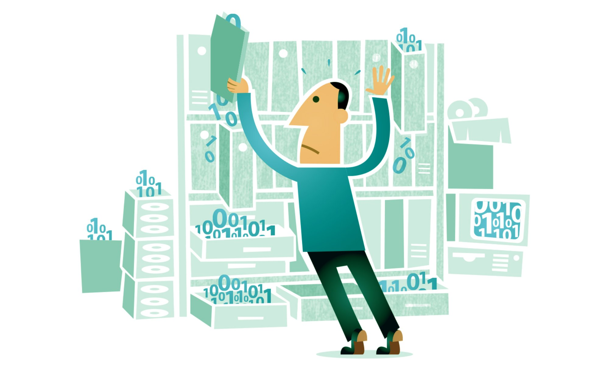

# Data Analytics
### [Back Home](https://github.com/boys-be-ambitious/TIL)

## Table of Contents
### 1. [Kickstarter - 성공한 프로젝트와 실패한 프로젝트 살펴보기](http://rpubs.com/verbena/kickstarter)
### 2. [Lending Club - 대출 고객 분석](http://rpubs.com/verbena/credit-risk-modelling-eda-classification)
### 3. [Hyundai Department Store - 백화점 고객 데이터로 성별 예측](http://rpubs.com/verbena/hds)
### 4. [Airbnb - airbnb를 이용한 고객 분석하고 예약할 국가 예측하기](http://rpubs.com/verbena/airbnb)
### 5. [Boston House Price - 집 값 예측하기](http://rpubs.com/verbena/house)
### 6. [Titanic - 당신은 생존할 수 있을까?](http://rpubs.com/verbena/titanic-prediction)
### 7. [Bikeshare - 이용 고객 분석을 통한 예측하기](http://rpubs.com/verbena/bike)
### 8. [Rossman Store - 매장 관리](http://rpubs.com/verbena/rossman)
### 9. [Market Basket Analysis Using Association Rules - 연관 분석](http://rpubs.com/verbena/MBA)
### 10. [Santander Bank - 은행 상품을 통한 데이터 분석](http://rpubs.com/verbena/santander)
### 11. [Bank Marketing - 고객 상품 유치 대작전 1](http://rpubs.com/verbena/bank-mkt)
### 12. [Bank Marketing 2 - 고객 상품 유치 대작전 2](http://rpubs.com/verbena/bank-forecasting)
### 13. [Why do some people cheat on their spouses?- 왜 일부 사람들은 배우자를 속일까? (불륜)](http://rpubs.com/verbena/love-affair)
### 14. [Sudent alcohol consumption - 학업 성취도가 낮은 이유는?](http://rpubs.com/verbena/school-score)
### 15. [Korea Welfare - 복지 데이터로 알아보는 한국인](http://rpubs.com/verbena/kor-welfare)
### 16. [San Francisco Crime Classification - 특정 지역에서 일어난 범죄 예측하기](http://rpubs.com/verbena/csi)

## Notice
- 만든지 얼마 되지 않은 github 저장소인데, 앞으로 공부해야할 분야와 양이 방대해서 저장소 및 포트폴리오 홈페이지의 업데이트가 늦어질 수 있습니다(미완성된 분석도 있습니다). 데이터 분석은 아래 링크를 참조해주세요.
- http://rpubs.com/verbena/
- R을 제외한 Python, SQL 분석은 차후에 업데이트할 예정입니다.

