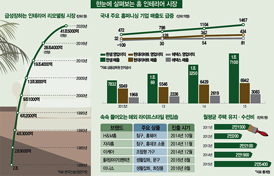
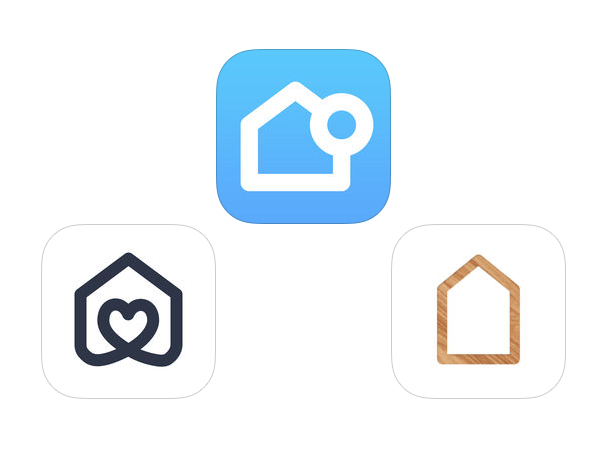
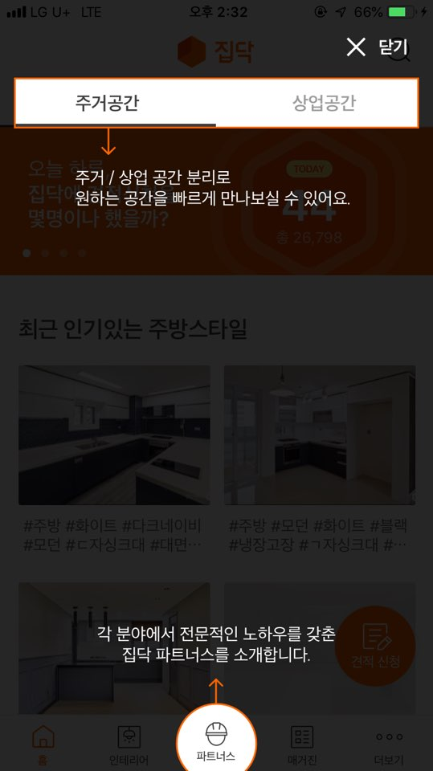

# 1. Home Interior Market Research

## 1.1. 국내 홈 인테리어 현황

-  시장 규모 : 12조 5,000억원 (2015년, 통계청)
    - 10조원 규모인 북미 LED 조명시장, 국내 수입차 시장보다 큰 규모의 시장
    - 국내 가구 시장 10조원 + 생활용품 관련 시장 2조 5,000억원
    - 2008년 7조원 규모에 비해 엄청난 성장세를 보이고 있음

- 시장 전망 : 18조원 (2023년, 통계청) / 41조 (2020년, 한국건설산업연구원)
    - 이사 철에나 이뤄지던 집 꾸미기가 이제는 일상의 취미로 자리 잡음.

## 1.2.셀프 인테리어
- 셀프인테리어는 2014년부터 SNS를 기반으로 지속적으로 시장을 넓혀가고 있다.

- 자신의 집을 꾸민 사진을 올려놓고 집안 소품은 어디에서 샀는지, 시공은 어떤 업체를 통해 했는지 등 인테리어 과정도 함께 올리면서 “나도 할 수 있겠다”는 인식이 번져나간 덕분이다.

- 셀프인테리어의 재미는 내가 원하는 소품들을 사용해 인테리어를 하나씩 바꿔가는데 있다. 때문에 1인 가구나 신혼부부들이 주로 관심이 많다. 이노션월드와이드가 올 상반기 발표한 ‘생애주기별 인테리어 트렌드 분석 보고서’에서 1인 가구와 신혼부부의 인테리어 관련 SNS 데이터 3만 1000건 을 분석한 결과 소품(7,433건), 색상(6,651건), 가격(6,087건) 등 혼자서 할 수 있는 인테리어 관련 단어가 많았다.

- 집 꾸미기에 대한 관심이 늘면서 집 내부 인테리어 직접 시공에 나서는 DIY(Do It Yourself)족들이 점점 늘어나고 있다. 실제로 시장조사전문기업 마크로밀엠브레인의 트렌드모니터가 전국 19~59세 성인남녀 2,000명을 대상으로 ‘홈 인테리어’에 관한 조사를 실시한 결과(올 9월 기준), 전체 응답자의 87.8%가 집안 인테리어를 자신의 개성을 나타내는 하나의 수단으로 생각한다고 답했다. 인테리어를 업체에 맡기지 않고 직접 해결하는 ‘셀프 인테리어’에 대한 관심도 상당한 것으로 나타났다. 전체의 75.2%는 셀프 인테리어를 또 다른 여가 생활로 인식하고 있었다. 그에 비해 셀프 인테리어가 괜한 고생을 자초하는 일이라고 생각하는 응답자는 29.9%에 그쳤다.

- 홈 인테리어에 대한 관심이 커지는 것은 최근 집이 가지는 의미가 단순한 주거공간에서 취미·여가 생활을 즐길 수 있는 장소로 변화되고, 집안 활동이 늘어나는 경향과 맞물려 있다. 전체의 75.2%가 굳이 밖에 나가지 않더라도 집에서 할 수 있는 것들이 충분히 많다고 생각했다. 집에서도 가볍게 술 한 잔 즐길 수 있는 환경을 원한다는 응답은 77.1%, 커피를 마실 수 있는 공간을 만들고 싶다는 응답은 89.5%에 달했다. 집안에서의 즐길 거리 다양화는 자연스럽게 인테리어에 대한 관심 증가로 이어지고 있다
    
## 1.3. 홈 인테리어 춘추전국시대
    - 온오프라인을 가리지 않고 뜨거움
   
### 1.3.1. 온라인 : 옥션
    - 2014 ~ 2017년까지 홈 퍼니싱 용품 판매량 분석한 결과
    - 가구·DIY 제품(소비자가 직접 조립하는 상품)은 99%
    - 침구·커튼은 96%
    - 주방용품 48%
    - 조명·인테리어 상품(벽 장식이나 조명기구, 장식 소품 등 포함)은 29% 급증했다.

### 1.3.2. 오프라인 : 한샘, 유진, 한화, 패션업계(자라, H&M, 세컨룸, 패션그룹형지, LF)
    - 전문매장 출점 경쟁이 뜨거움
    - 기존의 강호와 신흥 세력이 뒤엉켜 영토 확장에 여념이 없음
    - 기존 브랜드 업체들의 점유율 40%대(추정)
        - 한샘(20%), 리바트, 일룸, 에넥스, KCC (20%)
    - 브랜드 업체 이외의 군소 업체들이 나머지 60%를 차지
    
    - 한샘 : 리하우스(rehaus)
        - 부엌과 욕실 창호, 바닥재 등 리모델링 관련 제품을 취급하는 종합 홈 인테리어 매장
        - 매출 : 1,455억원(2013년) -> 4,112억원(2017년)
        
    - 유진 : 홈데이(Homeday), 홈임프루브먼트(Home Improvement)
        - 단순히 집 안을 꾸미는 데 그치는 것이 아니라 직접 개조·보수해 주거환경을 향상 시키는 것에 초점을 맞춘 매장
        
    - 한화 L&C : 갤러리큐
        - 건축자재 전문기업인 한화 L&C는 직영 인테리어 전시장 갤러리큐를 열고, TV 홈쇼핑 방송을 시작하는 등 소비자 접점 확대를 노리고 있음
        
    - 모던하우스(이랜드), JAJU(신세계), 무인양품, 미니소, 플라잉 타이거 코펜하겐
    - 글로벌 SPA 브랜드 : 자라홈, H&M홈, 세컨룸(세컨스킨)
    - 국내 패션 브랜드 : 까스텔바작홈(패션그룹형지), 헤지스홈(LF)
    
    - 이케아
        - 2014년 12월 오픈한 이후 1년 동안 매출액이 3,080억원, 방문객 670만명, 이케아 패밀리 회원 수는 70만 명에 육박함
        - 연간 40조 기업 이케아처럼 고객들에게 가구만 파는 것이 아니라 공간별 인테리어 컨셉트와 함께 토탈 라이프 스타일을 제안하는 대한민국 홈퍼니싱 브랜드들의 약진은 앞으로도 계속될 전망이다.     

## 1.4. 홈 인테리어 시장이 성장하는 이유
### 1.4.1. 노후주택
    - 건축된 지 20년 넘은 주택 : 약 763만호, 전체 주택의 45.7% (2015년)
    - 건축된 지 30년 넘은 주택 : 약 280만채, 전체 주택의 16.8%
    - 오래된 집이 많으니 그만큼 보수·리모델링 관련 잠재 수요가 클 수밖에 없다.
    - 경기도 분당, 일산 등 1기 신도시와 서울 목동과 같은 노후된 아파트들이 많다.

### 1.4.2. 국민소득 증가, 삶의 질을 중요시하는 사회로의 성장
    - 미국, 일본 등 선진국도 국민소득 3만달러 시대에 진입하면서 인테리어 관련 소비가 급증했다. 우리나라도 이런 흐름을 따라가고 있는 것으로 보인다.
    
    - 업계 관계자는 "최근 소비자들이 삶의 질을 중요하게 여기면서, 집 꾸미기에 대한 수요가 늘어나고 있다"면서 "목돈을 들이지 않아도 작은 소품으로 집 안 분위기를 바꿀 수 있는 홈퍼니싱에 대한 관심은 계속 늘어날 것"이라고 전망했다.
    
    - 가구·생활용품과 더불어 이불·베개·매트리스 같은 침구류 산업도 성장세다. 알레르기 방지 등 기능성 침구를 생산하는 웰크론의 침구 브랜드 '세사리빙'은 올해 매출이 전년 대비 20％ 증가했다. 웰크론 이영규 회장은 "올해 선보인 유아동 침구 브랜드 '세사키즈'가 인기를 끈 데 이어 조만간 노인 전용 침구 상품도 출시할 계획"이라고 말했다. 외국계 베개·매트리스 업체인 템퍼의 경우 지난해 전 세계 30개국 가운데 한국 법인이 성장률 1위를 기록했고, 올해도 매출이 31％ 급증했다.

    - 한국에서 생활 관련 산업이 성장하는 현상은 과거 스웨덴과 일본 같은 선진국이 거쳐온 길과 비슷하다. 1인당 연간 소득이 3만달러를 넘어서면 자신의 공간인 집안 꾸미기에 대한 욕구가 증가한다. 또 1~2인 가구는 자주 이사를 가기 때문에 고가품보다는 아기자기한 생활 소품을 선호하는 측면이 강하다. 스웨덴의 1인 가구 비율은 47％에 달한다. 현대경제연구원 주원 수석연구위원은 "소득 수준이 올라가면 삶의 질을 돌아보고 양질의 휴식을 통해 정신 건강을 챙기는 이들이 늘어난다"며 "늘 긴장하며 스트레스를 받는 현대인의 피로를 풀어주는 산업이 발전하고 있다"고 말했다.

### 1.4.3. 온라인 집들이
    - 셀프 인테리어 카페 '레몬테라스' 회원은 303만명에 달한다.
    - 기존의 인스타그램에서는 음식이나 맛집 사진을 공유하는 #먹스타그램이나 셀카 사진을 공유하는 #셀스타그램이 주요 인기 해시태그였다.
    
    - 요즘에는 집안의 셀프 인테리어를 공유하는 게시물에 대한 반응이 뜨겁다. '집 + 인스타그램'을 뜻하는 해시태그 #집스타그램으로 검색되는 게시물은 282만개(2016년 기준 54만 3천개로 5.2배 성장하였음), #집꾸미기는 125만개, #온라인집들이는 8.8만개(2016년 기준 3,500여개로 25배 이상 성장)일 정도로 인기가 많다.

### 1.4.4. 집에 대한 인식의 변화
##### "집은 비밀스럽고 사적인 공간에서 자기 표현 수단 중 하나로 변모하고 있다. 요즘 사람들은 SNS에서 인테리어 센스를 과시하길 원한다." - 전미영 서울대 소비자학과 교수
##### "소득수준이 낮아도 가치 높은 소비에 집중하는 이들이 넘쳐난다." - 이준영 상명대 소비자주거학과 교수
##### “그동안은 이사를 하거나 집 내부 시설이 고장 나는 등 특별한 계기가 있어야 인테리어를 새로 했다. 최근에는 이런 계기가 없어도 집을 꾸미려는 이가 많아졌다. 전월세로 거주하는 사람도 과거에는 인테리어 투자에 인색했지만 요즘은 적극적이다. 특히 셀프 인테리어가 확산되는 만큼 개인이 직접 시공하는 데 쓰는 공구, 자재, 소품 등의 수요가 빠르게 늘어날 것이다.” - 김태환 KB금융지주 경영연구소 연구위원
##### "기성세대가 셋집을 꾸미지 않았던 건 '곧 내 집을 장만할 수 있다'는 기대 때문이었다. 그러나 지금은 셋집이 '영구적으로 살아야 할지도 모르는 곳'이 되어버렸다. 내 집을 마련할 때까지 꾸미기를 유예하면 평생 집을 못 꾸밀 수도 있다는 우려가 '셋집 인테리어'라는 새로운 풍조를 낳았다." - 노명우 아주대 사회학과 교수

---
# 2. 오늘의집 (버킷플레이스)

### 2.1. 국내에서 가장 규모가 큰 인테리어 플랫폼
    - 가장 쉬운 인테리어 레시피
        - 누구나 쉽게 따라할 수 있는 인테리어 정보 공유 서비스
    - 핵심 가치
        - 앱을 통해 집 안의 인테리어를 훨씬 더 쉽게 꾸밀 수 있도록 돕는 것
    - 2014년 7월 출시(준비는 2013년부터 시작)한 인테리어 플랫폼으로 인테리어 사례, 가구소품, 시공에 대한 정보 제공을 통해 보다 간편한 인테리어 및 시공 작업을 지원한다.

    
    - 수치로 보는 오늘의집
        - 구글 앱 스토어 '부동산/홈인테리어'부분 1위
        - 설립일 : 2014.07.15 (5년차)
        - 누적 투자액 : 111억
        - 누적 거래액 : 1,000억원 (2019년 1월 기준)
        - 월 평균 매출액 : 100억원 (예상)
        - 앱 현황 : 380만 회 (다운로드), 220만 명 (MAU, 앱/웹)
        - 콘텐츠  : 50만 개 (인테리어 사례), 56만 개 (제품 정보 태그)
        - 입점브랜드 : 1,600개
        
    - 주요 타겟 : 20대 중반 ~ 30대 중반 여성(전체 고객 중 약 70%) -> 결혼을 앞두고 인테리어에 관심 갖기 시작하는 경우가 대다수 // 자취 중인 직장인

### 2.2. 차별화 포인트
    - 경쟁력 : 이용자 중심의 콘텐츠, 차별화된 쇼핑 경험
        - 사진에 제품 정보를 태그하는 기능을 제공해 콘텐츠와 커머스를 한 영역에 담았다.
            - 누구나 사진을 클릭해 곧바로 사진 속 제품 정보를 확인하고 구매할 수 있다.
            - 이용자는 인테리어 콘텐츠에 태그된 제품을 바로 구매하거나, 해당 제품을 다양하게 활용한 후기를 따로 모아 볼 수 있다.
            - 현재 오늘의집은 50만 개가 넘는 인테리어 사례와 56만 개 이상의 제품 태그를 보유해 국내 인테리어 플랫폼 중에서 가장 많은 정보를 제공하고 있다.
            
    - 해당 제품을 다양하게 활용한 후기를 따로 모아볼 수도 있다. 잡지 속 사진으로 끝나는 것이 아니라 제품 정보에 대한 궁금증을 해결해주고 즉시 구매까지 연결해준 덕분에 오늘의 집 누적 거래액은 1000억원을 넘겼다.

### 2.3. 수익구조
    - 중개수수료 : 가구, 가전
    - 광고 수익 : 다양한 브랜드와 마케팅 협업
    
    - "우리가 확보한 사진 태그 정보는 60만개, 서비스 내 노출 제품은 6만2000여 개나 된다"며 "매출 대부분이 가구, 가전 등 중개수수료에서 나온다. 다양한 브랜드와 마케팅 협업을 진행하며 광고 수익도 얻고 있다"
    
### 2.4. 최근 현황 및 계획
    - 버킷플레이스는 올해 2월 인테리어 O2O 스타트업 브랫빌리지의 사업권을 인수했다. 지난 8월 베타서비스로 전문가 카테고리를 출시해 시공 영역까지 사업을 확대하고 있다. 현재 인테리어·시공 전문가 회원 2000여명을 확보했고 전문가의 시공 포트폴리오·사진 또한 8만여개를 제공중이다.
    
    - 이승재 버킷플레이스 대표는 “오늘의집은 콘텐츠, 커머스, 시공영역을 확장하며 국내1등 인테리어 원스톱 플랫폼으로 거듭나고 있다” 며 “이번 투자 유치를 통해, 네이버와의 전략적 제휴와 함께 인테리어를 필요로 하는 모든 분들에게 필요한 정보와 서비스를 제공할 수 있도록 서비스를 고도화시켜 나갈 계획”이라고 말했다.
    
    - "인테리어를 단계별로 보자면 우선 원하는 콘셉트를 찾는 단계, 두 번째로 소품을 선정하고 찾는 단계까지 왔다"며 "올해부터는 크고 작은 시공을 고민 없이 쉽게 할 수 있도록 도와주는 서비스까지 도입해 '원스톱 인테리어 플랫폼'이 되는 것이 목표"라고 말했다. 이를 위해 시공·인테리어 분야 전문가 확보에도 나섰다.
    
    - "오늘의집은 커뮤니티, 커머스, 시공 등 핵심 서비스를 구축하며 원스톱 인테리어 플랫폼으로 성장하고 있다"며 "인테리어의 모든 과정에서 소비자에게 최고의 고객 경험을 선사하는 서비스가 되기 위해 계속 노력하겠다"고 밝혔다.

### 기사발췌
    - 오늘의 집과 하우스는 기존의 인테리어 잡지와 비슷하면서도 전혀 다른 서비스다. 잡지나 언론이 주목한 적 없는 집인데도 집 주인이 ‘나는 우리 집을 이렇게 꾸몄다’며 올리는 사진이 중심 콘텐츠다. 거칠고 정돈되지 않은 모습이어도 환영한다. 이는 인터넷 카페와 블로그에서 ‘온라인 집들이’라고 부르던 모습과 비슷하다.

    - 온라인 집들이는 집들이 손님이 오면 현관으로 마중 나가 거실, 방을 보여주듯, 집 사진을 찍어 올리는 걸 말한다. 주로 이사가거나 집을 새로 꾸민 사람들이 한다. ‘오늘의 집’은 아예 ‘온라인 집들이’를 별도 카테고리로 만들었다.

    - 온라인 집들이의 포인트는, 비 전문가를 독자로 둔다는 데에 있다. 블로그나 카페뿐 아니라 오늘의 집과 같은 전문 서비스도 인테리어 전문가를 독자로 삼지 않는다. 전문 용어를 풀어 쓰거나 ‘나도 몰랐는데 이번에 알게 되었다’라는 식으로 설명하여 누구나 읽을 수 있게 한다. 고가의 주문형 가구뿐 아니라 다이소나 이케아에서 저렴하게 구입한 소품이나 가구를 활용한 스타일이 다양하게 올라와서 ‘나도 해볼까’라는 심리를 자극한다. 이 심리는 '이 정도면 우리집도 소개할 만'이라는 마음으로 이어지는데 오늘의 집과 하우스 같은 전문 서비스가 배출구가 된다.

### 2.5. Player

#### 집꾸미기
    - 설립일 : 2012.04.01 (7년차)
    - 누적 투자액 : 110억원
    - 누적 거래액 : 400억원 (2018.05 기준)
    - 주요 타겟 : 20대 후반 ~ 30대 전월세 세입자
    - 월 평균 매출액 : 10억원 (2017.07 기준)

####  하우스
    - 설립일 : 2014.11.27 (5년차)
    - 누적 투자액 : 비공개(2015년, 총 2회)
    - 누적 거래액 : 100억원 (2018.08 기준)
    - 입점 시공사 : 250개
    - 입점 브랜드 : 370개
    - 누적 다운로드 수 : 150만
    - 주요 타겟 : 3040
    - 실제로 사용자가 사용해 본 뒤 남긴 제품리뷰글의 구매전환률이 10%를 넘어선다. 유명 SNS의 게시물의 구매전환률이 2~3% 수주인 것을 고려하면 높은 수준이다.

### 2.6. 한 줄 요약
    - "오늘의집은 집을 꾸미는 소비자의 시간과 비용을 아껴주는 인테리어 콘텐츠 커머스 서비스이며, 터치 한 번으로 인테리어 사진 속 제품 정보를 확인하고 저렴한 가격에 구매할 수 있는 서비스 입니다."
 

---
# 3. Feedback
## 3.1. Tutorial
### 처음 앱을 실행하면 아래와 같이 튜토리얼 모드 형식으로 사용법을 안내해준다.

## 3.2. Gamification
### 콘텐츠를 읽을 때, 어느 정도 읽었는지 알 수 있도록 표시한다.

## 3.3. AR

## 3.4. MOU
### 인테리어를 하는 타겟들의 인생에서 발생할 이벤트와 접점을 가진 업체와 전략적 제휴

### 3.4.1. 이사
- 집을 알아보는 어플, 이사를 알아보는 서비스 어플

### 3.4.2. 결혼
- 웨딩박람회, 스드메 업체, 관련 커뮤니티 등

## 3.5. Campaign & Event (Branding)
### 3.5.1. 업계 1위 전략인 캠페인 전략

### 3.5.2. 소비자 이벤트

---
# 4. Reference
1. [Trend : 진화하는 홈인테리어 시장…공들여 꾸민 내집 온라인서 맘껏 자랑해요](http://news.mk.co.kr/newsRead.php?year=2018&no=491730)
2. [오늘Who : 인테리어앱 '오늘의 집' 승승장구, 이승재 시공도 욕심](http://www.businesspost.co.kr/BP?command=article_view&num=107571)
3. [쇼룸·잡지 속 그림 같은 집, 누구든 꾸밀 수 있어요](https://news.naver.com/main/read.nhn?mode=LSD&mid=sec&oid=025&aid=0002885654&sid1=001)
4. [Let`s 스타트업 : 버킷플레이스, 인테리어 사진보다 구매까지…모바일로 손쉽게 집 꾸며요](https://news.naver.com/main/read.nhn?mode=LSD&mid=sec&oid=009&aid=0004300601&sid1=001)
5. [2016년 가장 인상 깊었던 서비스 - 인테리어 앱](http://thegear.net/13592)
6. [오늘의집을 함께 성장시켜나갈 동료를 찾습니다.](https://brunch.co.kr/@bucketplace/6)
7. [인테리어 정보 공유 플랫폼 ‘오늘의집’, 50억원 투자 유치](https://platum.kr/archives/95519)
8. [한국, 5000만명 이상 국가중 7번째 ‘3만달러’](http://news.donga.com/BestClick/3/all/20180101/87973340/1)
9. [세계개발지표](https://www.dropbox.com/s/kl2hdvx86radwf8/Screenshot%202019-02-25%2015.13.37.png?dl=0)
10. [주택유형별/건축연도별 주택수](http://kosis.kr/statHtml/statHtml.do?orgId=553&tblId=DT_55301_I001002)
11. [건축연도별 주택수](http://nationalatlas.ngii.go.kr/pages/page_329.php)
12. [전국 주택 통계 - 규모,유형,지역,기간,면적 등](https://m.blog.naver.com/PostView.nhn?blogId=vaidyaratna&logNo=220902638165&proxyReferer=https%3A%2F%2Fwww.google.com%2F)
13. [홈퍼니싱 트렌드가 만든 SNS 속 #온라인집들이 열풍](https://prgateblog.tistory.com/257)
14. [‘먹방’ 다음 ‘집방’ 시대…집꾸미기 산업이 뜬다](http://www.hani.co.kr/arti/economy/economy_general/727638.html)
15. [‘집방’ ‘셀프 인테리어’ 열풍이 분다…온라인 집들이하는 내가 트렌드세터
](http://news.mk.co.kr/v2/economy/view.php?sc=50000010&year=2016&no=686207&relatedcode=000130456)
16. [2017년 인구주택총조사 - 통계청](http://kostat.go.kr)
17. [공간을 리빌딩하는 홈퍼니싱의 경제학](https://m.blog.naver.com/PostView.nhn?blogId=daishin_blog&logNo=220695684128&proxyReferer=https%3A%2F%2Fwww.google.com%2F)
18. [내집 꾸미기 나 혼자 할까 통째로 살까](https://m.seoul.co.kr/news/newsView.php?cp=seoul&id=20161010018001#Redyho#csidx2877858cb5952c49ad594957499788f )
19. [소중한 우리 집 꾸미기 '홈퍼니싱' 시장 후끈후끈](http://www.busan.com/view/busan/view.php?code=2017021ㅁㄴ5000338)
20. [내 집의 품격을 높이는 셀프 인테리어 열풍](https://www.sindohblog.com/1116)
21. [트렌드 읽기 : 이젠 집 꾸미는 시대](http://news.chosun.com/site/data/html_dir/2015/12/24/2015122402334.html)
22. [구글 플레이 올해의 베스트앱 '오늘의집'](https://news.naver.com/main/read.nhn?mode=LSD&mid=sec&oid=092&aid=0002151964&sid1=001)
23. ['오늘의집' 버킷플레이스, 네이버 투자 유치](https://news.naver.com/main/read.nhn?mode=LSD&mid=sec&oid=277&aid=0004337259&sid1=001)
24. [오늘의집, 누적 거래액 1천억원 돌파](https://news.naver.com/main/read.nhn?mode=LSD&mid=sec&oid=092&aid=0002155367&sid1=001)
25. [앱 개발 통해 본 올해 라이프 트렌드는?](https://news.naver.com/main/read.nhn?mode=LSD&mid=sec&oid=014&aid=0004169833&sid1=001)
26. [검색어트렌드 : 네이버 데이터랩](https://datalab.naver.com/keyword/trendResult.naver?hashKey=N_485398496c0e82bf660cb00ca0af7d66)

---

# 5. 생각해봐야할 점
## 고객
- 소비자, 판매자(광고주)라는 두 명의 고객이 존재
- "내가 이사를 해야하는데, 곧 결혼을 준비 중인데 집을 이쁘게 꾸미고 싶은데 어떡하지?..."
- DIY의 대표주자인 이케아가 한국에 들어오면서 기존의 많은 가구 업체들이 긴장했으나, 오히려 같이 성장했음. 왜 일까?
