# Online Dating Market Research
### Goal
- 온라인 데이팅 시장에 대한 이해를 높이면서 데이터 분석가로 비즈니스에 기여할 수 있는 부분에 대해 생각해본다.

### Index
    1. Introduction : 데이팅 시장 개요
    2. GLAM
    3. I am ...
    4. Reference

- - -
# 1. Introduction : 데이팅 시장 개요

### 1.1. 스마트폰의 등장, 간편한 만남
- 모바일 서비스를 통해 이성과의 만남을 주선하는 '데이팅 앱'은 스마트폰으로 간편하게 낯선 이성과의 만남이 성사될 수 있어 인기가 높다.

### 1.2. 국내 시장과 해외 시장 개요
- <b style='color:#ee1155'>국내에서 서비스 되는 모바일 데이팅 앱의 수는 170여개(2018년 8월 기준)</b>로, 이중 상위 20개 앱에서 발생한 매출은 지난해 기준으로 1천억원으로 추산된다. -> 2019년 기준 2000억원 규모  
- 일본 데이팅앱 시장이 현재 1조원 규모인데, 인구수는 두 배 정도 많다. 한국은 인구수 등을 감안하면 2~3년 내 5000억원대 까지 시장이 무난하게 성장할 것으로 전망하는 중이다.  
- 미국 시장의 규모는 40억 달러(4조 5천332억)에 달할 정도로 인기가 높다.

### 1.3. 소비자 이해 1
- 시장조사전문기업 엠브레인 [트렌드모니터](http://www.trendmonitor.co.kr)가 전국 만 19세~44세 미혼남녀 1,000명을 대상으로 '사교 모입 앱'과 '소셜 데이팅 앱' 관련 설문조사를 실시한 결과, 인간관계의 유지 및 확장에 어려움을 느끼는 현대인이 많아지고 있는 가운데, 새로운 관계를 만드는 방법 중 하나로 '사교 모임 앱'과 '소셜 데이팅 앱'의 활용도가 조금씩 높아지고 있는 모습을 발견할 수 있었다.

####  미혼 62.5% "취미와 관심사 공유 위한 새로운 만남 의향 있어" 
- 먼저 <b>개인의 취향과 개성을 존중하는 사회 분위기와 맞물려 최근에는 학연과 지연에 의한 전형적인 인간관계에서 벗어나 취미와 취향, 관심사 등 비슷한 ‘공감대’를 형성할 수 있는 사람들을 만나고자 하는 욕구</b>가 강해진 것을 느낄 수 있는데, <b>실제 미혼남녀 상당수가 이런 의향을 가지고 있는 것으로 조사</b>되었다.  
- <b style='color:#ee1155'>미혼남녀 10명 중 6명(62.5%)이 취미와 관심사, 취향을 공유하기 위한 목적으로 새로운 관계를 맺거나 만남을 가질 생각이 있다고 응답</b>한 것이다. 최근에는 취미와 취향, 관심사에 의한 만남을 용이하게 하는 ‘사교 모임 앱’이 많이 출시되고 있는 모습으로, 이러한 앱을 인지하고 있는 사람들(55.1%)도 많은 편이었다.

####  2명 중 1명 '사교 모임 앱' 이용 의향 나타내   "일상에서 벗어나 새로운 사람을 만날 수 있어서" 
- 다양한 사교 모임 앱을 통해 <b>새로운 분야의 사람들을 만나고 싶어하는 욕구도 비교적 강한 것</b>으로 나타났다.  
- <b>미혼남녀 2명 중 1명(51.8%)이 취미와 취향, 관심사가 비슷한 사람들끼리 만나 정보를 공유하고, 친목을 도모하게끔 도와주는 ‘사교 모임 앱’을 이용해볼 의향이 있다</b>고 밝힌 것이다. 사교 모임 앱을 이용하고 싶어하는 가장 큰 이유는 <b>기존 인맥의 틀에서 벗어나고 싶다는 생각</b>이 강하기 때문인 것으로 보여졌다. <b>반복적이고, 일상적인 영역에서 벗어나 새로운 사람들을 만날 수 있다(54.8%, 중복응답)는 생각</b>을 단연 많이 내비친 것이다.  
-  또한 <b>인맥을 넓히고 싶은데(41.9%), 주변에 관심사를 공유할 수 있는 사람이 없다(25.9%)</b>는 생각도 중요하게 작용하고 있었다. <b>사교 앱을 이용할 의향이 있는 미혼남녀들은 여러 분야 중에서도 문화/공연/축제(42.1%, 중복응답) 분야와 운동/스포츠(40.7%) 분야에서의 ‘새로운 만남’을 주로 많이 원하는 모습</b>이었다. 그 다음으로 <b>사교/인맥(30.7%)과 외국어/언어(29%), 아웃도어/여행(28.8%), 음악/악기(27.6%) 분야에서 자신과 취향이나 관심사가 비슷한 사람을 만나고 싶어하는 마음</b>도 큰 편이었다.

####  '소셜 데이팅' 앱 이용경험(15.1%)은 적어, 주로 호기심에 이용   반면 "이상한 사람 많을 것 같아" 이용하지 않아 
- <b>취향과 관심사가 비슷한 사람들과 정보를 공유하고, 친목을 도모하기 위해서 ‘소셜 모임 앱’을 이용</b>하는 한편으로는 <b>연애 상대를 찾기 위해서 ‘소셜 데이팅(소개팅) 앱’을 이용</b>하는 모습도 엿볼 수 있었다.  
- 다만 아직까지는 소셜 데이팅 앱을 적극적으로 활용하고 있지는 않은 듯했다. <b>미혼남녀 66%가 소셜 데이팅 앱의 존재를 알고 있었으나, 실제 이용경험(15.1%)은 적었다.</b> 소셜 데이팅 앱 이용자는 주로 <b style='color:#ee1155'>호기심(50.3%, 중복응답) 때문에 많이 이용</b>한 것으로 나타났으나, <b style='color:ee1155'>친구 및 대화상대를 만나고 싶거나(27.2%), 취향과 관심사가 비슷한 이성을 만나고 싶다(24.5%)는 바람</b>으로 소셜 데이팅 앱을 이용하는 경우도 많은 편이었다.  
- 또한 주변에 <b style='color:#ee1155'>소개팅을 해달라는 부탁을 하지 않아도 되고(23.2%), 이성을 만날 수 있는 곳이 별로 없다(22.5%)는 현실적인 이유</b>로 소셜 데이팅 앱을 이용했다는 응답도 적지 않았다.  
- 반면 소셜 데이팅 앱을 <b style='color:#ee1155'>이용해본 경험이 없는 가장 큰 이유</b>는 <b style='color:#ee1155'>왠지 이상한 사람들이 많을 것 같다(52.5%, 중복응답)는 생각</b> 때문이었다. 이와 더불어 <b style='color:#ee1155'>앱을 통해 만나는 사람에 대한 믿음이 안 가고(49.1%), 위험한 일을 당할 것 같으며(41.1%), 성적 호기심 때문에 이용하는 사람이 많을 것 같다(38.9%)는 이유</b> 때문에 이용을 꺼리는 경우가 많아, <b style='color:#ee1155'>기본적으로 소셜 데이팅 앱과 이용자에 대한 신뢰도가 낮다는 것을 확인해볼 수 있었다.</b>

####  미혼 10명 중 8명 "불건전한 목적의 이용자 많을 것 같다"
- 소셜 데이팅 앱과 관련한 다양한 인식을 살펴본 결과, 소셜 데이팅 앱의 부정적인 측면이 주로 많이 부각되고 있는 것으로 조사되었다.  
- <b style='color:#ee1155'>10명 중 8명(77.8%)이 불건전한 목적으로 소셜 데이팅 앱을 이용하는 사람들이 많다고 생각</b>한다는 것을 단적인 예로 꼽을 수 있다. 소셜 데이팅 앱으로 <b style='color:#ee1155'>만나는 상대는 어딘가 신뢰가 가지 않을 것 같다는 의견도 63.1%</b>에 달했다.  
- 특히 <b style='color:#ee1155'>남성보다는 여성이 불건전한 목적으로 소개팅 앱을 이용하는 사람이 많고(남성 73.8%, 여성 81.8%), 여기에서 만나는 상대에게 신뢰감을 갖지 못할 것 같다(남성 52.6%, 여성 73.6%)</b>는 주장을 많이 피력했다.  
- 반면 소개팅 앱에 나오는 <b style='color:#ee1155'>이성의 프로필은 대체로 믿을 만하다는 의견(5.5%)</b>은 찾아보기 어려웠다. <b style='color:#ee1155'>2명 중 1명은 소개팅 앱으로 판단할 수 있는 것은 상대방의 외모밖에 없으며(51.8%)</b>, 그렇기 때문에 <b style='color:#ee1155'>진지한 만남이 어려울 것 같다(49.4%)</b>고 바라보기도 했다.

####   소셜 데이팅 앱 사용 자체를 부정적으로만 평가하지는 않아   24.1%만 "주변에서 안 찾고 소개팅 앱 이용하는 것 이해 안돼"
- 다만 소셜 데이팅 앱의 사용 자체를 부정적으로만 평가하는 것은 아니었다.  
- <b style='color:ee1155'>주변에서 이성을 찾지 않고 소개팅 앱을 이용하는 것이 이해되지 않는다는 시선은 전체 24.1%에 불과</b>했다. <b style='color:ee1155'>오히려 연애를 하고 싶은데 주변에 만날 사람이 없으면 소개팅 앱을 이용할 수도 있을 것 같다는 주장에 동의하는 의견(43.7%)이 동의하지 않는 의견(32.6%)보다 좀 더 우세</b>했다.
- 물론 소개팅 <b style='color:ee1155'>앱에 대한 신뢰도가 낮은 것은 사실이지만, 어떻게 이용하느냐에 따라 충분히 좋은 연애상대를 만날 수도 있다고 생각</b>하는 것으로 보인다.  
- 그만큼 연애상대를 <b style='color:ee1155'>어떻게 만나느냐 보다 누구를 만나느냐가 더 중요하다고 생각하는 미혼남녀(77.3%)가 많은 것</b>이다.  
- 성별(남성 76%, 여성 78.6%)과 연령(20대 초반 77%, 20대 후반 78%, 30대 초반 73.5%, 30대 후반 79%, 40대 초반 79%)에 관계 없이 <b style='color:ee1155'>만남의 방식보다는 어떤 상대를 만나는지가 중요하다는 인식</b>은 비슷했다.  
- 데이트 상대를 <b style='color:ee1155'>반드시 오프라인에서 만나야 할 필요는 없다는 생각(동의 45.4%, 비동의 28.9%)도 많은 편</b>이었다. 더 나아가 <b style='color:ee1155'>소개팅 앱으로 만나도 지속적인 만남이 가능하고(동의 43.4%, 비동의 21.7%), 결혼까지도 가능할 것 같다(동의 30.8%, 비동의 26.9%)는 인식도 적지 않았다.</b>

### 1.4. 소비자 이해 2
    - 아만다 이용패턴으로 알아보는 오늘날 대한민국의 연애방식
####  1. 하루에 16번쯤 마음에 드는 이성이 없나 휴대전화 애플리케이션(앱)으로 찾아본다.

####  2. 저녁 8시가 넘으면 이성이 더 만나고 싶어진다.
    - 전체 이용의 40%가 오후 8시부터 오전 1시 사이의 시간대에 몰린다.
    
####  3. 겨울철에 가장 외로움을 탄다.
    - 계절별로는 겨울철(12~2월)에 이용자가 가장 많다.
    - 아만다 앱 사용 중 겨울철이 차지하는 비중은 34%에 달한다.
    - '겨울철엔 옆구리가 더 허전하다'라는 속설이 입증된 셈이다.
    
####  4. 마음에 드는 이성과 연결이 되기 까지 드는 시간은 평균 2일 정도 걸린다.
    - 소개받은 이성과 첫 대화를 시작하는데 걸리는 시간은 서비스 가입 후 평균 24시간.
    - 마음에 드는 이성과 연결(대화창 개설 기준)되기까지 드는 시간은 평균 2일 정도다.

####  5.1. 여성들에 인기있는 남성은
    - 1위 : 의사
    - 2위 : 외모 상위 10%
    - 3위 : 명문대 출신
    - 4위 : 어깨가 넓은 남자
    - 5위 : 대기업 재직자
    
####  5.2. 남성들에 인기있는 여성은
    - 1위 : 외모 상위 10%
    - 2위 : 신규 가입자
    - 3위 : 몸매가 좋은 여성
    - 4위 : 네 살 연하의 여성
    - 5위 : 교사
    
    - '좋아요'를 많이 받은 인기 회원 분석 결과 여성은 남성의 능력을, 남성은 여성의 외모를 보는 경향이 뚜렷하다.    

####  6. 주 이용층은 20대 후반 ~ 30대 초반
    - 이용자 중 85%가 대학 재학이나 졸업자로 나타났다.
    - 가입자의 10%는 대학원 재학 이상의 학력을 갖추고 있었다.
    - 고졸 이하는 전체 가입자의 5%였다.
    - 가입자의 직업별로 회사원, 공무원, 자영압자 순으로 많았다.
    - 가입자 중 25~29세가 35.6%, 30~30세는 35.5%인 반면 20~24세는 14%, 35~40세는 15%에 그쳤다.
    - 남성의 경우 30~34세 가입자가 36.5%로 가장 많았고, 여성은 25~29세 가입자가 전체의 25.5%를 차지했다.
    - 이성을 만날 기회가 상대적으로 많은 대학생보단, 대학을 갓 졸업하고 사회인이 되는 시기에 신규 가입하는 경우가 많은 것 같다.

### 1.5. 시장의 플레이어들
#### - 특징
- 부동산, 숙박 관련 O2O 서비스의 경우 1, 2위가 치열하게 경쟁하는 반면, 데이팅 앱들은 상위 업체들이 공존하는 모습을 보인다.  
- 데이팅 앱은 웬만해선 적자를 안 내는 사업이기도 하지만 데이팅 앱 몇 개의 주인이 같은 경우가 많은 게 특징이다.

#### - 피드백
- 데이팅앱을 통해 회원들이 연인 관계로 발전하면 앱을 아예 지우기 때문에, 각기 다른 특색을 내세운 다수의 앱을 통해 새로운 이용자를 확보해야 한다.  
- 170~200개의 데이팅 앱이 공존하는 가운데 어떤 데이팅앱이 새로 출시된다 하더라도 남다른 콘셉트만 가지고 있다면 성공 가능성이 있다. 커플이 성사돼 앱을 이용하지 않더라도 20대 초반 연령층이 새롭게 유입되고 있다.  
- 이것 저것 다 써보는 사용자들 때문일까?

#### 1.5.1. 정오의 데이트
- 매출액 : 30억원
- 특징
    - 국내 최초 소셜데이팅 모바일 서비스
    - 20초 마다 1커플 탄생(누적 420만 커플)
    - 여성만족도 1위 소개팅앱
    - 국내 20-30대 남녀 6명 중 1명이 이용하는 서비스
    
#### 1.5.2. 아만다 (+ 너랑나랑, 연권)
- 매출액 : 25억원
- 특징
    - 회원수 500만 명
    - 아만다 : 일정 점수 이상을 획득한 사람만 가입할 수 있다.
    - 너랑나랑 :  토너먼트 방식으로 이성을 선택하는 방식
    - 연권 : 대만에서 서비스

#### 1.5.3. 틴더
- 매출액 : 9000억원
- 특징
    - 국내 이용자 300만명 보유
    - 국산 데이팅 앱들이 유료 아이템 수입으로 운영되는 것과 달리 구독료 수익 모델을 채택

#### 1.5.4. 오케이큐피드
<b style='color:#ee1155'> 데이팅 앱에 관심을 갖게 된 계기</b>

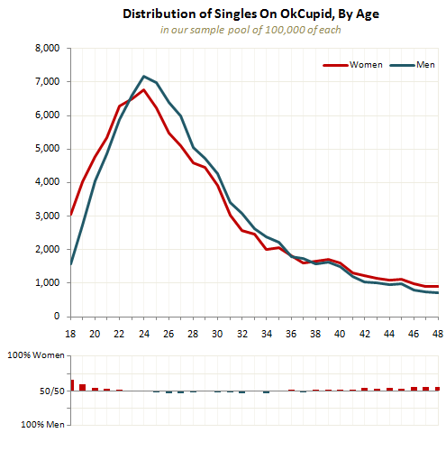
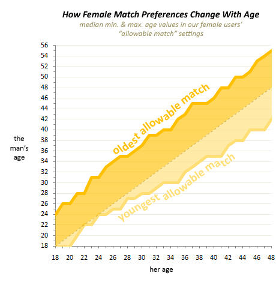
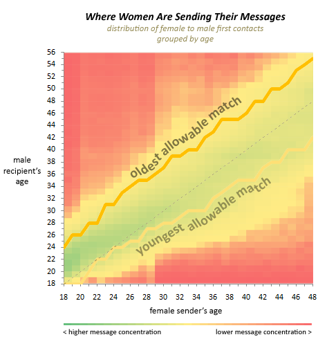

- x : 여성의 연령
- y : 여성이 선호하는 남성의 연령 범위

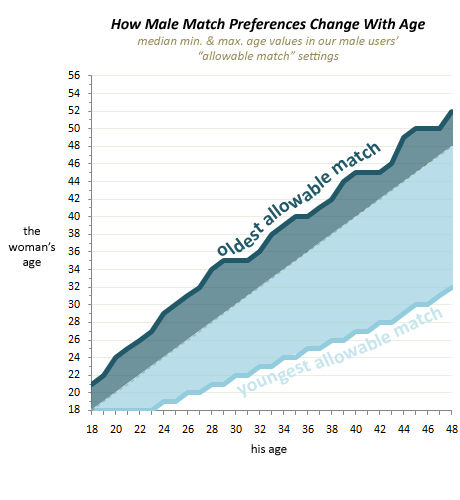
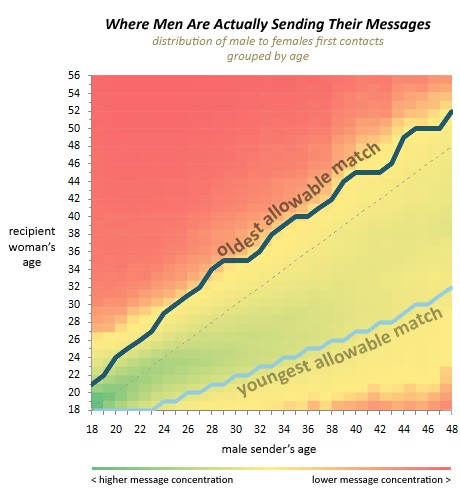

- x : 남성의 연령
- y : 남성이 선호하는 여성의 연령 범위

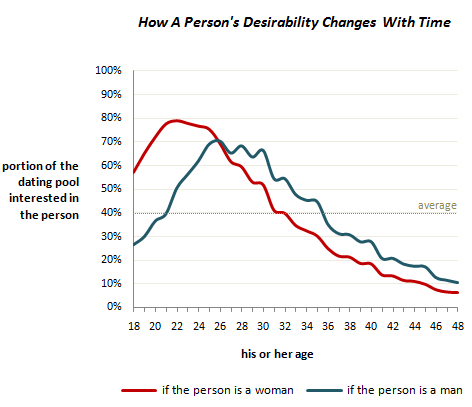

- 연락(메시지) 보낸 것
- 여자의 경우, 어리면 연상을 만나고 싶어하다가 점차 연하를 만나고 싶어하는 경향을 보인다.
- 남자의 경우, 무조건 어리고 연하를 만나고 싶어한다.

- <b style='color:#ee1155'>소비자에게 물어보고 나온 경우랑, 실제랑 다르다</b>
- <b style='color:#ee1155'>교훈 : 언행불일치!</b>
- <b style='color:#ee1155'>소비자에게 묻지 말고, 행동을 관찰해라(100배, 1000배 더 정확하다.)</b>

- - -
# 2. GLAM

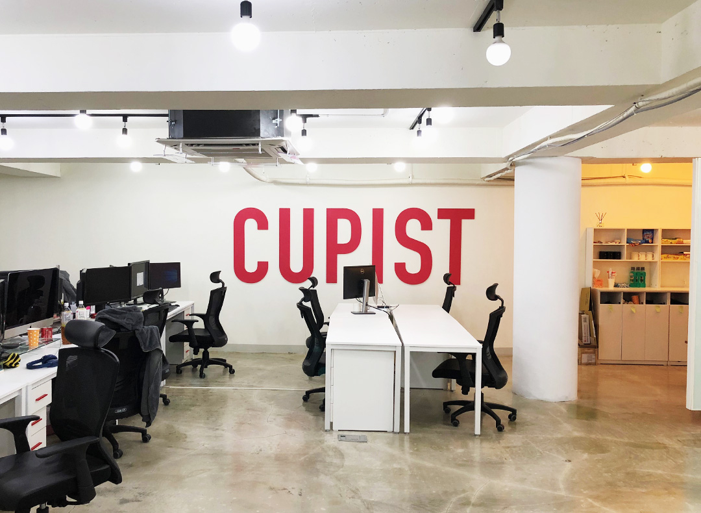

- '큐피드의 대리자'로서 누구나 사랑할 수 있는 세상을 꿈꾼다. 사랑의 욕망을 충족시킬 가치 있는 제품들을 통해 인류의 행복과 진보에 기여하고자 함.

- 2016년 4월 정식 런칭
- 누적 다운로드 100만 돌파
- 최근 2년간 8배 매출 성장
- 국내 최다 이용자가 이용하는 서비스, 국내 1위
- 현재 매일 1난 명 이상 유저들이 연결

- - -
# 3.  I am ...
## 3.1. 스타트업 경험 : 5 why, 72 법칙
- 중요한 문제에 직면했을 때, 5번의 why를 연달아 질문하면서 해결하는 성향을 가짐
- 스타트업 경험으로 인생의 습관이 변하였는데 그 이후로 72 법칙이 생김
- 성장하고 싶은 욕구가 강한 편이라(성장력), 사비로 15개가 넘는 데이터, 개발 수업을 들었음

## 3.2. J.D 중심으로
### 3.2.1. '사랑의 욕망 충족'의 큐피스트 미션에 대한 동의
    - '3.3. 마음을 움직였던 부분'에 적은 것처럼 미션과 비전에 대해 충분히 공감이 간다.

### 3.2.2. 통계 지식에 기반한 논리력, 분석력 및 분석에 대한 집요함
    - '칼을 뽑았으면 무라도 썰어야지'라는 말처럼 무언가를 시작했으면 끝을 보고마는 꼼꼼하고 집요한 성격을 갖고 있다.
    - 통계, 기계학습 공부 정리 page :  https://github.com/boys-be-ambitious/TIL/tree/master/Statistics
    - 

### 3.2.3~4. 서비스 데이터 실무 경험, 데이터를 토대로 한 높은 수준의 커뮤니케이션 역량
    - 신용평가사에서 서비스 데이터를 통해 데이터 기획, 수집, 분석한 경험이 있다.

### 3.2.5. R, Python, SQL
    - 실무에서 다양한 언어를 활용했다.
    - 데이터 분석 정리 page : https://github.com/boys-be-ambitious/TIL/tree/master/Data-analytics

## 3.3. 마음을 움직였던 부분
###  3.3.1. 데이터 분석 : 마음 읽기
- 사랑과 욕망에 대한 데이터를 다룹니다. 사람들의 마음에 대해 탐구하는 것은 매우 흥미롭지만 그만큼 어려운 일이기도 합니다. 더 많은 이들의 사랑의 욕망을 충족시킬 수 있도록 <b>서비스의 개선 방안을 도출</b>하는 것이 큐피스트 데이터 분석가의 주 역할입니다.
- <b style='color:#ee1155'>합류하시게 된다면 현재 데이터 분석가와 함께 데이터를 공유하고 탐구하며 시너지를 만들 수 있습니다. 세상에서 가장 흥미로운 사랑과 관계에 대한 데이터를 보면서 인간 심리에 대한 인사이트를 얻으며 함께 즐겁게 성장하길 바랍니다.</b>

### 3.3.2. 큐피스트의 미션
- 믿음, 미션, 현실, 비전, 목표, 6대 강령
    - 우리는 글로벌을 지향한다.
    - 우리는 리스크를 감수한다.
    - 우리는 매출이 아닌 유저에 집착한다.
    - 우리는 열심히가 아니라 독하게 일한다.
    - 우리는 실제 유처처럼 사용한다.
    - 어떻게든 잘 먹고 잘살 순 있겠지만 삶이란 좀 더 큰 무언가를 위헤 존재해야 한다고 생각합니다. 죽기전에 우주에 흔적이나마 남겨봅시다.

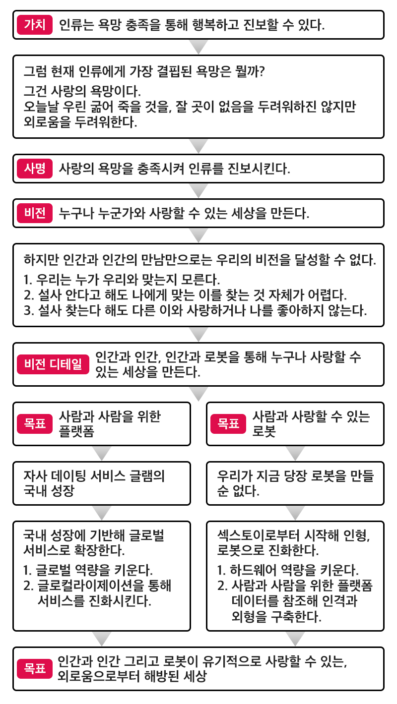

우린 사람들이 욕망에 충실해 자유로워지는 사회를 꿈꿉니다. 어떻게 보면 한국에서 데이팅 앱이 폭발적으로 성장하고 있는 건 이런 이유가 아닐까 합니다. 위에서 나열한 제약사항들을 극복해주거든요. 욕망에 솔직해도 뒷말 걱정이나 눈치 볼 필요도 없습니다.

혹자는 '소개팅 어플은 낭만적이지 않다'고 합니다. 하지만 사실 '낭만적'이라는 건 결과론적인 이야기입니다. 내가 누군가를 좋아하고 사랑하게 된다면 그 누군가와 뭐로 만났건, 뭘 먹었건, 그냥 집 앞 공원을 걸었건 그 사람은 60억분의 1이 되고 그 모든 것들은 낭만적으로 변하거든요. 우연히 명절 내려가는 버스 옆에 앉았던 그 사람보다 데이팅 앱으로 조금은 더 조건을 따져 만난 Fit한 그 사람이 더 낭만적일 수 있습니다. 그 Fit한 사람과 먹은 길거리 김밥이, 불편한 사람과의 회전 초밥보다 더 값집니다.

---
우리는 데이팅 서비스의 가치를 믿습니다. 왜냐면 그건 ‘너무나 쉽게’, ‘좋은 사람들을’, ‘잘' 만날 수 있게 해주거든요. 아직 데이팅 서비스의 비전에 대해 부정적이신가요? 시간이 갈수록 우린 점점 욕망에 충실해지고 있습니다. 문화는 절대 욕망을 이길 수 없습니다. 아쉬울 것이 없는 사람일수록 점점 더 데이팅 서비스를 이용하게 될 겁니다.

그렇게 데이팅 서비스가 점점 더 많은 유저와 정교한 알고리즘을 확보해간다면 '친구나 지인을 통한 만남의 퀄리티와 이를 위해 소요된 비용'과 '데이팅 앱 서비스를 통한 만남의 퀄리티와 이를 위해 소요된 비용'은 압도적으로 차이가 나게 될 것입니다. 그리고 그 '퀄리티와 비용'의 간극이 일정 이상 수준으로 커질 때 데이팅 서비스가 대중성을 띄게 되며 폭발적으로 성장하는 특이점을 경험할 수 있을 겁니다.

---
생리와 안전의 욕구가 채워진 현재 인류에게 '사랑의 욕망'은 여전히 채울 수 없는 갈증이기 때문입니다. 인구는 늘고 문명은 폭발적으로 성장했지만, 여전히 우리는 지인에게 소개팅을 부탁하고 길거리에서 번호를 물어보고 있죠. 상대가 누군지도 잘 모르면서. 정작 사랑의 욕구 충족 방식은 여전히 원시인의 그것과 다를 바 없어요. 1만 년 전에도 그랬을 겁니다. 머지않은 미래에서 돌이켜봤을 때 매우 원시적으로 여겨지지 않을까요? 그리고 누군가는 또 그렇게 여겨지도록 만들어야 하지 않을까요?

우린 큐피드의 대리자로서 이를 이루려 합니다. 그 시작으로 앞서 말씀드린 글램을 런칭해 누적 회원 100만 명을 돌파, 지난 2년 간 빠른 성장을 이뤄내며 런칭 2017년, 1년 만에 매일 10,000명이 넘는 유저들을 연결하고 있습니다. 자사와 자사 서비스인 글램의 이야기는 화제의 tvN 드라마 <이번 생은 처음이라>의 스토리로 방송되는 등 대중적으로 인기를 끌기도 했습니다. 그리고 이제는 한국 시장의 성공을 바탕으로 전세계 글로벌 진출을 위한 대대적인 준비에 있습니다.

---

많은 기업이 데이팅 서비스를 '캐시 카우'정도로 쉽게 생각합니다. 데이팅 서비스는 사람과 사람의 만남이기에 그 어떤 서비스보다 기술적으로 진보된 알고리즘이 필요하며, 또 손쉬운 만남을 위해 매우 직관적이고 단순한 디자인이 필요합니다. 또한, 인식 변화와 시장 경쟁을 위한 철저한 브랜딩과 마케팅 전략 역시 빠질 수 없습니다. 우리에게 데이팅 서비스는 돈을 위한 '캐시 카우'가 아니라 사명 달성을 위한 '존재 이유 중 하나'입니다.

미래는 어떨까요? 머지않은 미래에는 지금과 같은 사랑의 욕망 충족 방식이 매우 원시적으로 여겨질 것입니다. 우리가 한 끼 식사를 통해 생리적 욕망을 쉽게 충족하는 것처럼 사랑의 욕망 충족 또한 매우 쉽게 이뤄질 것입니다. 그리고 그렇게 되어야만 합니다. 사랑의 욕망이 충족된다면 인류는 더욱 행복하고 진보할 수 있으니까요.

--- 
## 7가지 기업 맥락과 나
### 사명감 : '에스프레소맨'
- 개인주의 < 전체지향적인 동료
- 남의 말을 들지 않는 슈퍼스타보다 헌신적인 일반 팀원을 선호
- 직무보단 적성, 적성보단 가치관이 우선

### 자율 : '기존의 업무 방식과 흡사'
- 기업의 비전과 KPI에 따라 스스로 세부 KPI를 설정하고 이행하는 인재를 지향

### 하드코어 : '궁즉통'
- 어떻게든 목적을 이루려는 동료, 미래는 바꿀 수 있다고 믿는 동료를 지향

### 책임 : '칼을 뽑았으면 무라도 썰어야지, 빠른 인정'
- 스스로 설정한 KPI를 지키는 동료, 자신의 행동에 대한 책임을 지는 동료, 자신의 잘못을 다른 사람에게 잘못을 전가하지 않는 동료를 지향

### 성장 : '작년 한 해 들었던 데이터 관련 강의 15개
- 당장의 실력보다 앞으로 자신의 분야에서 일류가 되기를 원하는 동료, 피드백을 통해 성장하며, 또 피드백을 재공해 팀원을 성장하게 하는 동료를 지향

### 퍼포먼스 : 데이터를 판매하여 회사 이익에 기여한 경험
- 실제 성과를 창출해내는 동료를 지향

### 커뮤니케이션 : 카카오 김범수 의장의 교훈
- 직설적이며 적극적인 피드백으로 소통할 수 있는 동료를 선호

---
이렇게 공고를 상세히 기술한 이유는 우리는 단순히 일을 시킬 사람이 아닌, 함께 사명을 달성할 동료를 찾기 때문입니다. 돈을 버는 '생업', 직무를 위한 '직업'이 아닌 사명 달성을 위한 '소명'으로서의 지원자를 찾기 때문입니다. 우리는 무난한 100명의 기업보다는 하나 된 10명의 기업을 원하기 때문입니다. 우리는 최대한 구성원에게 What으로 얘기하지 않으려 합니다. 그 대신 Why로 소통하려 합니다. 그리고 그러한 소명 의식을 함께 하는 수준 높은 동료와 함께 일할 수 있다는 건 우리 생애 최고의 경험이 될 것입니다.

인간의 사랑과 소속감에 대한 욕망에 관련한 일이니만큼 그 과정은 재밌을 것입니다. 우리의 매칭 알고리즘, 앱 디자인, 마케팅 멘트 하나하나에 누군가가 인연이 될 수 있으니까요. 그건 정말 짜릿한 경험입니다. 

앞으로 우리가 일할 수 있는 시간은 길어야 30년 내외입니다. 대략 우리가 살아왔던 만큼 더 일 할 수 있다고 생각해보면 그리 긴 시간이 아닙니다. 생각보다 우리가 주어진 시간에 할 수 있는 일은 많지 않고 느끼신다면 '이번 생이 처음이라'면, 삶이란 좀 더 큰 무언가를 위해 존재해야 한다면 그 짧은 시간 동안 큐피스트로서 함께 사명을 이뤄보시지 않겠어요? 

- - -
# 4. Reference
1. [데이팅앱 춘추전국시대... 5천억 시장 열린다](http://www.zdnet.co.kr/view/?no=20180810192417)
2. [‘새로운 만남’도 ‘연애’도 스마트폰 앱에서 찾는 현대인들](http://www.openads.co.kr/nTrend/article/4888)
3. [‘하루에 16번 앱으로 이성 검색, 겨울이 가장 외롭다'](https://n.news.naver.com/article/025/0002890231)
4. [나도해, "그동안의 소개팅 어플은 어떠셨나요?"](http://www.e2news.com/news/articleView.html?idxno=207291)
5. [온라인 데이팅 앱 오케이큐피드에서 치명적 취약점 발견](https://www.boannews.com/media/view.asp?idx=76985)
6. [글램 국내 1위 고군분투기](https://brunch.co.kr/@iamzenon/11)
7. [‘이번 생은 처음이라’면 큐피스트와 함께하실래요?](https://brunch.co.kr/@iamzenon/3)
8. [큐피스트 데쓰벨리 탈출기](https://brunch.co.kr/@iamzenon/1)
9. [The Back Story: Dating Preferences & Age](https://theblog.okcupid.com/the-case-for-an-older-woman-99d8cabacdf5)

---
# 5. Future ...
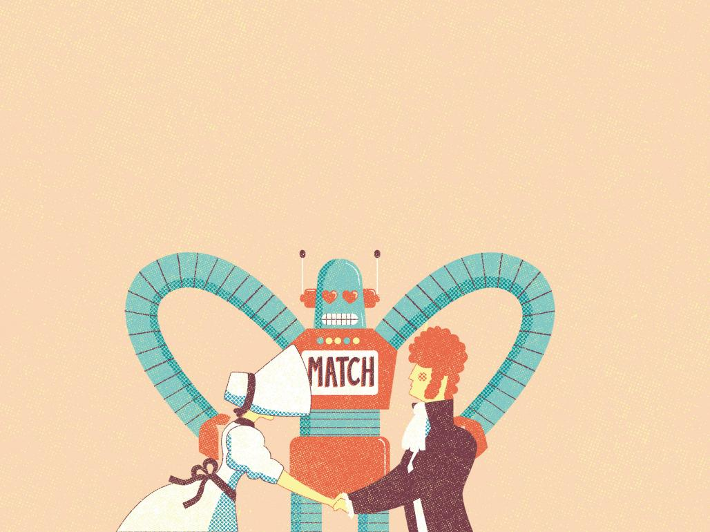
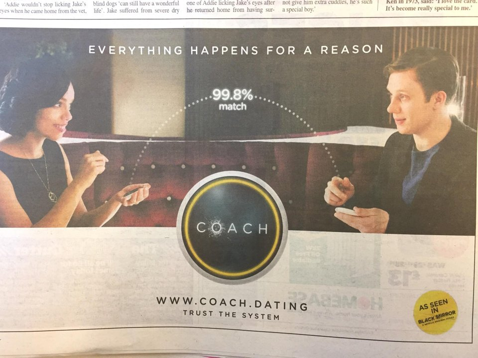
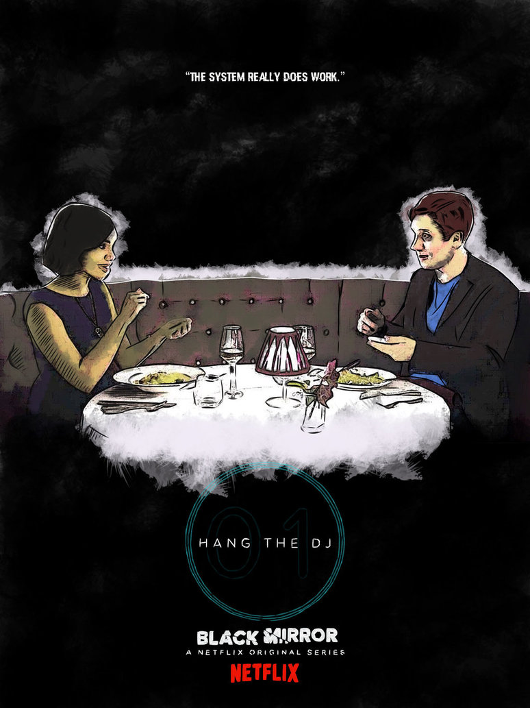
