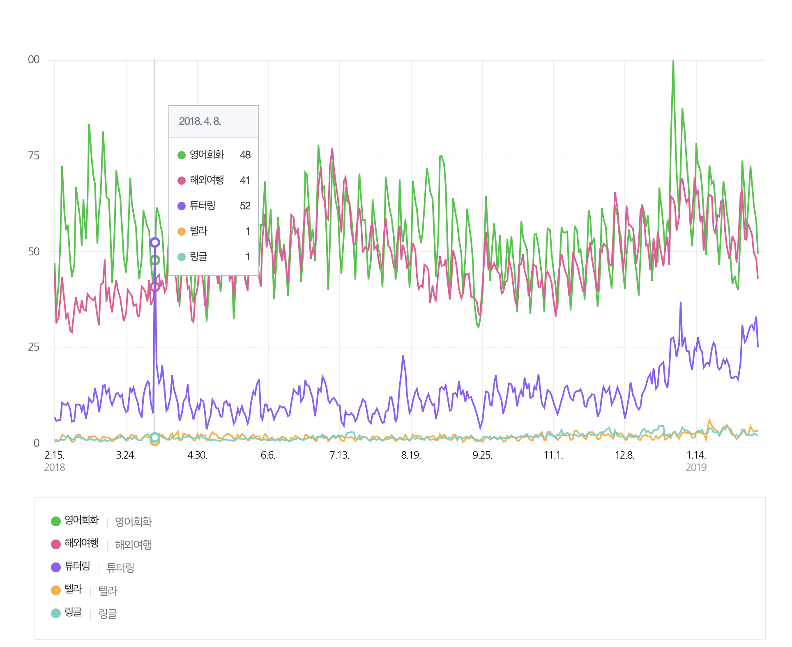
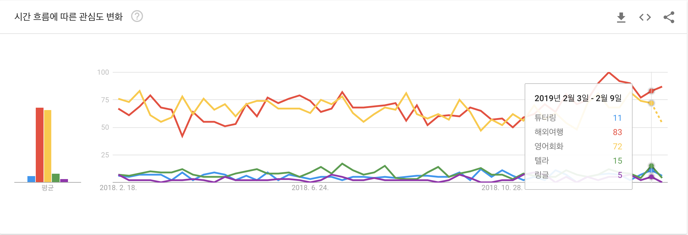
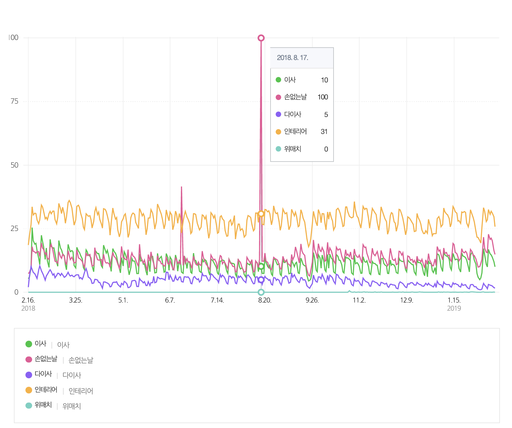
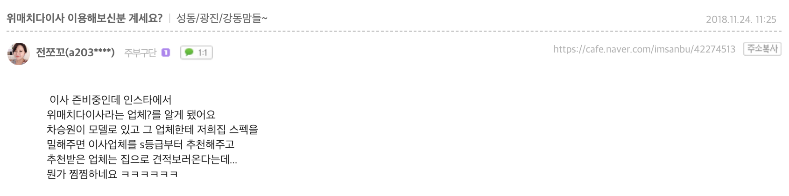
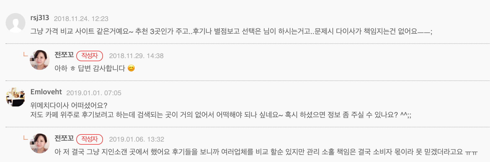
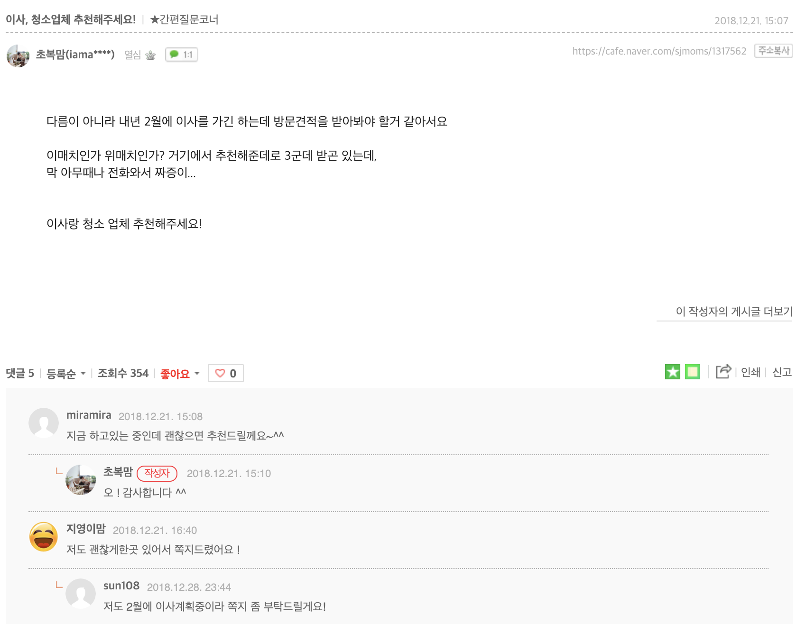
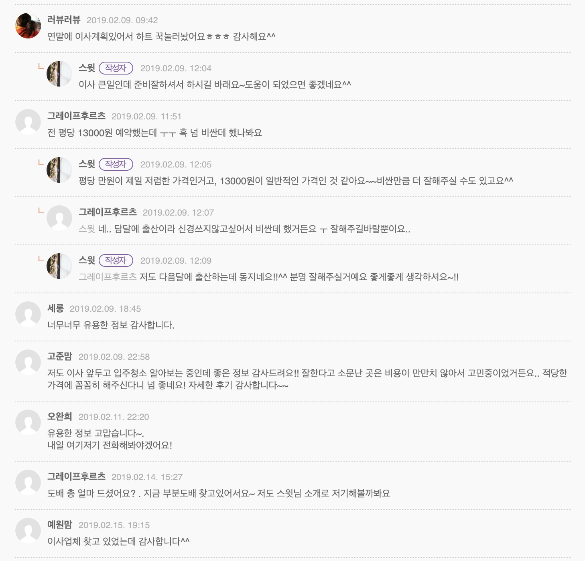

# Market Designers
## 1. Intro

- ‘원하는 시간에 원하는 내용’에 대해 바로 도움을 받을 수 있는 서비스

### 1.1. Edutech : 영어
- 국내 영어 시장 개요
    - 시장 규모
        - 사교육 시장 : 17조 8,000억 원(과외시장 포함하면 33조 원)
        - 성인 대상 영어 교육시장 :7,200억 원
        - 성인 대상 영어 회화 시장 : 약 3,000억 원
        - 주요 고객 연령층 : 30대, 40대, 20대, 50대 (직장인, 가정주부)
    - 트렌드
        - 시험을 위한 영어 공부 -> 실질적 회화 능력
            - 기존 어학 교육 빅3의 하락세
                - 근거자료 : YBM(766->575->억원), Pagoda의 매출 감소(709억 원 -> 506억 원)
                - 기준년도 : 2016~2017년
        - 하루 10분, 평생 수강, 패키지
    
    - 플레이어
        - 야나두, 스피킹맥스, 시원스쿨, 영단기, 스터디서치, 월스트리트 인스티튜트, 패스트원, ybm, 파고다, 파이널리스피크, 미티영, 리얼클래스, 브릿잉글리쉬, 슈퍼팬, 링글, 텔라, 캠블리
    

### 1.2. Moving : 포장이사업
- 화물자동차운수사업법
- 시장 규모 : 4.5조원(1.5~2조원)
- 한해 평균 이동 인구 : 약 715만 명
- 1회 평균 포장이사 비용 : 약 170만원
- 플레이어
    - 전략 제휴
        - 짐카
            - 원룸이사 전문 (2톤 이하 이사만 가능)
            - 타겟 : 20~30대 1인 가구
            - 자체 이사 서비스 제공 (라이트, 베이직, 플러스, 파트너)
            - 이사 가능 지역 : 서울, 인천, 경기
            - 누적 견적 수 : 19,723 건
            - 투자금액 : 1억5천만원 + @
            
        - 이사모아 : 이사 업체 중계 서비스
            - 이사 경험 : 170,390건
                - 서울지역 누적 건수 : 35,218건
                - 월 5,000명의 고객?
                - 평균 포장이사 단가 : 105만원
                - 평균 용달 단가 : 15만원
                - 이사후기 : 2천 건
            - 누적투자금액 : 10억원
            - 특징 : 이사꿀팁
            
        
    - 짐싸
        - 원룸이사 전 문(이사 견적비교 서비스)
        - 타겟 : 20~30대 1인 가구
        - 누적 견적금액 : 2,163억
        - 누적 견적 수 : 747,038건
        - 이사 요청수 : 203,253건
        - 누적 앱 다운로드 수 : 20만 건
        - 투자금액 : 10억원 (빅베이슨캐피탈, TIPS 프로그램)
        - 특징 : 이사박스, 짐싸 파트너

- 기사 발췌
    - "이사를 처음 경험하는 이들은 무엇이 중요한 요소인지 잘 모르는 경우도 있고, 단순히 가격만 비교하다가는 A씨의 사례처럼 서비스를 불렀음에도 자신이 노동해야 하는 일도 발생할 수 있다."
    - 성장 요인에 대해 "정보의 부족 등으로 이사가격이 정확하게 정해지지 않아, 기존에는 컴퓨터에 접속해야만 견적을 의뢰하고 볼 수 있었지만 이는 즉시성이 떨어진다는 단점이 있었다"며 "하지만 최근 스마트폰의 등장 등 모바일이 성장하면서 언제 어디서나 이사업체 견적을 확인하고 연락할 수 있다"
    - 결론을 말하자면 짐카는 셀프이사를 원하는 자취하는 학생이나 처음 독립을 하는 사회초년생에게는 적합하지만, 짐 포장을 할 시간이 없는 직장인이나 오랜 1인가구 생활로 짐이 늘어난 사람들에게는 적합하지 않게 느껴졌다.  

    - 온라인 상에서 짐카의 입소문이 좋은 이유가 SNS나 후기 작성에 적극적인 젊은 층이 많이 이용하기 때문으로도 추측할 수 있다.
    
    - 기자는 그 중 근무시간을 고려해 아침시간에 직접 집으로 견적사항을 확인하러온 다른 업체를 선택했다. 해당 업체에서는 기자가 여성임을 배려해 여성플래너를 배치하는 배려까지 보였다.

- 중계서비스의 약점
    - 소비자 - 이사업체와의 갈등 (미스매치)
    
---
## 2. Tutoring
- 사업모델 : 1:1 영어회화 매칭 서비스 (P2P)
- 언어 : 영어, 중국어
- 이슈
    - 마켓디자이너스와 합병 (2018.08)
- 수치로 보는 튜터링
    - 회원 수 : 589,791명
    - 토픽카드 : 650종
    - 전문튜터 : 750명
    - 1:1 레슨 : 1,650,641회
    - 앱 다운로드 : 1,502,970명
    - 누적 투자금액 : 80억 (DSC 인베스트먼트, LB인베스트먼트, KB인베스트먼트) 
    - 월 매출 5억 (2018년 8월 기준)

- 미션
    - '경제력이 교육을 지배하지 않는 세상을 만든다’는 우리 기업의 미션과 같이 1%만 누리던 고급 과외 서비스를 99%의 대중도 좀 더 편리하고 부담 없이 즐길 수 있도록'

- 브랜드 캠페인
    - '요즘 영어공부'
        - 24시간 언제 어디서든 학생이 직접 튜터를 선택해 공부할 수 있는 튜터링의 특장점을 강조
        - 기존 영어회화 학습과 달리, 시간-장소 제한 없는 튜터링
        - 유명 모델 기용 : 브랜드 인지도 높이기 전략

- 서비스 요약
    - 튜터링은 일대일로 원어민 강사에게 영어를 배울 수 있는 회화 앱.
    - 몇시 건 앱만 켜면 24시간 원어민 튜터와의 1:1 영어수업이 가능
    - 새벽이나 친구를 기다리는 자투리 시간에도 면접, 시험, 취미 등 관심 있는 주제의 1:1 대화가 가능해, 잦은 야근과 약속으로 영어학원을 빼먹기 일 수인 사람에게 유용.
    - 튜터(강사) 또한 프로필을 보고 직접 선택할 수 있다.
    - 튜터는 수업 중에는 모바일 전용 토픽 카드를 보며 실시간 첨삭을 제공하며, 수업 후, 발음, 문법, 표현, 유창함, 자신감 등에 대해 진단해주므로, 영어실력 향상을 위해 어떤 부분에 집중해야 하는지 파악할 수 있다.

- 궁금한 점
    - 개인화 학습 튜터링, 백엔드 지능형 시스템?
    - 수만가지 커리큘럼?
    - 유아-학령층을 위한 영어 콘텐츠 확장 계획은?
    - 리텐션은? 이탈율은?

- 4월 8일 전후에 검색량이 높게 나온 이유는 뭘까?
    - 직원이면 다양한 곳에서의 내부 데이터를 들여다볼 수 있을 것 같은데...
    - 여러 가지 가설 : 마케팅이 잘 됐거나, 내부 작업이거나, 외부에서 광고 자금 소진을 위해?
- 네이버 : 튜터링 > 텔라
- 구글 : 튜터링 < 텔라
- 재밌는 사실 : 해외여행과 영어회화는 비슷하게 높지만 둘 중 하나가 올라가면 하나는 내려가는 경향을 보인다.

---
## 3. Wematch 다이사
- 사업 아이템 : 빅데이터 기반 이사/청소/대출 매칭 플랫폼
- 수치로 보는 위매치 다이사
    - 이사 거래액 : 3,306억원
    - 누적 이용자 수 : 60만 명 (방문자수 약 413만 명)
    - 누적 이사 매칭 수 : 581,348건
    - 이용자수 : 32만명(2018년 기준, 전년대비 86% 증가, 누적이용자수 60만명)
    - 이사업체 수 : 1580개
    - 이사 매칭 월 평균 3.1만 건

- 특징
    - 실제 이사업체를 이용한 유저를 직접 컨택하여 모은 평가 데이터를 기반으로, 평가 시스템을 통해 '소비자평가등급'을 소비자에게 투명하게 제공.
    - 스마트물류의 앞단인 ‘데이터 수집 및 분석’에 중점을 두고 있는 만큼, 자사 시스템을 통해 수집된 데이터는 사내 DSL(Data Science Lab)을 거쳐 수요분석에 따른 요금제 등과 같은 다양한 결과물로 산출되며 관련 정보를 통해 정보 불균형이 심화된 시장에 선순환 구조를 만든다는 것이다.
    - 회사는 최근 이사업체에서 선호하는 특정 지역에서 안정적으로 많은 이사 고객을 확보할 수 있는 상품인 ‘프리미엄 정액제’를 개발해 시범 운영 중인 점을 언급, 소비자와 이사업체 모두에게 필요한 서비스 상품을 지속 개발할 계획이라고 밝혔다.
    
    - 알아두면 좋을 정보 (달력, 체크리스트, 꿀팁>
- 궁금한 점
    - 초기에 어떻게 수집을 했는지? (콜드 스타트), 어떤 지표들로 평가를 하는지?
    - 신뢰할 수 있는 정보제공자
    

#### 리스크
    - 어려운 부분 : 맘카페, 업체 --> 지인 추천 선호
        - 대부분의 소비자들은 몇 년에 한 번이나 있을법한 큰 행사인 이사를 이왕이면 믿고 신뢰할 수 있는 이사서비스 업체에 맡기고자 하는 신중함을 보이고 있다.
    - 이사를 많이하는 시즌이 되기 전에 타겟이 있는 곳에 집중적으로 광고/제휴를 한다든지
    - 소비자 영상, 후기, 캠페인을 꾸준히 올려서 인지도를 상승시킬 필요가 보임.
    - <Happy디자이너스>는 아주 좋은 캠페인
    
    

---

## 4. Reference
- [위매치다이사, 2018 거래액 1690억…누적 3천억 넘어
](https://platum.kr/archives/114062)
- [에듀테크 기업 ‘튜터링’, 마켓디자이너스와 합병](https://platum.kr/archives/104597)
- [190조 규모 글로벌 온라인 과외 시장 급성장, 국내선 온디맨드 모바일 과외 서비스 ‘튜터링’ 한해 30배 성장](http://www.newstap.co.kr/news/articleView.html?idxno=68629)
- [글로벌 온라인 과외 시장 190조원 급성장…국내 스타트업 튜터링 주목](http://www.mashupangels.com/%EA%B8%80%EB%A1%9C%EB%B2%8C-%EC%98%A8%EB%9D%BC%EC%9D%B8-%EA%B3%BC%EC%99%B8-%EC%8B%9C%EC%9E%A5-190%EC%A1%B0%EC%9B%90-%EA%B8%89%EC%84%B1%EC%9E%A5-%EA%B5%AD%EB%82%B4-%EC%8A%A4%ED%83%80%ED%8A%B8/)
- [소비자평가 리포트 : 토익에서 '말하기'로...변화하는 영어 교육 시장](http://www.iconsumer.or.kr/news/articleView.html?idxno=5017)
- [마켓인 : 성장가도 달리는 영어교육시장…투자열기도 후끈
](http://www.edaily.co.kr/news/read?newsId=01462886619142336&mediaCodeNo=257)
- [스타트업, UX관리자에게 필요한 5가지](https://ppss.kr/archives/186393)
- [‘새해 목표’ 영어공부, 회화 앱으로 영어 울렁증 ‘극복’](http://gametoc.hankyung.com/news/articleView.html?idxno=50684)
- ['마켓컬리' 전지현 광고효과 톡톡, 스타트업도 광고에 톱스타 기용](http://www.businesspost.co.kr/BP?command=article_view&num=113609)
- [튜터링 투자에서 엑시트까지](https://liveandventure.com/2018/08/12/tutoring/)
- [한해 30배 성장하는 동안 우리에게 일어난 일들](https://brunch.co.kr/@insight-kmh/17)
- [스타트업 얼라이언스 임정욱 센터장님 페이스북 게시글](https://www.facebook.com/684762124/posts/10156503774537125/)
- [마켓플레이스와 서비스 플랫폼의 차이](https://brunch.co.kr/@insight-kmh/26)
- [네이버 검색어 트렌드 : 영어회화](https://datalab.naver.com/keyword/trendResult.naver?hashKey=N_c74527ec567c919d711124833fb5d6c4)
- [네이버 검색어 트렌드 : 이사](https://datalab.naver.com/keyword/trendResult.naver?hashKey=N_50863677abeb20b470749175fc1841c1)
- [구글 트렌드 : 영어회화](https://trends.google.co.kr/trends/explore?geo=KR&q=%ED%95%B4%EC%99%B8%EC%97%AC%ED%96%89,%EC%98%81%EC%96%B4%ED%9A%8C%ED%99%94,%ED%8A%9C%ED%84%B0%EB%A7%81,%ED%85%94%EB%9D%BC,%EB%A7%81%EA%B8%80)
- [구글 트렌드 : 이사](https://trends.google.co.kr/trends/explore?geo=KR&q=%EC%9D%B4%EC%82%AC,%EC%9C%84%EB%A7%A4%EC%B9%98%EB%8B%A4%EC%9D%B4%EC%82%AC,%ED%8F%AC%EC%9E%A5%EC%9D%B4%EC%82%AC,%EB%8B%A4%EC%9D%B4%EC%82%AC,%EC%9D%B8%ED%85%8C%EB%A6%AC%EC%96%B4)
- [스타트업은 성장단계별로 다른 리더십을 요구합니다](https://outstanding.kr/startupleadership20181107/?fbclid=IwAR2sVa1gzyPeWQGK0M_J2a9i_WzpnHttNO3Ar51_qUPwqR4KE29FFB8xMmI#comment-72583)
- [이재홍의 회계인사이드 : 2017년, 2조 7000억 포장이사 대목이 온다](http://clomag.co.kr/article/1817)
- [O2O가 뜬다 : 1인 가구 이사서비스 '짐카' vs 이사업체 견적비교 '이사모아', 특징은?](http://www.dailypop.kr/news/articleView.html?idxno=19619)
- [솔직체험기 : '이사말고, 짐카'를 선택하지 않은 이유](http://www.dailypop.kr/news/articleView.html?idxno=21703)
- [이사 견적비교 서비스 ‘짐싸’, 누적 이사 신청 20만 건 넘어](https://platum.kr/archives/116187)

---

## 5. 앞으로 생각해봐야할 점
### 소비자는 무엇을 원하는가?
#### 내가 영어 공부를 한다면... 내가 이사를 한다면... 내가 이사 서비스를 이용한다면... 내가 대출을 받는다면...
#### 자사 서비스와, 경쟁 서비스를 충분히 이용해보고, 소비자 인터뷰도 해야 더욱 날카로운 비즈니스가 될 수 있을 듯.

---

  