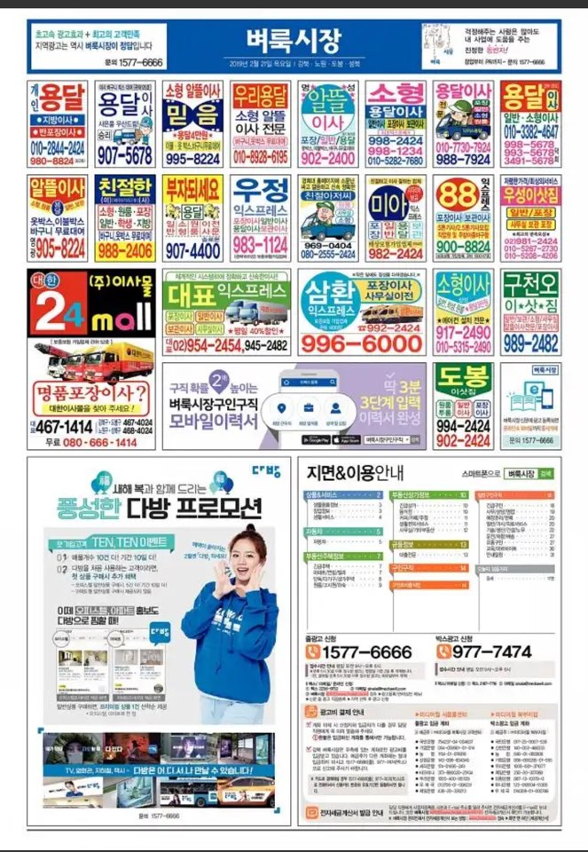

# Market Designers
## 1. Intro

- 배경 : 수요-공급 시장의 정보 비대칭성(레몬마켓)을 해결하기 위해 나온 서비스
    - 사람들에게 합리적인 의사결정을 도와주는 서비스
    - 중요한 요소 : 신뢰성을 기반으로 선순환 생태계 구축, 시장 상향평준화 및 시장 활성화
    - **스타트업 캠퍼스**시절 정보 비대칭성을 해결하기 위해 비즈니스 모델 제안하던 때가 떠올랐음. 취지와 철학이 잘 맞을 것 같음!
- 1줄 요약 : ‘원하는 시간에 원하는 내용’에 대해 바로 도움을 받을 수 있는 서비스

### 1.1. Edutech : 영어
- 국내 영어 시장 개요
    - 시장 규모 (자료 출처는 Reference의 링크)
        - 사교육 시장 : 17조 8,000억 원 (과외 시장 포함하면 33조 원)
        - 성인 대상 영어 교육시장 :7,200억 원
        - 성인 대상 영어 회화 시장 : 약 3,000억 원
            - 주요 고객 연령층 : 30대, 40대, 20대, 50대 (직장인, 가정주부)
    - 트렌드
        - 시험을 위한 영어 공부 -> 실질적 회화 능력
            - 기존 어학 교육 빅3의 하락세
                - 근거자료 : YBM(766->575억 원), Pagoda(709 -> 506억 원)의 매출 감소
                - 기준년도 : 2016~2017년
        - 하루 10분, 평생 수강, 패키지
    
    - 플레이어
        - 기존의 오프라인 업체 : YBM, Pagoda, 월스트리트 인스티튜트, 패스트원 등
        - 새로운 온라인 업체 (강의, 어플) : 시원스쿨, 야나두, 스피킹맥스, 영단기, 리얼클래스, 미티영, 파이널리스피크, 슈퍼팬, 브릿잉글리쉬
        - 오프라인 중계 플랫폼(영어에 특화) : 스터디서치... 추후에 탈잉, 러닛같은 오프라인 스터디 모임 플레이어들과 경쟁할 수도 있음.
        - 영어 회화 특화(중계) 어플 : 링글, 텔라(텍스트 기반), 캠블리
    
### 1.2. Moving : 포장이사업
- 업종 : 화물자동차운수사업법
- 시장 규모 : 4.5조원
- 한해 평균 이동 인구 : 약 715만 명
- 1회 평균 포장이사 비용 : 약 170만원
- 플레이어
    - 전략 제휴형
        - 1. 짐카
            - 원룸이사 전문 (2톤 이하 이사만 가능)
            - 타겟 : 20~30대 1인 가구
            - 이사 가능 지역 : 서울, 인천, 경기
            - 누적 견적 수 : 19,723 건
            - 투자금액 : 1억5천만원 + @(비공개)
            - 특징 : 자체 이사 서비스 제공 (라이트, 베이직, 플러스, 파트너)
            
        - 2. 이사모아 : 이사 업체 중계 서비스
            - 이사 경험 : 170,390건
                - 서울지역 누적 건수 : 35,218건
                - 월 5,000명의 고객?
                - 평균 포장이사 단가 : 105만원
                - 평균 용달 단가 : 15만원
                - 이사후기 : 2천 건
            - 누적투자금액 : 10억원
            - 특징 : 이사꿀팁
            
    - 3. 짐싸
        - 원룸이사 전 문(이사 견적비교 서비스)
        - 타겟 : 20~30대 1인 가구
        - 누적 견적금액 : 2,163억
        - 누적 견적 수 : 747,038건
        - 이사 요청수 : 203,253건
        - 누적 앱 다운로드 수 : 20만 건
        - 투자금액 : 10억원 (빅베이슨캐피탈, TIPS 프로그램)
        - 특징 : 이사박스, 짐싸 파트너

- 기사 발췌 (소비자 인사이트)
    - "이사를 처음 경험하는 이들은 무엇이 중요한 요소인지 잘 모르는 경우도 있고, 단순히 가격만 비교하다가는 A씨의 사례처럼 서비스를 불렀음에도 자신이 노동해야 하는 일도 발생할 수 있다."
    - 성장 요인에 대해 "정보의 부족 등으로 이사가격이 정확하게 정해지지 않아, 기존에는 컴퓨터에 접속해야만 견적을 의뢰하고 볼 수 있었지만 이는 즉시성이 떨어진다는 단점이 있었다"며 "하지만 최근 스마트폰의 등장 등 모바일이 성장하면서 언제 어디서나 이사업체 견적을 확인하고 연락할 수 있다"
    - 결론을 말하자면 짐카는 셀프이사를 원하는 자취하는 학생이나 처음 독립을 하는 사회초년생에게는 적합하지만, 짐 포장을 할 시간이 없는 직장인이나 오랜 1인가구 생활로 짐이 늘어난 사람들에게는 적합하지 않게 느껴졌다.  

    - 온라인 상에서 짐카의 입소문이 좋은 이유가 SNS나 후기 작성에 적극적인 젊은 층이 많이 이용하기 때문으로도 추측할 수 있다.
    
    - 기자는 그 중 근무시간을 고려해 아침시간에 직접 집으로 견적사항을 확인하러온 다른 업체를 선택했다. 해당 업체에서는 기자가 여성임을 배려해 여성플래너를 배치하는 배려까지 보였다.

- 중계 서비스의 리스크 (관리해야할 부분)
    - 소비자 - 이사업체와의 갈등 (미스매치)
    - 소비자에게는 소비자가 원하는 서비스(편리성, 정확성), 공급자와 상생(ex. 배민 아카데미).
    - 치믈리에 자격시험처럼 소비자들에게 재미를 주는 경험을 제공하는 것도 하나의 마케팅과 브랜딩을 올리는 방법이 될 수 있음.
    
---
## 2. Tutoring
- 사업모델 : 1:1 영어회화 매칭 서비스 (P2P)
- 언어 : 영어, 중국어
    - 궁금한 점 : 유아-학령층을 위한 영어 콘텐츠 확장 계획은?
- 수치로 보는 튜터링
    - 회원 수 : 589,791명
    - 토픽카드 : 650종
    - 전문튜터 : 750명
    - 1:1 레슨 : 1,650,641회
    - 앱 다운로드 : 1,502,970명
    - 누적 투자금액 : 80억 (DSC 인베스트먼트, LB인베스트먼트, KB인베스트먼트) 
    - 월 매출 5억 (2018년 8월 기준), 마켓디자이너스 1월 1일 1매출 1억 달성(2019년 01월 01일 기준)

- 미션
    - '경제력이 교육을 지배하지 않는 세상을 만든다’는 우리 기업의 미션과 같이 1%만 누리던 고급 과외 서비스를 99%의 대중도 좀 더 편리하고 부담 없이 즐길 수 있도록' --> **서울라이트러닝**을 운영하던 시절의 철학과 맞아 떨어져서 좋음!

- 브랜드 캠페인
    - '요즘 영어공부'
        - 24시간 언제 어디서든 학생이 직접 튜터를 선택해 공부할 수 있는 튜터링의 특장점을 강조
        - 기존 영어회화 학습과 달리, 시간-장소 제한 없는 튜터링
        - 유명 모델 기용 : 브랜드 인지도 높이기 전략

- 궁금한 점
    - 개인화 학습 튜터링, 백엔드 지능형 시스템?
    - 리텐션은? 체류시간은? 이탈율은? --> 깊이 파서 분석해보고 싶음.

- 4월 8일 전후에 검색량이 높게 나온 이유는 뭘까?
    - 직원이면 다양한 곳에서의 내부 데이터를 들여다볼 수 있을 것 같은데...
    - 여러 가지 가설 : 마케팅이 잘 됐거나, 내부에서 작업을 했거나, 외부 경쟁업체에서 광고 자금 소진을 위해?
- 네이버 : 튜터링 > 텔라
- 구글 : 튜터링 < 텔라
- 재밌는 사실 : 해외여행과 영어회화는 비슷하게 높지만 둘 중 하나가 올라가면 하나는 내려가는 경향을 보인다.

---
## 3. Wematch 다이사
- 사업 아이템 : 빅데이터 기반 이사/청소/대출 매칭 플랫폼
- 1줄 요약 : 신뢰할 수 있는 정보 제공자
- 수치로 보는 위매치 다이사
    - 이사 거래액 : 3,306억원
    - 누적 이용자 수 : 60만 명 (방문자수 약 413만 명)
    - 누적 이사 매칭 수 : 581,348건
    - 이용자수 : 32만명(2018년 기준, 전년대비 86% 증가, 누적이용자수 60만명)
    - 이사업체 수 : 1580개
    - 이사 매칭 월 평균 3.1만 건

- 기사 발췌
    - 마켓디자이너스는 30~40대 여성을 타깃으로 이사, 청소, 금융, 교육, 중고차, 부동산 등 '레몬마켓'의 정보 비대칭을 해소하는 서비스 플랫폼을 제공한다. 같은 기간 직원 수 58명에서 109명으로 증가했다. 이 관계자는 “플랫폼, 개발 회사이다보니 아무래도 이공계열이 절반 정도를 차지한다”며 “신입보단 경력자들 위주로 채용했다”고 설명했다.

- 특징
    - 실제 이사업체를 이용한 유저를 직접 컨택하여 모은 평가 데이터를 기반으로, 평가 시스템을 통해 '소비자평가등급'을 소비자에게 투명하게 제공.
    - 스마트물류의 앞단인 ‘데이터 수집 및 분석’에 중점을 두고 있는 만큼, 자사 시스템을 통해 수집된 데이터는 사내 DSL(Data Science Lab)을 거쳐 수요분석에 따른 요금제 등과 같은 다양한 결과물로 산출되며 관련 정보를 통해 정보 불균형이 심화된 시장에 선순환 구조를 만든다는 것이다.
    - 회사는 최근 이사업체에서 선호하는 특정 지역에서 안정적으로 많은 이사 고객을 확보할 수 있는 상품인 ‘프리미엄 정액제’를 개발해 시범 운영 중인 점을 언급, 소비자와 이사업체 모두에게 필요한 서비스 상품을 지속 개발할 계획이라고 밝혔다.
    - 알아두면 좋을 정보 (달력, 체크리스트, 꿀팁)
    
- 궁금한 점
    - 초기에 어떻게 수집을 했는지? (콜드스타트)
    - 어떤 지표들로 평가를 하는지?
    

---
## 4. Feedback
### 4.1. 이탈된 사람 끌어들이기
- 이사 날짜 실패 : 홈 버튼 말고, 다른 이사날짜 찾기(질문형으로 말 걸듯이, “다른 날짜 찾아보시겠어요?” 문구도 AB테스트 or “오전에 다시 해보세요.”라는 안내멘트 넣어주면 좋지 않을까?)
- 중간에 이탈하면 바로 이전에 입력한 정보까지 저장하고 언제든지 다시 불러올 수 있게 save(최대 1주일)

### 4.2. 주소 검색, 부가 정보 관련
- 주소 api : 도로명 주소도 가능하게끔!
- 층만 입력하기 보다는 조금 더 세분화된 주택형태를 기입하게 하는 건 어떨까? -> 주소 검색 후에 건물형태, 방구조, 옥탑 여부, 복층여부, 정차 가능 여부, 엘베 가능 여부

- 연락 가능한 시간대 : 여러 시간대를 선택하는 건 어떨까?
    - 짐카 : 이 부분에서 날짜/시간 선택!, 총 이동거리 안내... 요일별 희망시간 선택(8~9, 12~13, 16, 18시 이후) -> 내 짐 체크 ... 비용적인 부분은 비슷비슷함 예상견적 38만원.

### 4.3. 후기(평가지표) 관련
- 견적업체 후기 : 더보기 기능이 있었으면 더 좋을 것 같다!
- 후기를 좀 더 세분화해서 받는 건 어떨까? -> 분쟁 건수 파악할 수 있는 지표(공정위 시정 조치 처럼...?)
- 평가 지표 : 전문성, 친절도, 가격도 -> 만족한 부분은? 불만족한 부분은? 적당한 가격은?(5만원 단위로)

### 4.4. 기타 사항
- (카카오 알림톡) 업체 상세 정보 : url 개인정보가 나와 있는데 괜찮을까?
- (콜드스타트) 추천을 위해 성별과 나이도 받는게 어떨까? 물론 선택사항으로... 지그재그(나이), 브랜디(나이, 성별), 짐카(나이, 성별)

### 4.5. 30-40 여성 타겟
- 타겟들이 자주 모이는 곳 : 키즈카페, 카페, 맘카페 등등
- 그들이 모인 곳에서 설문조사, FGI, 이벤트 진행하면서 긍정적인 관계를 구축하는 것도 좋을 듯!

---
## 5. Reference
- [위매치다이사, 2018 거래액 1690억…누적 3천억 넘어
](https://platum.kr/archives/114062)
- [에듀테크 기업 ‘튜터링’, 마켓디자이너스와 합병](https://platum.kr/archives/104597)
- [190조 규모 글로벌 온라인 과외 시장 급성장, 국내선 온디맨드 모바일 과외 서비스 ‘튜터링’ 한해 30배 성장](http://www.newstap.co.kr/news/articleView.html?idxno=68629)
- [글로벌 온라인 과외 시장 190조원 급성장…국내 스타트업 튜터링 주목](http://www.mashupangels.com/%EA%B8%80%EB%A1%9C%EB%B2%8C-%EC%98%A8%EB%9D%BC%EC%9D%B8-%EA%B3%BC%EC%99%B8-%EC%8B%9C%EC%9E%A5-190%EC%A1%B0%EC%9B%90-%EA%B8%89%EC%84%B1%EC%9E%A5-%EA%B5%AD%EB%82%B4-%EC%8A%A4%ED%83%80%ED%8A%B8/)
- [소비자평가 리포트 : 토익에서 '말하기'로...변화하는 영어 교육 시장](http://www.iconsumer.or.kr/news/articleView.html?idxno=5017)
- [마켓인 : 성장가도 달리는 영어교육시장…투자열기도 후끈
](http://www.edaily.co.kr/news/read?newsId=01462886619142336&mediaCodeNo=257)
- [스타트업, UX관리자에게 필요한 5가지](https://ppss.kr/archives/186393)
- [‘새해 목표’ 영어공부, 회화 앱으로 영어 울렁증 ‘극복’](http://gametoc.hankyung.com/news/articleView.html?idxno=50684)
- ['마켓컬리' 전지현 광고효과 톡톡, 스타트업도 광고에 톱스타 기용](http://www.businesspost.co.kr/BP?command=article_view&num=113609)
- [튜터링 투자에서 엑시트까지](https://liveandventure.com/2018/08/12/tutoring/)
- [한해 30배 성장하는 동안 우리에게 일어난 일들](https://brunch.co.kr/@insight-kmh/17)
- [스타트업 얼라이언스 임정욱 센터장님 페이스북 게시글](https://www.facebook.com/684762124/posts/10156503774537125/)
- [마켓플레이스와 서비스 플랫폼의 차이](https://brunch.co.kr/@insight-kmh/26)
- [네이버 검색어 트렌드 : 영어회화](https://datalab.naver.com/keyword/trendResult.naver?hashKey=N_c74527ec567c919d711124833fb5d6c4)
- [네이버 검색어 트렌드 : 이사](https://datalab.naver.com/keyword/trendResult.naver?hashKey=N_50863677abeb20b470749175fc1841c1)
- [구글 트렌드 : 영어회화](https://trends.google.co.kr/trends/explore?geo=KR&q=%ED%95%B4%EC%99%B8%EC%97%AC%ED%96%89,%EC%98%81%EC%96%B4%ED%9A%8C%ED%99%94,%ED%8A%9C%ED%84%B0%EB%A7%81,%ED%85%94%EB%9D%BC,%EB%A7%81%EA%B8%80)
- [구글 트렌드 : 이사](https://trends.google.co.kr/trends/explore?geo=KR&q=%EC%9D%B4%EC%82%AC,%EC%9C%84%EB%A7%A4%EC%B9%98%EB%8B%A4%EC%9D%B4%EC%82%AC,%ED%8F%AC%EC%9E%A5%EC%9D%B4%EC%82%AC,%EB%8B%A4%EC%9D%B4%EC%82%AC,%EC%9D%B8%ED%85%8C%EB%A6%AC%EC%96%B4)
- [스타트업은 성장단계별로 다른 리더십을 요구합니다](https://outstanding.kr/startupleadership20181107/?fbclid=IwAR2sVa1gzyPeWQGK0M_J2a9i_WzpnHttNO3Ar51_qUPwqR4KE29FFB8xMmI#comment-72583)
- [이재홍의 회계인사이드 : 2017년, 2조 7000억 포장이사 대목이 온다](http://clomag.co.kr/article/1817)
- [O2O가 뜬다 : 1인 가구 이사서비스 '짐카' vs 이사업체 견적비교 '이사모아', 특징은?](http://www.dailypop.kr/news/articleView.html?idxno=19619)
- [솔직체험기 : '이사말고, 짐카'를 선택하지 않은 이유](http://www.dailypop.kr/news/articleView.html?idxno=21703)
- [이사 견적비교 서비스 ‘짐싸’, 누적 이사 신청 20만 건 넘어](https://platum.kr/archives/116187)

---

## 6. 앞으로 생각해봐야할 점
### 6.1. 소비자는 무엇을 원하는가?
#### 내가 영어 공부를 한다면...  내가 이사를 한다면... 내가 대출을 받는다면...
#### 자사 서비스와, 경쟁 서비스를 충분히 이용해보고, 소비자 인터뷰도 해야 더욱 날카로운 비즈니스가 될 수 있을 듯.

### 6.2. 리스크는 무엇인가?
- 어려운 부분 : 맘카페, 업체 --> 지인 추천 선호
    - 대부분의 소비자들은 몇 년에 한 번이나 있을법한 큰 행사인 이사를 이왕이면 믿고 신뢰할 수 있는 이사서비스 업체에 맡기고자 하는 신중함을 보이고 있다.
- 이사를 많이하는 시즌이 되기 전에 타겟이 있는 곳에 집중적으로 광고/제휴를 한다든지
- 소비자 영상, 후기, 캠페인을 꾸준히 올려서 인지도를 상승시킬 필요가 보임.
- <Happy디자이너스>는 아주 좋은 캠페인, 광고 마케팅 전략에서도 공익성 캠페인은 1위 기업만이 할 수 있는 전략.

