# Data Engineering Extension School 1 Weeks (knj_1)
## Goal
- 클라우드와 온프레미스의 차이를 이해한다.
- AWS 클라우드 환경에서의 Network 구조를 이해한다.

## Table of Contents
1. 용어의 이해
2. 클라우드 서비스 이해
3. AWS 이해
4. AWS EC2 이해
5. IAM 권한 관리
6. VPC 생성

- - -
## 1. 용어의 이해
### 1.1. 데이터 엔지니어
- 다양한 데이터 소스로부터 의미있는 데이터를 추출, 변환하고 적재하는 시스템을 설계하고 구현하여 운영하는 사람

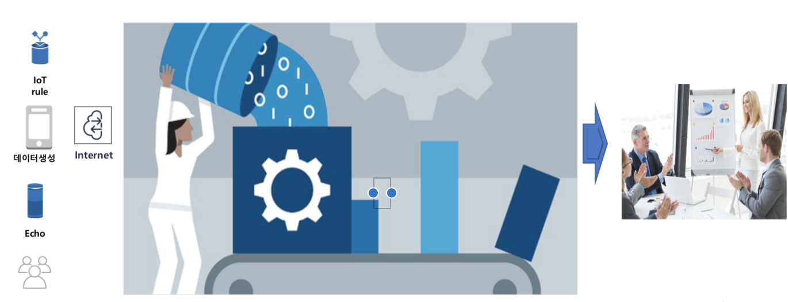

- 데이터를 잘 쌓고, 분석가들이 인사이트를 찾을 수 있도록 데이터를 제공해주는 역할
- Garbage In, Garbage Out : 잘 정제해야, 분석에 의미가 있다.

### 1.2. 온 프레미스
- 자사에 데이터센터를 두고 시스템 구축부터 운영까지 수행하는 형태
    - 자체 구축, 운용
    - 자체 보유 인프라 환경
    - 내부에 구축된 인프라
    - 자사에 데이터센터를 두고 시스템 구축부터 운영까지 수행하는 형태
    - 정보시스템을 사용자(주로 기업) 자신이 관리하는 설비 내에 도입, 설치, 운용하는 일
    - 서버, 네트워크 장비를 자사에서 조달하여 인프라를 구축하고 자사(또는 시스템 자회사)에서 운영함
    - 본래 매우 흔한 운용형태였음
    - IT 설비의 구축, 유지보수를 아웃소싱 하는 일이 많아지면서 기존 형태를 지칭하기 위해 사용되는 용어
    - 대략 클라우드 컴퓨팅의 반대 개념

### 1.3. 메타 데이터
- 데이터(data)에 대한 데이터
    - 데이터에 관한 구조화된 데이터로, 다른 데이터를 설명해 주는 데이터이다. 대량의 정보 가운데에서 찾고 있는 정보를 효율적으로 찾아내서 이용하기 위해 일정한 규칙에 따라 부여되는 데이터이다.
    - 어떤 데이터, 즉 구조화된 정보를 분석, 분류하고 부가적 정보를 추가하기 위해 그 데이터 뒤에 함께 따라가는 정보를 말한다 (출처 : 위키백과)

### 1.4. ETL
- 추출, 변환, 적재(Extract, Transform, Load, ETL)는 컴퓨팅에서 데이터베이스 이용의 한 과정으로 특히 데이터 웨어하우스에서 다음을 아우른다.
    - 동일 기종 또는 타 기종의 데이터 소스로부터 데이터를 추출한다.
    - 조회 또는 분석을 목적으로 적절한 포맷이나 구조로 데이터를 저장하기 위해 데이터를 변환한다.
    - 최종 대상(데이터베이스, 특히 운영 데이터 스토어, 데이터 마트, 데이터 웨어하우스)으로 변환 데이터를 적재한다 (출처 : 위키백과)
    
### 1.5. Producer, Consumer, Queue
- Producer는 메시지를 생산하는 주체이다.
- Consumer는 소비자로써 메시지를 소비하는 주체이다.

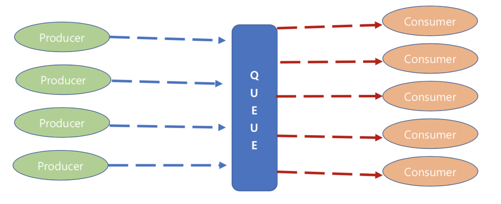

### 1.6. Cluster
- 컴퓨터 클러스터는 여러 대의 컴퓨터들이 연결되어 하나의 시스템처럼 동작하는 컴퓨터들의 집합을 말한다.

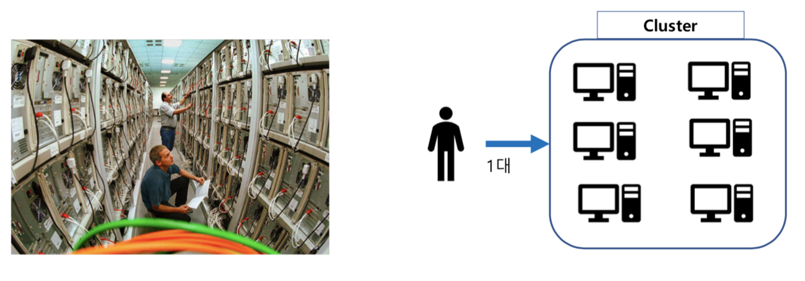

### 1.7. Scale up vs. Scale Out
- Scale Up/Down : 서버의 크기(용량)을 증가, 달리 말해서 고성능(상위 레벨) 장비로 대체하는 것
- Scale Out/In : 접속된 서버 대수를 늘려 처리능력을 향상시키는 것을 말한다.

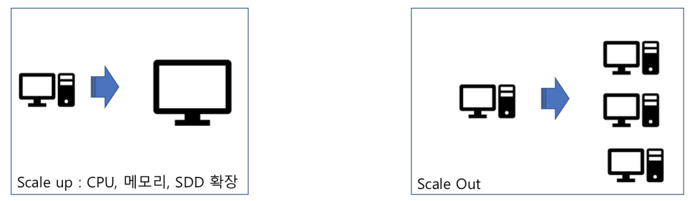

### 1.8. Data Lake
- 데이터의 형태에 상관없이 무제한의 저장소로 Data를 수집하는 형태
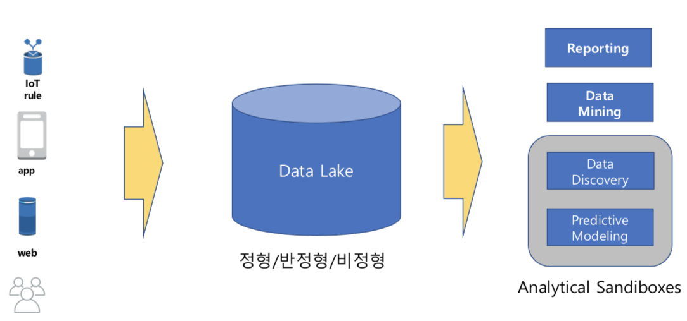

- - -
## 2. 클라우드 서비스 이해
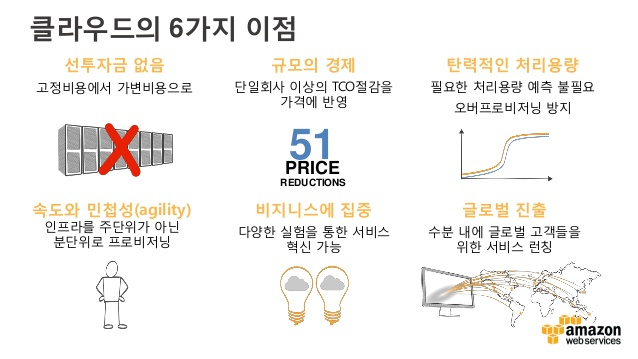

- - -
## 3. AWS 이해

### 3.1. AWS에서 제공하는 서비스

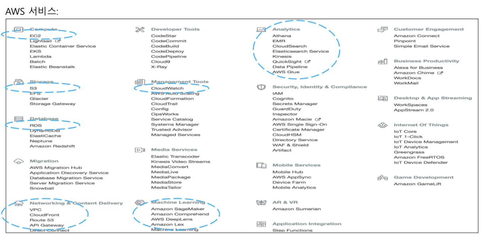

### 3.2. Region
    - Amazon S3에서 상ㅅㅇ자가 만드는 버킷을 저장할 수 Region을 선택할 수 있다. 지연 시간 최적화, 비용 최소화, 규정 요구 사항 준수 등 다양한 필요에 따라 리전을 선택할 수 있다.
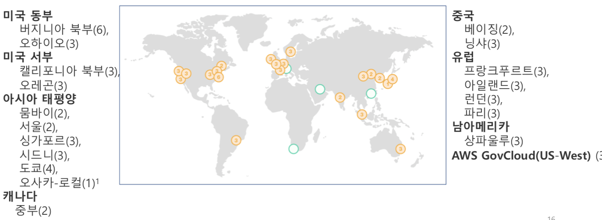

- - -
## 4. AWS EC2 이해

### 4.1. EC2 (Amazon Elastic Computer)
- Amazopn Web Services(AWS) 클라우드에서 확장식 컴퓨팅을 제공한다.

### 4.2. 인스턴스
- 가상 컴퓨팅 환경

### 4.3. Amazon Machine Image(AMI)
- 서버에 필요한 운영체제와 여러 소프트웨어들이 적절히 구성된 상태로 제공되는 템플릿으로 인스턴스를 쉽게 만들 수 있다.

### 4.4. 인스턴스 유형
- 인스턴스를 위한 CPU, 메모리, 스토리지, 네트워킹 용량의 여러 가지 구성 제공

- - -
## 5. IAM 권한관리
### AWS Identity and Access Management (IAM)
- AWS 리소스에 대한 엑세스를 안전하게 제어할 수 있는 웹 서비스
- IAM을 사용하여 리소스를 사용하도록 인증(로그인) 및 권한 부여(권한 있음)된 대상을 제어한다.
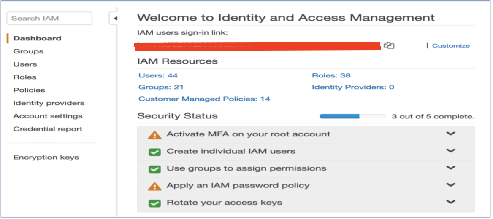

- - -
## 6. VPC 생성
### 6.1. VPC (Virtual Private Cloud)
- Amazaon virtual Private Cloud(Amazon VPC)에서는 사용자가 정의한 가상 네트워크로 AWS 리소스를 시작할 수 있다.
- 이 가상 네트워크는 AWS의 확장 가능한 인프라를 사용한다는 이점과 함께 고객의 자체 데이터 센터에서 운영하는 기존 네트워크와 매우 유사하다.

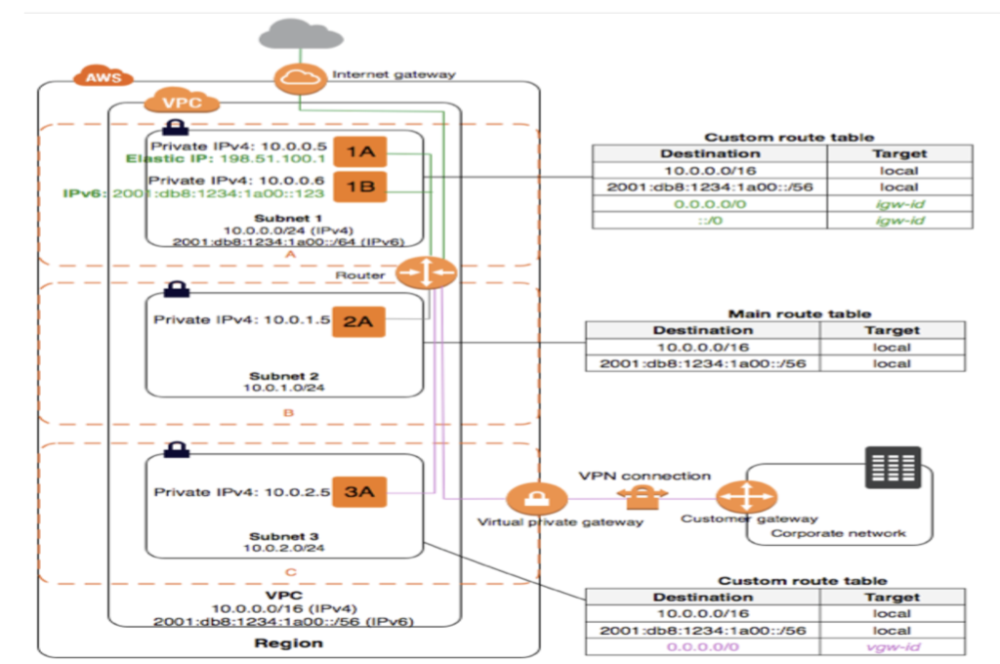

### 6.2. CIDR (Classless Inter-Domain Routing)
- 기존의 IP 주소 할당 방식이었던 네트워크 클래스를 대체하였다.

- IP 주소는 모두 32비트의 정보로 이루어진다.
    - [11111111.11111111.11111111.11111111]식으로 2진 표시
    
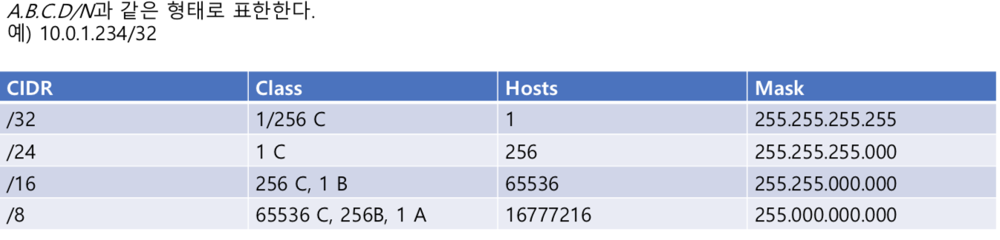

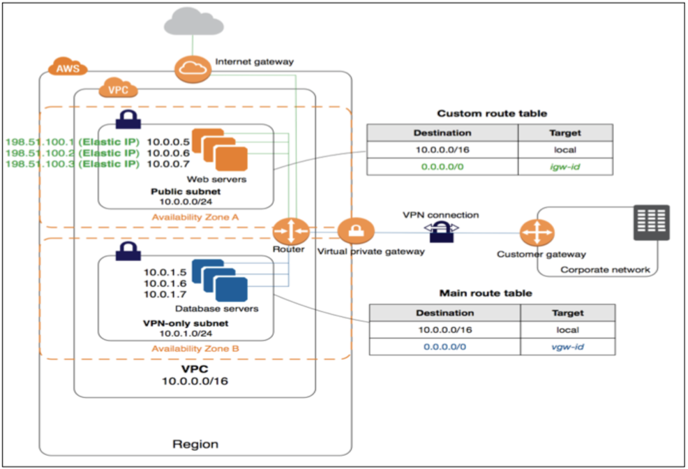

### 6.3. Subnet
- Public : Web servers
- Private : Database Servers

### 6.4. Internet Gateway
- VPC의 인스턴스와 인터넷 간에 통신할 수 있게 해준다.
- 대외계와 비슷한 시스템 : 외부와의 연결 통로

### 6.5. Route Tables
- 라우팅 테이블에는 네트워크 트래픽을 전달할 위치를 결정하는 데 사둉되는 라우팅이라는 규칙 집합이 포함되어 있다.

- - -
## 7. Summary
### 네트워크 이해
- VPC : 하나하나의 층
- Subnet : 방 (Server)
- Internet Gateway: 연결통로 (각 층?)
- Route Tables : 어디로 가야하는지 지시(설정)