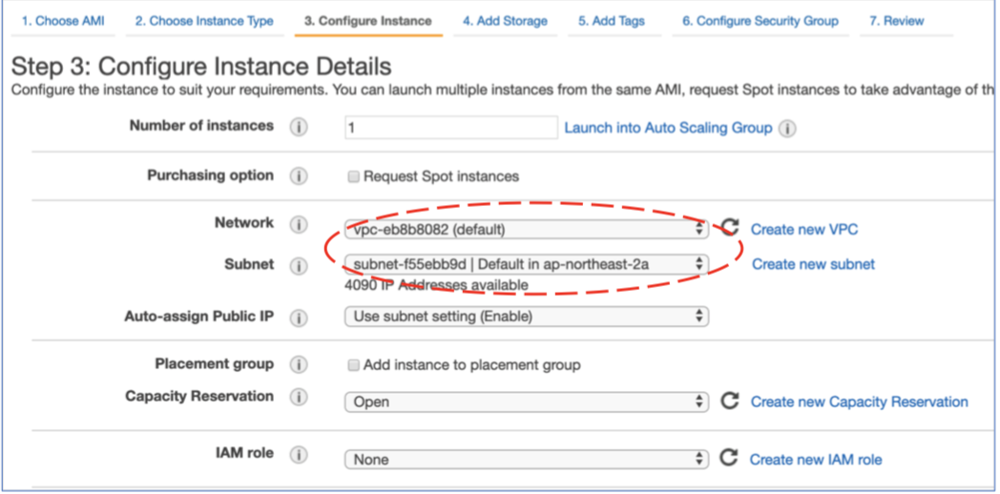
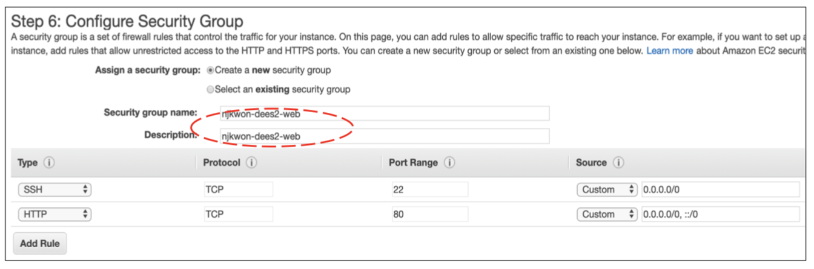
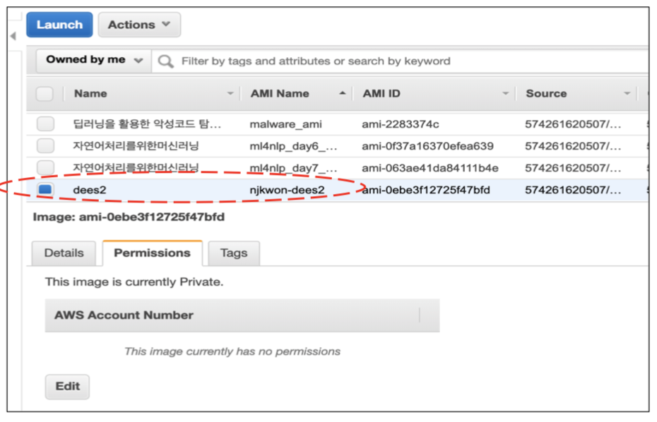

# Data Engineering Extension School 1-2
## Goal
> - EC2 인스턴스와 S3 사용해보기

##  Index
> 1. EC2 인스턴스 생성
> 2. EC2 관리 실습
> 3. S3란
> 4. S3 버킷 생성, 관리, 설정
> 5. Cloud Watch를 이용한 모니터링

- - -
# 1.  EC2 인스턴스 생성
## 1.1. EC2 (Amazon Elastic Compute)란 ?
> - Amazon Web Services(AWS) 클라우드에서 확장식 컴퓨팅을 제공
- 인스턴스 : 가상 컴퓨팅 환경
- Amazon Machine Image (AMI) : 서버에 필요한 운영체제와 여러 소프트웨어들이 적절히 구성된 상태로 제공되는 템플릿으로 인스턴스를 쉽게 만들 수 있다.
- 인스턴스 유형 : 인스턴스를 위한 CPU, 메모리, 스토리지, 네트워킹 용량의 여러 가지 구성 제공

## 1.2. EC2 Intance 생성
### 1.2.1. Step 1 : Choose an Amazon Machine Image (AMI)
> - 운영 체제 이미지 선택 : Cent OS, Linux OS 등 원하는 조건으로 선택 가능

- Amazon Linux 2 AMI를 선택하는 이유는? : 

### 1.2.2. Step 2 : Choose an Instance Type
> - 인스턴스 유형 선택 : 필요에 맞는 인스턴스 유형을 선택하면 된다. 서버의 하드웨어적인 부분이라고 생각하면 된다.

### 1.2.3. Step 3 : Configure Instance Details
> - Network : VPC란?
- Subnet : Private이 아닌 Public Subnet을 사용해야한다. why?

- Network Interfaces : Advanced Details에서 User data에 입력하는 이유는 웹 서비스가 정상 작동하는지 확인하기 위해서?

### 1.2.4. Step 4 : Add Storage
> - Size : Memory, 
- Volume Type : SSD로 선택 (IOP 선택 시, IOP의 1/50이 Size가 되어야 한다)

- Delete on Termination : 인스턴스 종료 시 스토리지 삭제를 선택해줘야 한다.

### 1.2.5. Step 5 : Add Tags
> - 태그를 하는 이유 : 태그를 통해 쉽게 관리하기 위해서다(예를 들어 여행용 캐리어에 네임 택을 달면, 도착하고 수화물을 찾을 때 쉽게 찾을 수 있는 것처럼)

### 1.2.6. Step 6 : Configure Security Group
> - 웹 서비스를 하려면 HTTP도 설정해야 한다.

### 1.2.7. Step 7 : Review Instance Launch
> 
- Key Pair 선택 또는 생성 : 잃어버리면 재발급 받을 수 없으므로 잘 보관해야한다.

### 1.2.7. Step 8 : EC2 Instance Connect
> 

### 1.2.8. Step 9 : EC2 Instance 웹 서버 올리기
> 

- - -
# 2. EC2 관리 실습
## 2.1. Create Template From Instances (시작 템플릿에서 인스턴스 시작)
> - 시작 템플릿과 AMI의 차이 : 시작 템플릿은 스크립트를 실행시켜주고, AMI는 스냅샷의 개념. 어떠한 경우에 쓰는지?

## 2.2. AMI에서 인스턴스 시작
> - 도커랑 비슷한 개념이다. 환경을 저장했다가 나중에 쓰고 싶다면 이미지로 뜨면 된다.
- 템플릿이랑 차이점 : 이미지는 스크립트를 실행하지 않는다. 템플릿은 실행했던 스크립트 내역을 똑같이 실행항다.
- 이미지를 만드는 이유 : 환경을 구축하는데 들어가는 Cost를 줄일 수 있으니까.
- Job이 돌고 있는 EC2는 주의해야 한다. 이미지를 뜨는 순간 종료되기 때문에.

## 2.3. Spot Instance로 시작
### 정의
> - 온디맨드 가격보다 저렴한 비용으로 사용할 수 있는 미사용 EC2 인스턴스
- 큰 할인율로 미사용 EC2 인스턴스를 사용(경매의 개념, 70~80%의 가격)

### 개념
> - 스팟 인스턴스 풀
    - 스팟 인스턴스 풀이 있는 공간
- 스팟 가격
    - 양이 많은 인스턴스인데 사람들이 많이 사용하지 않는다면 수요와 공급의 법칙에 의해서 경매 방식으로 보다 저렴한 가격에 사용 가능
- 스팟 인스턴스 요청
    - 리소스를 요청할 수 있으면 pending 상태가 된다.
- 스팟 집합
- 스팟 인스턴스 중단
    - 강제적으로 중단(terminated)되는 경우도 있다.
    - 어떤 사람이 수 많은 서버를 온디맨드 방식으로 잡아버리면, 스팟 풀이 모자르게 된다. 그럼 지금 사용하고 있는 사용자들에게 alert를 날리고, 사용자가 어떤 action을 취하기 전에 권한을 뺏어버린다.
    - 그래서 그냥 사라질 수 있다. 그 점은 꼭 유의해야한다. 서버가 죽으면 서버에 인스톨했거나 리소스가 그 안에 있다면 잃어버릴 수 있다. 그럴 경우에는 보통 안 하고, 마스터와 워커 개념으로 두고 작업한다.
    - 보통 마스터 : 온디맨드, 워커 : 스팟 인스턴스 이렇게 사용한다.
    - 마스터가 관장을 하고 있는 중, 워카가 죽으면 다른 워커로 변경하면 된다.

### 관련 URL
> - [Amazon EC2 - 온디맨드 요금](https://aws.amazon.com/ko/ec2/pricing/on-demand/)
- [Amazon EC2 - 스팟 인스턴스 요금](https://aws.amazon.com/ko/ec2/spot/pricing/)
- [Amazon EC2 - 스팟 인스턴스 어드바이저](https://aws.amazon.com/ko/ec2/spot/instance-advisor/)

> 

> - 데이터 분석을 하는 경우에는 r3.xlarge를 가장 많이 선택한다.

- - -
# 3. S3란
## 3.1. S3
    - 인터넷 스토리지 서비스
    - 용량에 관계 없이 파일을 저장
    - S3 자체로 정적 웹 서비스 가능
    - 웹하드 서비스와 비슷하지만, 별도의 클라이언트 설치나 Active X를 통하지 않고, HTTP 프로토콜로 파일 업로드/다운로드 처리
    - 보통 버킷(폴더)과 객체(파일들)로 구성되어 있다.

### - 버킷
    - AWS S3에 저장된 객체에 대한 컨테이너이다.
    - 모든 객체는 어떤 버킷에 포함된다.
    - 쉽게 이해해서 윈도우의 Root 폴더라고 이해를 하면된다.
### - 객체 
    - AWS S3에 저장되는 기본 개체이다.
    - 객체는 객체 데이터와 메타 데이터로 구성된다.
    - 객체는 버킷 안에 있는 파일들이라고 생각하면 된다.
### - 키 
    - 버킷 내 고유한 식별자이다.
    - 버킷 내 모든 객체는 정확히 하나의 키를 갖는다.
    - 버킷, 키 및 버전 ID의 조합이 각 객체를 고유하게 식별하기 때문에 Amazon S3는 "버킷 + 키 + 버전"과 객체 자체 사이의 기본 데이터 맵으로 간주할 수 있다.

## 3.2. 버킷 (Bucket)
    - 한 계정당 최대 100개의 버킷 사용 가능
    - 버킷의 이름은 region에 상관없이 globally unique해야 한다.
    - 버킷 주소는 https://s3-리전이름.amazonaws.com/버킷이름
    - keyname prefix (Folder1/Object1)를 사용해서 논리적인 hierachies

## 3.3. 객체 (Object)
    - 객체(파일) 하나의 크기는 1Byte ~ 5TB
    - 저장 가능한 객체 갯수 무제한
    - 객체마다 각각의 접근 권한 설정 가능
    - defaultfh private이다
    - 객체는 url를 사용해서 다운로드

## 3.4. S3 Class
### S3 Standard
    - 99.99% availability (게런티 99.9%)
    - 99.999999999% durablity
    - 다수의 장치와 다수의 시설에 저장
    - 2개의 시설을 동시에 잃어도 지속되게끔 설계

### S3 IA (infrequently Accessed)
    - 자주 접근되지 않지만, 필요할 때 빠르게 접근할 필요가 있는 데이터에 적합
    - S3보다 저렴하다. 하지만 retrieval fee가 과금된다.
    
### S3 One Zone IA
    - 이전의 RRS를 대체하는 새로운 클래스

- - -
# 4. S3 버킷 생성, 관리, 설정
## 4.1. 스토리지 클래스의 선택
> 

## 4.2. Bucket 생성하기
> 

## 4.3. S3 버킷 Permissions
> - bucket 리소스에 대해서 사용자에 copy할 수 있는 권한을 줄 수 있음
- 사용자별로 버킷 권한을 줌.
- 특정 회사에 쌓아놓은 로그를 공유해주거나, 전송하면 Cost가 많이 든다. 버킷으로 공유해주면 버킷명은 unique하니까 버킷명으로 접근해서 가져다가 분석할 수 있다!

## 4.4. S3 버킷 생명주기
> 

## 4.5. S3 SQL 샘플
> 

## 4.6. EC2 S3 Mount 하기
> 

- - -
# 5. Cloud Watch를 이용한 모니터링
> - AWS 리소스와 AWS에서 실시간으로 실행 중인 애플리케이션을 모니터링
> - 리소스 및 애플리케이션에 대해 측정할 수 있는 변수인 지표를 수집하고 추적할 수 있다.
> - 경보는 알림을 보내거나 정의한 규칙을 기준으로 모니터링하는 리소스를 자동으로 변경한다.

