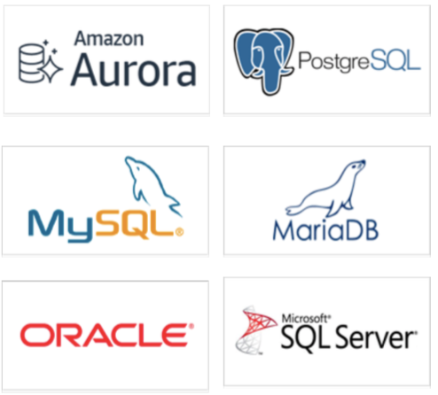

# Data Engineering Extension School 1-3

## 목표
- AWS RDS에 대해서 이해한다.

## 목차
1. AWS RDS란
2. AWS RDS 서버 생성 및 관리
3. AWS RDS 백업 및 복구
4. AWS RDS Scale up & Scale out 실습
4. Cache 서비스
5. Redshift의 실습

# 1. AWS RDS란
## RDS란
- 클라우드에서 관계형 데이터베이스를 더 쉽게 설치, 운영 및 확장할 수 있는 웹 서비스
- 이 서비스는 산업 표준 관계형 데이터베이스를 위한 경제적이고 크기 조절이 가능한 용량을 제공하고 공통 데이터베이스 관리 작업을 관리한다.

## RDS의 종류


- MySQL : 스타트업에서 많이 사용하는 RDS
- MariaDB : Oracle이 MySQL을 인수하자, MySQL 창시자가 만든 RDS
- PostgreSQL : 유럽에서 많이 쓰는 SQL
- Aurora : 아마존
- Oracle : 성능이 좋으나 비싼 가격이 흠
- Microsoft SQL Server

- - -

## OLTP / OLAP
### OLTP
- 트랜잭션에서 많이 사용하는 DB
- 저장하면 트랜잭션 1건이 발생해서 처리하는 것

### OLAP
- redshift, 엑사, bigquery
- 데이터 처리하는 건, 데이터 요청을 어떻게 하냐면 하루치가 아니라 일주일, 한달, 일년치... meta data 처리

### OLTP / OLAP 1
#### OLTP: OnLine Transaction Processing
Batch 와 반대되는 개념으로 실시간으로 db의 데이터를 트랜잭션 단위로 갱신/조회하는 처리방식. 은행, 증권사 등에서 씀. 기존과 달리 다수의 client가 거의 동시에 이용할수 있도록 송수신자료를 트랜잭션단위로 압축한것이 특징.

#### DW: Data Warehouse
수년간 발생한 데이터를 모아서 주제별로 합쳐 분석할 수 있게 하는 통합시스템.
예) 운영데이터, 분산데이터, 시장데이터를 추출하여 DW를 구축하고 그걸 DSS나 OLAP로 분석

#### ※Data Mart:
DW의 하위단위라고 볼 수 있으며, DW는 중앙집중식 데이터 집합체의 개념을 가지나, data mart는 데이터 저장소의 역할을 하고 특정 목적을 위해 쉬운 접근성과 사용성을 가진다. DW는 기존 데이터를 어떻게 수집/분석하고 어떻게 재사용할 것인가에 초점을 맞춤

#### OLAP:OnLine Analytical Processing
위의 DW에서 데이터를 분석해서 의미있는 형태로 만들기 위한 과정및 도구.  의사결정 지원 시스템의 하나.

#### ※ 의사결정 지원 시스템(DSS, Decision Support System)
단순히 정보를 수집, 저장, 분배하기 위한 시스템을 넘어서 사용자들이 기업의 의사결정을 쉽게 내릴 수 있도록 사업 자료를 분석해주는 역할을 하는 컴퓨터 응용 프로그램이다.

#### Batch Processing
작업을 몰아두었다가 한번에 처리하는 시스템. 예:선거투표결과 추출, 게임 이벤트 아이템 일괄 지급 등


### OLTP / OLAP 2
#### - OLTP (Online Transaction Processing) : 온라인 트랜잭션 처리

네트워크상의 여러 이용자가 실시간으로 데이터베이스의 데이터를 갱신하거나 조회하는 등의 단위 작업을 처리하는 방식을 말한다. 주로 신용카드 조회 업무나 자동 현금 지급 등 금융 전산 관련 부문에서 많이 발생하기 때문에 ‘온라인 거래처리’라고도 한다. 이 방식의 특징은 기존 컴퓨터 통신에서 이용해 온 온라인 방식과 달리 다수의 이용자가 거의 동시에 이용할 수 있도록 송수신 자료를 트랜잭션(데이터 파일의 내용에 영향을 미치는 거래 ·입출고 ·저장 등의 단위 행위) 단위로 압축, 비어 있는 공간을 다른 사용자들이 함께 쓸 수 있도록 한 점이다.

#### - OLAP (OnLine Analytical Processing) : 온라인 분석 처리

OLAP는 사용자가 다양한 각도에서 직접 대화식으로 정보를 분석하는 과정을 말한다.OLAP 시스템은 단독으로 존재하는 정보 시스템이 아니며, 데이터 웨어하우스나 데이터 마트와 같은 시스템과 상호 연관된다. 데이터 웨어하우스가 데이터를 저장하고 관리한다면, OLAP은 데이터 웨어하우스의 데이터를 전략적인 정보로 변환시키는 역할을 한다. OLAP은 기본적인 접근과 조회·계산·시계열·복잡한 모델링까지도 가능하다. OLAP은 최근의 정보 시스템과 같이 중간매개체 없이 이용자들이 직접 컴퓨터를 이용하여 데이터에 접근하는 데 있어 필수적인 시스템이라 할 수 있다. 


### OLAP 와 OLTP 의 차이점 
#### - OLTP :  현재 업무의 효율적인 처리에만 관심이 있음
#### - OLAP : 의사결정에 도움되는 데이터 분석에 관심이 있음


### OLTP / OLAP 3

### 참고 URL
- https://unabated.tistory.com/entry/OLTP-OLAP
- https://mozi.tistory.com/80
- http://blog.naver.com/PostView.nhn?blogId=skygrab&logNo=30102437276
- http://neo-vector.blogspot.com/2012/03/oltpolapdw.html


# 2. AWS RDS 서버 생성 및 관리
## 2.1. AWS RDS 서버 생성 및 관리
### MySQL
### Amazon Aurora

- Enable deletion protection (삭제 방지 비활성화)
- Public accessibility (퍼블릭 액세스)
- Port

## 2.2. MySQL Workbench와 연동
- hostname : Endpoint
- username : AWS RDS에서 만든 name
- password : AWS RDS에서 만든 password

## 2.3. Insert Data
```SQL
show schemas;
show tables;

#drop table movies;
#drop table tags;

SELECT * 
FROM information_schema.SCHEMATA 
WHERE schema_name = "dees";

ALTER DATABASE dees
CHARACTER SET = utf8mb4
COLLATE = utf8mb4_unicode_ci;

create database dees2 
CHARACTER SET = utf8mb4
COLLATE = utf8mb4_unicode_ci;

show schemas;
use dees2;


CREATE TABLE `movies` (
  `movie_id` int(10) NOT NULL,
  `title` varchar(100)  DEFAULT NULL,
  `genres` varchar(200)  DEFAULT NULL,
  PRIMARY KEY (`movie_id`)
) ENGINE=InnoDB DEFAULT CHARSET=utf8;


CREATE TABLE tags (
   userId int(10) not null ,
  movie_id int(10) NOT NULL,
  tag varchar(100)  DEFAULT NULL
) ENGINE=InnoDB DEFAULT CHARSET=utf8;


select *
from movies;

select *
from tags;

select a.userId,
       b.title,
       b.genres, 
       a.tag
from tags a 
join movies b 
on a.movie_id = b.movie_id;


select a.userId,
       b.title,
       b.genres, 
       a.tag
from tags a 
left join movies b 
on a.movie_id = b.movie_id;


```

# 3. AWS RDS 백업 및 복구
## 3.1. Snapshot 만들기
## 3.2. 기존 DB 삭제
## 3.3. Snapshot 복원
- hostname : 복원해서 새로 생성된 Endpoint
- username : (스냅샷 생성 전의 기존) AWS RDS에서 만든 name
- password : (스냅샷 생성 전의 기존) AWS RDS에서 만든 password

```SQL
use dees2; -- use schema

select * from movies;
```

# 4. AWS RDS Scale up & Scale out 실습
## 4.1. Scale up
- Modified

## 4.2. Scale out
- add reader
    - 네트워킹 가용영역 다르게 만들기 (a, c)
    - Role : 쓰기, 읽기

# 5. Cache 서비스

# 6. Redshift의 이해 및 실습
