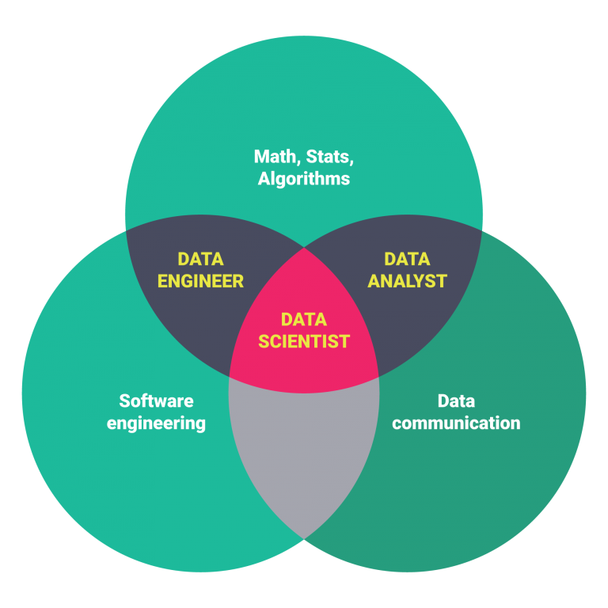

# 1. Data Engineering Intro
## 1.1. Index
- 대용량 데이터 처리 기술 개요
- Functional Prograaming과 Scala
- Apache Spark Overview
    - Apache Spark Demo
    - Spark Core Concept
- Apache Zeppelin
- Spark SQL
- Spark Streaming
- Spark Cluster

---
## 1.2. 데이터 분야의 직업들

### - 데이터 분석가
    - Excel, SPSS, SAS, R(통계 툴) 등을 잘 다룸.
    - 데이터를 통해 문제를 해결하는데 집중된 능력.
    - 대량의 데이터(빅데이터)를 다루거나, 수학적 알고리즘이나 모델을 만드는 능력은 기대되지 않음
    
### - 데이터 엔지니어
    - Hadoop, MapReduce, MySQL (RDBMS), 프로그래밍 등을 할 줄 안다.
    - 데이터 분석가를 위해 대량의 데이터로부터 핵심 데이터를 추출 (ETL 작업)
    - 개발 부분에 포커스하기 때문에 데이터 분석이나 머신러닝 같은 능력은 기대되지 않음
    
### - 데이터 사이언티스트
    - Apache Spark, Python, Machine Learning, Statistics 등을 다룰 수 있음
    - 대량의 데이터로부터 인사이트를 뽑아내기
    - 다양한 스킬셋, 다양한 업무

---
## 1.3. 왜 데이터를 분석하는가?
- 비싼 비용에도 불구하고 많은 양의 데이터를 분석하는 이유
    - 실제로 사업에 도움이 되기 때문이다.
    - 광고 비즈니스, 커머스, 금융 분야에서는 데이터가 매출과 직결되기에 비싼 비용에도 데이터 분석에 공을 들임
    
- 데이터 분석이 쉽고 저렴해지면서, 일반 서비스 회사들에서도 독자적인 데이터 분석을 하는 경우가 많아졌음.
- 머신 러닝 분야가 대중화되면서 새로운 혁신의 가능성이 많이 열림.

---
## 1.4. 컴퓨터 엔지니어링
- 엔지니어 != 개발자
    - 비슷하면서도 다른 사람
    - **엔지니어**
        - 원론적인 지식을 가지고 과학적인 접근을 하며 엔지니어링 문제를 해결하는 사람
    - **개발자**
        - 블로그나 책을 보고 배운 지식들을 창의적으로 활용하여 업무를 해내는 사람

---
## 1.5. 데이터 엔지니어링
- 데이터 인프라를 통해 데이터 분석가들이 **데이터를 활용할 수 있도록 준비**하는 사람
- 주로 빅데이터 분야에 집중되어 있음
- 데이터 시스템을 설계하고 구축하며, 여러 데이터 소스를 통합하는 역할
- 복잡한 데이터를 정리하거나, 성능을 최적화 함.

---
## 1.6. 데이터 엔지니어링과 연관된 다양한 분야
- 데이터 엔지니어
- 데이터 사이언티스트
- 머신러닝 엔지니어
- 데이터 인프라 엔지니어
- 데브옵스

---
## 1.7. 현실 세계의 데이터 사이언티스트
### 통계학자가 머신러닝을 배우는 경우
- 개발을 배우기 힘들다.
- 빅데이터를 다루는 능력이 부족해지는 경우가 많다.

###  개발자가 통계 및 머신러닝을 배우는 경우
- 수학을 익히기 힘들다.
- 비즈니스적인 마인드가 부족한 경우가 있다.

### 비전공자 혹은 관련 경험이 부족한 경우
- 배워야할 것이 너무 많다...

---
## 1.8. 데이터 분야에 종사하는 사람이라면...
### - Starting Point를 어디에서 가져가든, 목표점을 어디로 가져가든 많은 공부를 하고 경험을 쌓아야 한다!

---
## 1.9. 데이터 엔지니어는?
### 데이터 엔지니어링 분야에서 계속해서 경험과 능력을 쌓고 싶은 경우
- Hadoop, Spark 등 데이터 인프라의 동작 원리를 깊이 이해히고, 운영 경험 쌓기
- Machine Learning 관련 인프라 경험 쌓기
- Python, Scala, Java, R, JavaScript 등 많은 언어에 익숙해져야 함
- 커뮤니티 활동 등을 통해 계속해서 트렌드를 따라잡거나 리드해 나가기

### 데이터 과학자로 거듭나고 싶은 경우
- Hadoop, Spark 등 데이터 인프라를 잘 다루어 원하는 데이터를 뽑을 수 있도록
- Machine Learning을 이론부터 적극적으로 공부 및 연구
- 다양한 실전 데이터 분석 경험을 쌓기

---
## 1.10. 채용하고 싶은 데이터 엔지니어는?
### 업무 부분
- 데이터 엔지니어링, 데이터 분석, 머신러닝 등 여러 데이터 관련 분야에 **자신의 특기**가 있어야 한다.
- 자신이 **특기**로 하는 분야에 대해서는 **누구보다도 잘 알아야** 한다.

### 기업 문화 부분
- 끊임없이 노력하고 배우려는 사람
- 자신이 할 일을 찾아서 하며, 깔끔하게 마무리 짓는 사람

---
## 1.11. Summary
- 데이터 엔지니어링은...
    - 빅데이터 머신러닝 등으로 빠르게 발전하는 매력있는 분야
    - 한편으로는 많은 시간과 노력, 인내가 필요한 분야
    - 다른 팀원들이 데이터를 잘 활용해야만 빛이 날 수 있는 분야

---
## 1.12. 실제 회사에서는 어떻게 일하는가?
---
## 1.13. 데이터 엔지니어로 커리어를 시작하려면?