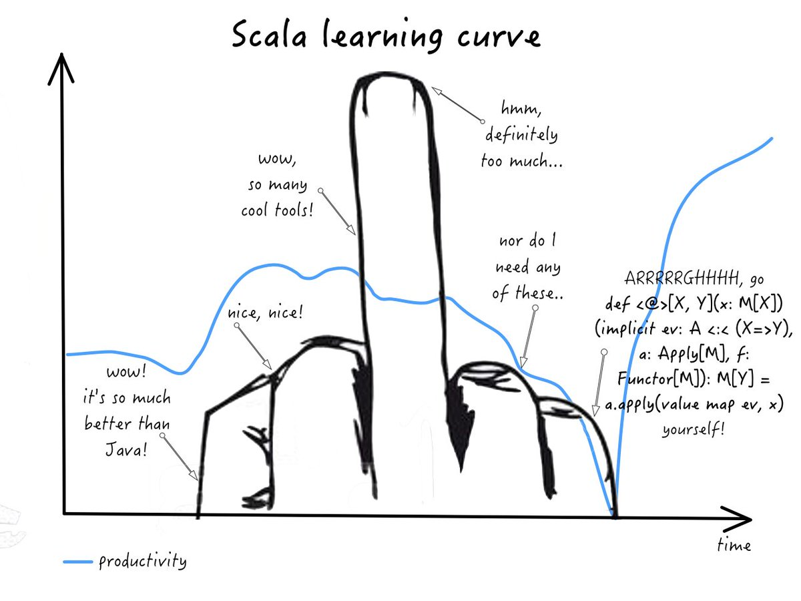
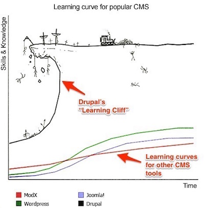
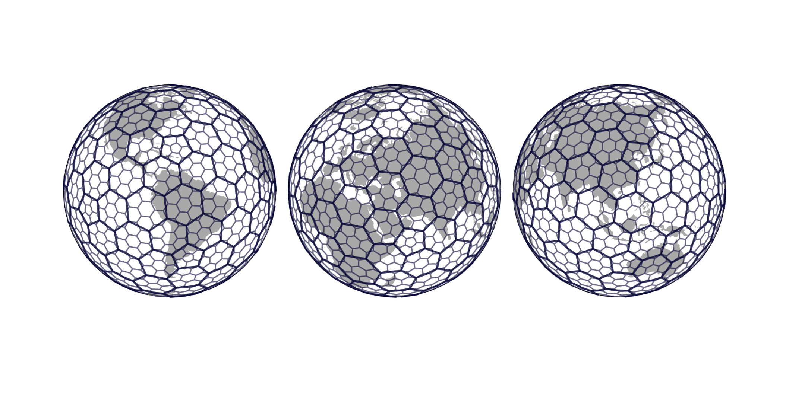
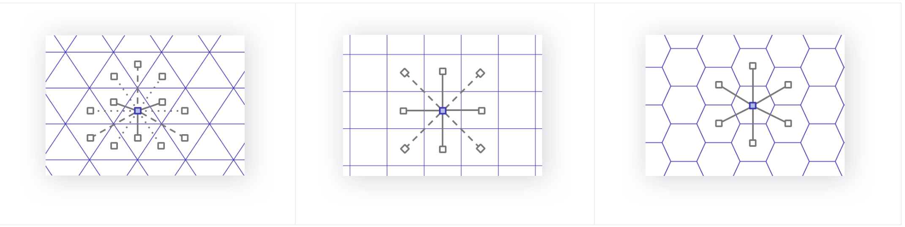
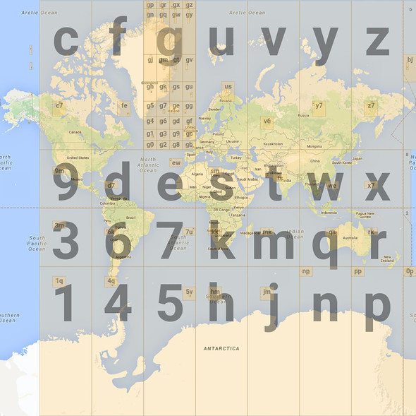
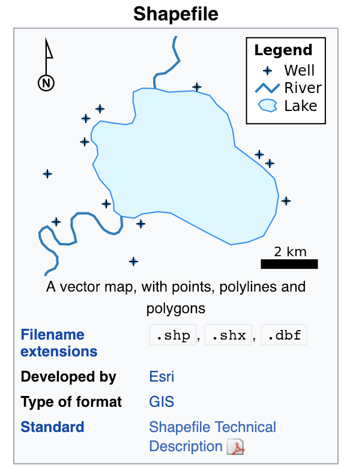

# Data Enginnering Extension School 2-2

- [Google Cloud Next ’19](https://cloud.withgoogle.com/next/sf)


## 1. Small Talks
- 대세는 Python, 잘하면 잘할 수록 좋다. 생산성을 끌어 올려준다.
    - ML, DL은 Python.
    - Bigdata 분야에서는 Python이 대세는 아니지만... 점점 대세가 될 것이다.
    - Python으로 Spark 쓸 만하다.
    - 현재 Apache Spark에 한정한다면 Scala > Python 이지만... 점점 Python이 따라 잡을 것이다.
    - 추천 코스 : Python -> R & JavaScript
    
- (순수) 엔지니어링을 하겠다면, 여러 언어를 습득해야 한다.
    - Java, Scala, JavaScript, Python, R은 필수적이다.
    - 데이터 엔지니어면... 빅데이터를 다루는 포지션이다.
        - Hadoop Code가 전부 Java로 짜여져 있다.
        - S3, Hadoop을 쓰는데 Java를 알 필요는 없지만... 문제가 생겼을 때, 소스코드를 보고 분석을 하고, 작동원리를 파악해야한다. 당연히 알아야 한다. 꽤 잘 알아야 한다.
        - Spark은 Scala로 짜여져 있다. 코드 분석을 해야 한다.
    - 자바스크립트
        - Visualize에 특화
        - [charting library : D3](https://d3js.org/)
        - 인터넷에 보는 차트는 거의 자바스크립트
        - 노력 대비 써먹을만 한 게 많다.
    
    - 추천 코스 : Python -> Java -> Scala -> R & JavaScript

- Scala learning curve




## 2. Python


### 2.1. Introduction
    - 간단하게 사용할 수 있는 하이레벨 프로그래밍 언어
    - 많은 사용자
        - 하다가 막힐 때 자료를 찾기 용이함(googling, Stackoverflow)
    - 데이터 분야에서 중요한 언어 중 하나
        - C 언어와 연결이 용이하여 연산성능을 높일 수 있기 때문에 데이터, 과학 분야에서 많이 이용됨
    - PySpark, NumPy, Pandas, Matplotlib, TensorFlow, Jupyter

### 2.2. 데이터 분야의 Python
#### NumPy
    - Matrix 연산을 위한 기능들이 많음
    - vs. Matlab : General Programming이 가능하기 때문에 유용함 (연구에서 많이 쓰임)

#### Pandas
    - DataFrame
        - Table 형태의 데이터, 엑셀 같은 형태로 데이터를 다루는 도구라고 생각하면 쉽다.
    - Pandas DataFrame과 Apache DataFrame이 사용법이 다르다. -> 둘 다 익혀야 함!
    
#### Matplotlib
    - Python 코드를 이용한 시각화
    - 그 외 : Plotnine, Plotly, seaborn 등등
    
#### TensorFlow
    - (설명이 필요없는) 딥러닝 라이브러리
    - 많았는데 TensorFlow로 천하 통일
    
#### Jupyter
    - 노트북 도구
    
    
### 2.3. Python Basic

### 2.4. Variables and Types
- Object Oriented, Dynamic Type 언어
    - OOP (Object Oriented)
        - 프로그래밍을 작성할 떄의 방법론
        - 현실 세계처럼, 여러 가지 물체들을 프로그램으로 만들어서 물체의 동작이나 특성을 정의하게끔 해주는 언어
        - 클래스는 blue print
            - object 특성을 기술서
            - instance를 만들어내는 특성
            
    - Dynamic Type
        - Type : 언어의 기초적인 Element들이 있는데 그것들의 종류를 Type이라고 한다.
        - Variable을 미리 선언할 필요가 없음
        - 모든 Variable은 object
        
### 2.5.  Lists
- 빈약한 기능
    - 장점 : 기능이 없어서 진입 장벽이 낮다(?)

- Scala의 위엄함?


### 2.6. Basic Operators
### 2.7. Basic String Operations
### 2.8. Conditions
### 2.9. Loops
### 2.10. Functions
- [lambda](https://www.w3schools.com/python/python_lambda.asp)

### 2.11. Classes and Objects

### 2.12. 실습 : FizzBuzz
```Python
for i in range(1, 100+1):
    if i % (3 * 5) == 0:
        print(i, 'FizzBuzz !')
    elif i % 3 == 0:
        print(i, 'Fizz !')
    elif i % 5 == 0:
        print(i, 'Buzz !')   
else:
    print("Bye Bye~")
```

### 2.13. Dictionaries

### 2.14. Modules and Packages
- pip install의 문제점
    - 그걸 보완하기 위해 Virtual Environment로 환경을 분리시킴
    

## 3. Python for Data
### 3.1. NumPy
- 과학분야에서의 계산을 효율적으로 하기 위한 패키지
- 강력한 N차원 배열(매트릭스) 계산
- 머신러닝 분야에서 매트릭스 계산을 많이하므로, 많이 사용됨

#### NumPy Array
- Python List의 대체품
- 빠르고, 기능이 많다.
- 내부의 원소들에 일괄 연산
- Subset

#### 실습 (숙제)
- [Game of Life](https://namu.wiki/w/%EC%BD%98%EC%9B%A8%EC%9D%B4%EC%9D%98%20%EC%83%9D%EB%AA%85%20%EA%B2%8C%EC%9E%84)

### 3.2. Pandas (DataFrame)
- local에서 사용하는 것이기 때문에, 데이터 용량이 많아지면 한계가 발생한다.
- 그 경우에는, pyspark를 사용한다.

### 3.3. PySpark


### 3.4. TensorFlow


## 4. Spatial Index

- [Uber - H3](https://eng.uber.com/h3/)
    - 육각형 모양
        - 장점 : 
        - 단점 : 계산해야할 게 많고 복잡하다. 큰 범위의 육각형이 작은 범위를 모두 포함하지 않는 경우도 있다.
        
        
        
- [geohash](https://www.movable-type.co.uk/scripts/geohash.html)
    - 사각형 모양
        - 장점 : 이해하기 쉽고, 만들기가 쉽다.
        - 단점 : 거리 계산할 때, 껄끄럽다.
        



```Python
import ipywidgets as widgets
import geopy
import gmaps
import json
from h3 import h3
```

### 수요예측
- 기존 방식
    - '구별' -> 간단하게 operation 할 수 있으니까.
- 새로운 방식
    - 벌집 모양의 격자로 만들어서 구역 나누기
        - '강남구'도 꽤 넓기 때문에, 구체적으로 어느 지역의 수요가 더 많은지 확인해서 배치를 최적화해서 더 정확하게 예측할수록 효율이 더 좋아진다.
        - 회사와 사용자 입장 모두 Win-Win이다.
        - 동 대신에 격자로 하는 이유는? -> 동으로 했을 때, 문제가 조금 있다.
            - 강남역 기준으로 다른 여러 동이 나온다... 강남역 수요는 강남역 수요이지, 행정구역 수요가 아니다. 우리가 원하는 모양으로 만들고 싶은 니즈가 있었다. -> 그러니까 격자무늬 모양으로 나눔


- 3단계
    - 1. 서울 모양 가져오기
        
        
        - [Shapefile](https://en.wikipedia.org/wiki/Shapefile)
        - [seoul boundary shapefile github](https://github.com/southkorea/southkorea-maps)
        - 
    - 2. 6각형 구하기
        - h3의 polyfill
            - h3.polyfill
            
    - 3. 지도에 그리기
        - [gmaps](https://jupyter-gmaps.readthedocs.io/en/latest/tutorial.html)

- KPI : **매출**
    - 구역을 나눠서 평균적인 수요를 분석해서 배치
    - 시간대별로 많이 나오는 시간대를 분석해서 그때 기사들을 많이 출근하라고 배치
    
## 5. 질문
### DataRobot
- 쿠폰의 효과를 예측해보고 싶은 것 (회사 입장)
    - 쿠폰을 주지 않아도 쓸 생각인 사람에게 쿠폰을 준다면? -> 손해
    - 쿠폰을 안줬으면 쓸 생각이 없던 사람이 쓴다면? -> 이득
    
    - 누구한테 보내는 게 +이고, -일까?
        - 이걸 조사하려면 몇 가지 과정이 필요하다.
        - 실험을 한다. 전체 유저에 뿌리고, 랜덤하고 주사위를 굴려서 반에는 보내고, 나머지 반은 보내지 않는다(A/B Test)
        - 원하는 모든 segment에 대해서 반반씩 나가고 안 나간다.
        - 나이별 사용량 분포도
            - 1번 seg (20대 초반 ~ 20대 중반) : 소비가 많다.
            - 2번 seg (20대 중반 ~ 30대) : 소비가 짜다.
            - 