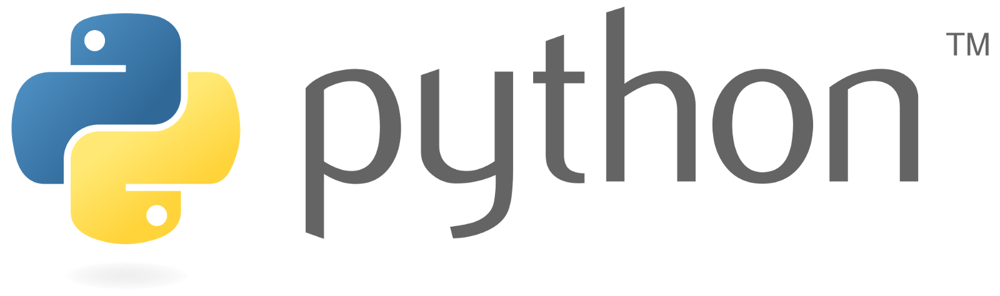
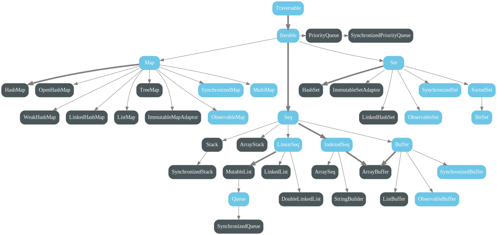

# Data Enginnering Extension School 2-2

- [Google Cloud Next ’19](https://cloud.withgoogle.com/next/sf)


## 1. Small Talks
- 대세는 Python, 잘하면 잘할 수록 좋다. 생산성을 끌어 올려준다.
    - ML, DL은 Python.
    - Bigdata 분야에서는 Python이 대세는 아니지만... 점점 대세가 될 것이다.
    - Python으로 Spark 쓸 만하다.
    - 현재 Apache Spark에 한정한다면 Scala > Python 이지만... 점점 Python이 따라 잡을 것이다.
    - 추천 코스 : Python -> R & JavaScript
    
- (순수) 엔지니어링을 하겠다면, 여러 언어를 습득해야 한다.
    - Java, Scala, JavaScript, Python, R은 필수적이다.
    - 데이터 엔지니어면... 빅데이터를 다루는 포지션이다.
        - Hadoop Code가 전부 Java로 짜여져 있다.
        - S3, Hadoop을 쓰는데 Java를 알 필요는 없지만... 문제가 생겼을 때, 소스코드를 보고 분석을 하고, 작동원리를 파악해야한다. 당연히 알아야 한다. 꽤 잘 알아야 한다.
        - Spark은 Scala로 짜여져 있다. 코드 분석을 해야 한다.
    - 자바스크립트
        - Visualize에 특화
        - [charting library : D3](https://d3js.org/)
        - 인터넷에 보는 차트는 거의 자바스크립트
        - 노력 대비 써먹을만 한 게 많다.
    
    - 추천 코스 : Python -> Java -> Scala -> R & JavaScript

- Scala learning curve


## 2. Python


### 2.1. Introduction
    - 간단하게 사용할 수 있는 하이레벨 프로그래밍 언어
    - 많은 사용자
        - 하다가 막힐 때 자료를 찾기 용이함(googling, Stackoverflow)
    - 데이터 분야에서 중요한 언어 중 하나
        - C 언어와 연결이 용이하여 연산성능을 높일 수 있기 때문에 데이터, 과학 분야에서 많이 이용됨
    - PySpark, NumPy, Pandas, Matplotlib, TensorFlow, Jupyter

### 2.2. 데이터 분야의 Python
#### NumPy
    - Matrix 연산을 위한 기능들이 많음
    - vs. Matlab : General Programming이 가능하기 때문에 유용함 (연구에서 많이 쓰임)

#### Pandas
    - DataFrame
        - Table 형태의 데이터, 엑셀 같은 형태로 데이터를 다루는 도구라고 생각하면 쉽다.
    - Pandas DataFrame과 Apache DataFrame이 사용법이 다르다. -> 둘 다 익혀야 함!
    
#### Matplotlib
    - Python 코드를 이용한 시각화
    - 그 외 : Plotnine, Plotly, seaborn 등등
    
#### TensorFlow
    - (설명이 필요없는) 딥러닝 라이브러리
    - 많았는데 TensorFlow로 천하 통일
    
#### Jupyter
    - 노트북 도구
    
    
### 2.3. Python Basic

### 2.4. Variables and Types
- Object Oriented, Dynamic Type 언어
    - OOP (Object Oriented)
        - 프로그래밍을 작성할 떄의 방법론
        - 현실 세계처럼, 여러 가지 물체들을 프로그램으로 만들어서 물체의 동작이나 특성을 정의하게끔 해주는 언어
        - 클래스는 blue print
            - object 특성을 기술서
            - instance를 만들어내는 특성
            
    - Dynamic Type
        - Type : 언어의 기초적인 Element들이 있는데 그것들의 종류를 Type이라고 한다.
        - Variable을 미리 선언할 필요가 없음
        - 모든 Variable은 object
        
### 2.5.  Lists
- 빈약한 기능
    - 장점 : 기능이 없어서 진입 장벽이 낮다(?)

- Scala의 위엄함?



### 2.6. Basic Operators
### 2.7. Basic String Operations
### 2.8. Conditions
### 2.9. Loops
### 2.10. Functions
### 2.11. Classes and Objects

### 2.12. 실습 : FizzBuzz
```Python
for i in range(1, 100+1):
    if i % (3 * 5) == 0:
        print(i, 'FizzBuzz !')
    elif i % 3 == 0:
        print(i, 'Fizz !')
    elif i % 5 == 0:
        print(i, 'Buzz !')   
else:
    print("Bye Bye~")
```

### 2.13. Dictionaries

### 2.14. Modules and Packages

## 3. Python for Data
### 3.1. NumPy
### 3.2. Pandas (DataFrame)
### 3.3. PySpark
### 3.4. TensorFlow
