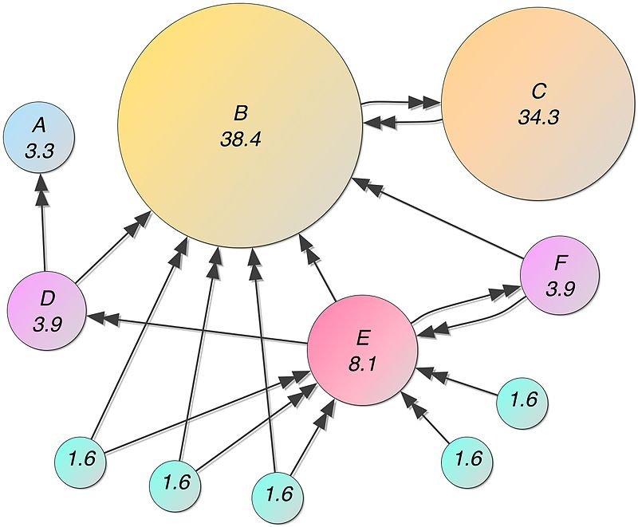

# 대용량 데이터 처리 기술 개요
### [Back to DE Home](https://github.com/boys-be-ambitious/TIL/tree/master/Data-engineering-school)
---
## 1. 빅데이터?
- 빅데이터란 기존 데이터베이스 관리도구의 능력을 넘어서는 대량의 정형 또는 심지어 데이터베이스 형태가 아닌 비정형의 데이터 집합조차 데이터로부터 가치를 추출하고 분석하는 기술이다. - 위키피디아

### 1.1. 기존 데이터베이스 관리도구
    - SQL 기반의 데이터베이스
    - 주로 컴퓨터 1대에서 돌아감, 고성능이 필요하면 좋은(비싼) 컴퓨터 사용
    - 컴퓨터 1대로 처리할 수 있는 용량과 성능의 한계

### 1.2. 대량
    - 컴퓨터 1대로 처리할 수 없는 양 (수십TB 이상)
    - 3V (by IBM) : Volume, Velocity, Variety
    
### 1.3. 기술
    - 컴퓨터 1대로 처리하지 못하므로, 여러 대를 연결해서 데이터를 저장하고 처리하는 심플한 접근
    - 주로 구글 등 검색엔진 회사들이 웹 전체를 저장하고 처리하려다보니 기술개발이 필요하게됨
    - 구글이 이끌고, 야후 등이 오픈 소스를 통해 (하둡) 적극 지원, 접근하기 쉬워지고 널리 쓰이기 시작
    - 빅데이터 기술 = 대부분 하둡이라고 생각해도 무방
    
### 1.4. 형태 (정형, 비정형)
    - SQL 기반의 데이터는 거의 행렬 형태로 정형화된 데이터였으나 일반 문서 (웹 문서) 등과 같이 비정형화된 데이터도 초점
    
### 1.5. 가치 추출, 결과 분석
    - 데이터를 저장만 해서는 쓸모가 없음
    - 데이터를 읽어들이고, 변환하고, 핵심을 추출하는 것도 마찬가지로 컴퓨터 1대로 할 수 있는 것보다 훨씬 빨라져야 함
    - 맵리듀스 (MapReduce) : 분산 데이터 처리
    - 현재는 스파크 (Apache Spark)가 널리 쓰임
    
## 2. 빅데이터 기술
- 데이터가 커졌을 때, 이를 처리하는 방식
    - 고전적으로는 큐잉, 샤딩(데이터의 키를 해시하여 여러 대의 데이터베이스로 분산시킴) 등의 여러가지 테크닉으로 큰 양의 데이터를 처리
        - 큐(que) : 처리해야할 task를 처리하기 위해 줄 세우기
        - 샤드(shard) : 예를 들어, Facebook에서 회원수가 많아서, 회원을 특정 기준에 의해 나누어 저장한다.
        - 해시(hash) : 뭉갠다. user id를 다른 숫자로 나오게 처리하는 방식
        - ex) DB 1대로 쓰다가 꽉차서, 10대로 늘리자 하면, user id 끝자리 0~9번을 각 서버에 저장... 아이디를 다른 방식으로 변환한 다음에 변환한 기준을 가지고 ...?
    - 이러한 방법들은 갈수록 시스템의 복잡도를 증가시키고, 문제가 생겼을 때 유지보수하기 매우 힘듬
    - 이를 대체하기 위해 **스스로 데이터를 분산**시키고, **오류로부터 데이터를 복구하는 기능을 가진 시스템**들이 만들어짐
    
## 3. 빅데이터의 시초 : GFS
- Google File System 논문 (2003년)
    - File System : 디렉토리 구조가 있고, 파일을 저장하거나, 옮기거나, 이름을 변경하거나, 저장할 수 있는 시스템.
- 막대한 양의 웹 문서를 저장 조회해야하는데, 컴퓨터 1대로는 당연히 처리가 불가능
- 저렴한 하드웨어를 사용하면서, 대신 중복저장을 통해 파일 유실을 방지
    - [S3의 파일이 유실되지 않을 가능성 nine-eleven(99.999999999%)](https://www.quora.com/Has-Amazon-S3-ever-lost-data-permanently)
    
    
- 파일을 새로 추가하는데 집중, 삭제나 파일 덮어쓰기는 어려움
- Latency 보다 Throughput을 중시
    - 둘 다 속도의 개념
    - Latency : 요청했을 때, 얼마나 빨리 받아주느냐
    - Throughput : 얼마의 용량을 처리할 수 있느냐
    - 수도꼭지의 비유
        - Latency : 물이 얼마만에 나오느냐 ... 개인용 시스템에 중요함
        - Throughput : 물이 얼마나 콸콸콸 나오느냐, 찔끔 찔끔 나오면 Throughput이 낮은 것.
    - Throughput을 중시하는 이유 : PageRank 때문에 ...
        
    
        - [PageRank](https://en.wikipedia.org/wiki/PageRank)
            - DB에 WebPage를 저장
            - 특정 사이트가 여러 페이지에서 링크가 많이 됐으면, 그만큼의 중요성이 높다고 판단.
            
- 클러스터 댓수를 늘릴수록 저장용량과 throughput이 점점 올라감


- 여러 대의 Chunk Server에 중복 저장
- Master를 통해 파일의 위치를 알아내고, Chunk Server에 직접 접속해서 데이터 전송받음

- Master : Master
    - 무슨 파일이 어디 서버에 있는지 알고 있고, APP에 알려준다.
    - 마스터에 볼일이 끝나서 App이 Chunk Server에 요청
- Chunk Server : Slave
    - Chunk Server가 고장났을 떄, data를 안정적으로 유지하기 위해서 Redundant.

## 4. 빅데이터의 시초 : MapReduce
- Google MapReduce (2004년 논문)
- 여러 대의 분산 저장소에 존재하는 데이터를 변환하거나 계산하기 위한 프레임워크
- Functional Programming의 Map() 함수와 Reduce()함수를 조합하여 효율적으로 분산 환경에서 다양한 계산을 함.


- PageRank(데이터)를 병렬적으로 처리하기 위해 나온 방법론

- 여러 개의 DB에 특정 Operation을 적용하고(Map), 같은 애들끼리 모으고(Shuffle), 하나로  처리함(Reduce)

- [MapReduce 설명](http://engineering.vcnc.co.kr/2015/05/data-analysis-with-spark/)

### [Wordcount  예제](https://hadoop.apache.org/docs/current/hadoop-mapreduce-client/hadoop-mapreduce-client-core/MapReduceTutorial.html)
```JAVA
import java.io.IOException;
import java.util.StringTokenizer;

import org.apache.hadoop.conf.Configuration;
import org.apache.hadoop.fs.Path;
import org.apache.hadoop.io.IntWritable;
import org.apache.hadoop.io.Text;
import org.apache.hadoop.mapreduce.Job;
import org.apache.hadoop.mapreduce.Mapper;
import org.apache.hadoop.mapreduce.Reducer;
import org.apache.hadoop.mapreduce.lib.input.FileInputFormat;
import org.apache.hadoop.mapreduce.lib.output.FileOutputFormat;

public class WordCount {

  public static class TokenizerMapper
       extends Mapper<Object, Text, Text, IntWritable>{

    private final static IntWritable one = new IntWritable(1);
    private Text word = new Text();

    public void map(Object key, Text value, Context context
                    ) throws IOException, InterruptedException {
      StringTokenizer itr = new StringTokenizer(value.toString());
      while (itr.hasMoreTokens()) {
        word.set(itr.nextToken());
        context.write(word, one);
      }
    }
  }

  public static class IntSumReducer
       extends Reducer<Text,IntWritable,Text,IntWritable> {
    private IntWritable result = new IntWritable();

    public void reduce(Text key, Iterable<IntWritable> values,
                       Context context
                       ) throws IOException, InterruptedException {
      int sum = 0;
      for (IntWritable val : values) {
        sum += val.get();
      }
      result.set(sum);
      context.write(key, result);
    }
  }

  public static void main(String[] args) throws Exception {
    Configuration conf = new Configuration();
    Job job = Job.getInstance(conf, "word count");
    job.setJarByClass(WordCount.class);
    job.setMapperClass(TokenizerMapper.class);
    job.setCombinerClass(IntSumReducer.class);
    job.setReducerClass(IntSumReducer.class);
    job.setOutputKeyClass(Text.class);
    job.setOutputValueClass(IntWritable.class);
    FileInputFormat.addInputPath(job, new Path(args[0]));
    FileOutputFormat.setOutputPath(job, new Path(args[1]));
    System.exit(job.waitForCompletion(true) ? 0 : 1);
  }
```

## 5. 빅데이터의 시초 : Hadoop

### 5.1. Hadoop HDFS

### 5.2. HDFS Shell API

## 6. MapReduce
### 6.1. MapReduce 개념
### 6.2. MapReduce 워크플로우
### 6.3. MapReduce 코드

## 7. Hadoop Hive
## 8. 분산 데이터베이스 (NoSQL)
## 9. Apache HBase
## 10. HBase 아키텍쳐

## 11. 하둡 생태계의 많은 프로젝트들
### 11.1 Apache Spark
### 11.1. Apache Storm
### 11.2. Spark Streaming

## 12. Spark 이후의 기술들?
### 12.1. Apache Flink
### 12.2. 데이터 수집기
### 12.3. Apache Flume
### 12.4. Apache Kafka
### 12.5. Apache AirFlow

## 13. 그 밖의 빅데이터 프로젝트들
### 13.1. 검색 엔진을 넘어선 ElasticSearch

## 빅데이터 분석 워크플로우
## 향후 방향성
## 정리