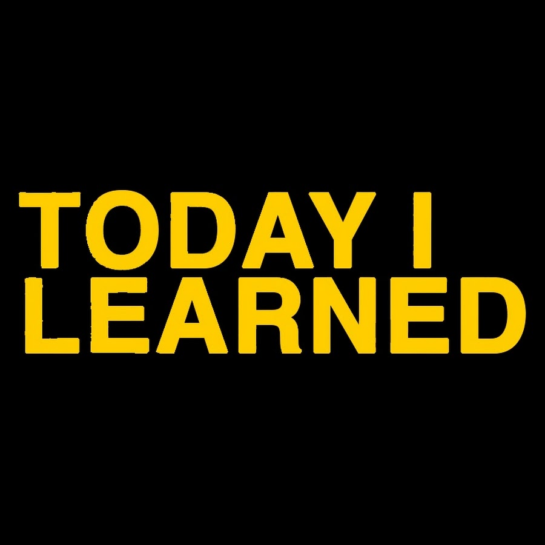

## Today I Learned

[](http://hits.dwyl.io/boys-be-ambitious//TIL)
​
- 시작일 : 2019년 2월 6일
​
## 작성규칙
- 언어나 기술명으로 폴더를 만든다(root에 문서를 만들지 않는다).
- python의 경우 ipynb(혹은 py)으로 생성, python이 아닌 다른 언어라면 md파일(혹은 html파일) 권장한다.
- 파일명은 영어로 작성한다.
​
## Folder Structure
```
├── 1) Data-anaytics
├── 2) Data-engineering-school
├──├── 1. AWS
├──├──├── EC2
├──├──├── S3
├──├──├── cloud watch
├──├── 2. Data Engineering Intro
├──├──├── Hadoop
├──├──├── MapReduce
├──├──├── Hive
├──├──├── 분산 DB
├──├── 3. RDBMS 실습 및 효율화
├──├──├── Managed RDBMS(RDS)
├──├──├── Scale Up
├──├──├── Load Balancing 
├──├── 4. Spark
├──├── 4.1. Spark DataFrame
├──├──├── Spark SQL
├──├──├── Spark DataFrame UDF
├──├──├── Spark DataFrame Analytic Function
├──├── 4.2. Spark Cluster
├──├──├── Spark Cluster 구축 리뷰 (EMR)
├──├──├── Master, Slave Script
├──├──├── Cluster 구조 (이론)
├──├──├── Cluster UI
├──├── 4.3. Spark Streaming
├──├──├── Spark Streaming 이론 수업
├──├──├── 실습환경 구축
├──├──├── 트위터 실시간 분석 실습
├──├── 5. Practice using Cloud Platform
├──├── 5.1. Preprocessing & Storage
├──├──├── EMR
├──├──├── Athena
├──├──├── Redshift
├──├── 5.2. Collection
├──├──├── Kinesis stream
├──├──├── Kinesis Firehose
├──├──├── Lambda
├──├── 5.3. Dashboard
├──├──├── AWS ES (Elasticsearch Service)
├──├──├── DMS (Database Migration Service)
├──├── 5.4. Cloud_GCP
├──├──├── GCP Bigquery
├──├── 5.5. Sage Maker for ML
├──├──├── Sage Marker
├──├── 6.Visualization
├──├──├── Tableau
├──├──├── DataStudio
├──├──├── BI Tools (Dashboard)
├──├── 7. ETC
├──├──├── Linux
├──├──├── Network
├──├──├── Docker
├── 3) Git
├── 4) Scraping
├── 5) SQL
├── 6) Statistics
```
​
## Reference
- [유림님 TIL](https://github.com/milooy/TIL#today-i-learned)
- [성윤님 TIL](https://github.com/zzsza/TIL)