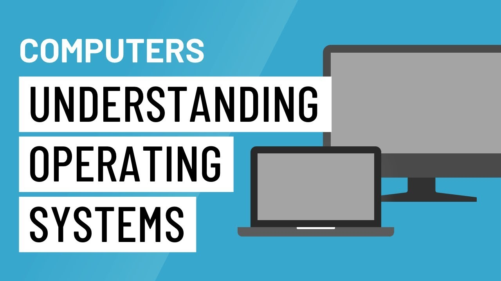

# Operating System

### [Back to CS Home](https://github.com/boys-be-ambitious/TIL/tree/master/computer-science-school)

## Table of Contents
### 1. [운영체제 큰 그림](https://github.com/boys-be-ambitious/TIL/blob/master/computer-science-school/Operating_system/os_big_picture.md)

#### 1.1. 운영체제 역할을 큰그림으로 이해하기
#### 1.2. 운영체제와 응용 프로그램

### 2. [운영체제 역사](https://github.com/boys-be-ambitious/TIL/blob/master/computer-science-school/Operating_system/os_2_history.md)
#### 2.1. 운영체제 역사 (1950-1960년대 초반)
#### 2.2. 운영체제 역사 (1960년대 후반 - 시분할 시스템)
#### 2.3. 운영체제 역사 (1960년대 후반 - 멀티태스킹)
#### 2.4. 운영체제 역사 (1970년대)
#### 2.5. 운영체제 역사 (1980년대)
#### 2.6. 운영체제 역사 (1990년대)
#### 2.7. 운영체제 역사 (2000년대) 및 총정리

### 3. [운영체제 구조](https://github.com/boys-be-ambitious/TIL/blob/master/computer-science-school/Operating_system/os_3_structure.md)
#### 3.1. 시스템콜
#### 3.2. 사용자 모드와 커널 모드

### 4. 스케쥴링
#### 4.1. 배치 처리, 멀티 태스킹, 멀티 프로세싱 상세
#### 4.2. 멀티 프로그래밍
#### 4.3.1. 스케쥴링 알고리즘 기본1 
#### 4.3.2. 스케쥴링 알고리즘 기본2
#### 4.4. 프로세스 상태와 스케쥴러
#### 4.5. 프로세스 상태기반 스케쥴링 알고리즘 기본
#### 4.6. 선점형과 비선점형 스케쥴러
#### 4.7. 스케쥴링 알고리즘 조합

### 5. 인터럽트
#### 5.1. 인터럽트 종류
#### 5.2. 인터럽트 내부 동작

### 6. 프로세스 구조
#### 6.1. 프로세스 구조와 컴퓨터 구조
#### 6.2. 프로세스 구조와 힙
#### 6.3. 프로세스 구조와 스택 오버플로우

### 7. 컨텍스트 스위칭
#### 7.1. 컨텍스트 스위칭 원리
#### 7.2. 컨텍스트 스위칭 개념 정리

### 8. 프로세스
#### 8.1. 프로세스간 커뮤니케이션
#### 8.2. 프로세스와 IP
#### 8.3. IPC 기법1 (참고 강의)
#### 8.4. IPC 기법2 (참고 강의)
#### 8.5. 프로세스 총정리와 프로그램 성능개선방법의 이해

### 9. 스레드
#### 9.1. 스레드 개념
#### 9.2. 스레드 장단점
#### 9.3. 스레드 동기화 문제
#### 9.4. 세마포어
#### 9.5. deadlock과 starvation

### 10. 가상 메모리
#### 10.1. 가상 메모리 개념
#### 10.2. 페이징 시스템
#### 10.3. 다중 단계 페이징 시스템과 페이징 시스템 장점
#### 10.4. 페이지 폴트
#### 10.5. 페이지 교체 알고리즘
#### 10.6. 세그멘테이션 기법
#### 10.7. 가상 메모리 동작 이해 총정리

### 11. 파일 시스템
#### 11.1. 파일 시스템 배경 이해하기
#### 11.2. inode 방식과 가상 파일 시스템
#### 11.3. 부팅의 이해
#### 11.4. 가상 머신의 이해 (참고)
#### 11.5. 실제 최신 운영체제 이해 및 운영체제 총정리