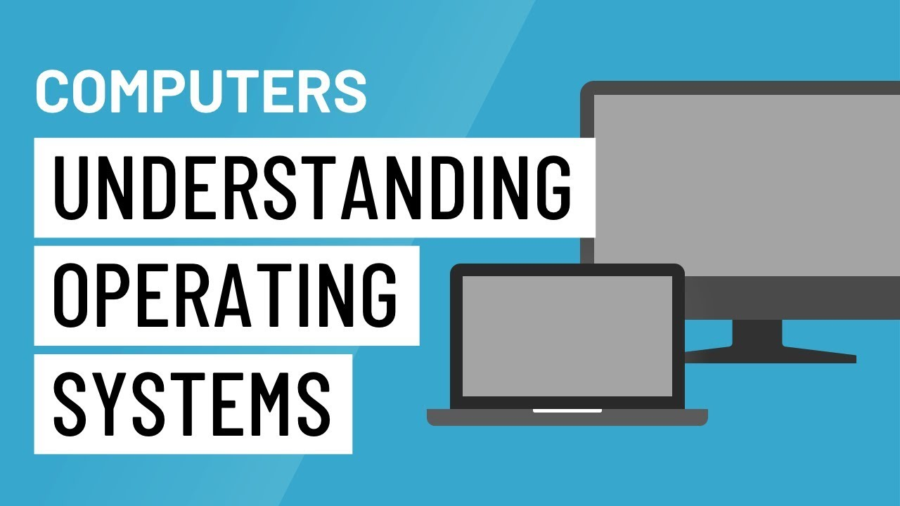

# Operating System

## Table of Contents
### 1. 운영체제 큰 그림
### 2. 운영체제 큰 그림과 응용 프로그램
### 3. 운영체제 역사 (1950-1960년대 초반)
### 4. 운영체제 역사 (1960년대 후반 - 시분할 시스템)
### 5. 운영체제 역사 (1960년대 후반 - 멀티태스킹)
### 6. 운영체제 역사 (1970년대)
### 7. 운영체제 역사 (1980년대)
### 8. 운영체제 역사 (1990년대)
### 9. 운영체제 역사 (2000년대) 및 총정리
### 10. 운영체제 구조 - 시스템콜
### 11. 운영체제 구조 - 사용자 모드와 커널 모드
### 12. 스케쥴링 - 배치 처리, 멀티 태스킹, 멀티 프로세싱 상세
### 13. 스케쥴링 - 멀티 프로그래밍
### 14-1. 스케쥴링 알고리즘 기본1
### 14-2. 스케쥴링 알고리즘 기본2
### 15. 프로세스 상태와 스케쥴러
### 16. 프로세스 상태기반 스케쥴링 알고리즘 기본
### 17. 선점형과 비선점형 스케쥴러
### 18. 스케쥴링 알고리즘 조합
### 19. 인터럽트란
### 20. 인터럽트 종류
### 21. 인터럽트 내부 동작
### 22. 프로세스 구조
### 23. 프로세스 구조와 컴퓨터 구조
### 24. 프로세스 구조와 힙
### 25. 프로세스 구조와 스택 오버플로우
### 26. 컨텍스트 스위칭 원리
### 27. 컨텍스트 스위칭 개념 정리
### 28. 프로세스간 커뮤니케이션
### 29. 프로세스와 IP
### 30. IPC 기법1 (참고 강의)
### 31. IPC 기법2 (참고 강의)
### 32. 프로세스 총정리와 프로그램 성능개선방법의 이해
### 33. 스레드 개념
### 34. 스레드 장단점
### 35. 스레드 동기화 문제
### 36. 세마포어
### 37. deadlock과 starvation
### 38. 가상 메모리 개념
### 39. 페이징 시스템
### 40. 다중 단계 페이징 시스템과 페이징 시스템 장점
### 41. 페이지 폴트
### 42. 페이지 교체 알고리즘
### 43. 세그멘테이션 기법
### 44. 가상 메모리 동작 이해 총정리
### 45. 파일 시스템 배경 이해하기
### 46. inode 방식과 가상 파일 시스템
### 47. 부팅의 이해
### 48. 가상 머신의 이해 (참고)
### 49. 실제 최신 운영체제 이해 및 운영체제 총정리

