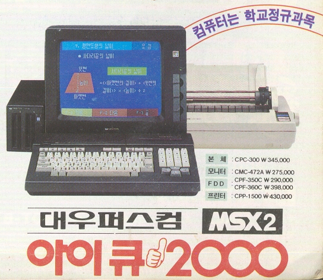

# History로 보는 운영체제
### [Back to OS Home](https://github.com/boys-be-ambitious/TIL/tree/master/computer-science-school/Operating_system)

# 1. 1950 ~ 1960년대 초반
## 1.1. 1950년대
##### ENIAC : 첫 번째 컴퓨터

### 1950년대에는 운영체제가 없었다.
    - 1개의 응용 프로그램을 실행시키키도 바빴다.
    - 응용 프로그램이 시스템 자원을 직접 제어
    - 참고 : https://www.youtube.com/watch?v=kH8gehlirrE

## 1.2. 1960년대 초기
    - 프로그램 종류도 많아지고, 사용자도 슬슬 많아지기 시작했다.

    - 철수 : 프로그램 1 (예상 실행 시간 12시간)
    - 영희 : 프로그램 2 (예상 실행시간 1분)
    - 이전 방식
        - 프로그램 1 --> 프로그램 2
        - 프로그램 2 --> 프로그램 1
        - 하나의 프로그램이 끝나야지 다음 프로그램을 실행시킬 수 있음.
        - 선행된 프로그램이 끝날 때까지 하염없이 기다려야함.
    
### 배치 처리 시스템 (Batch Processing System) 출현
	- 여러 응용 프로그램을 등록시켜놓으면, 순차적으로 실행하는 시스템
	- 배치 처리 시스템을 기반으로 운영체제가 출현
	- 참고 : https://youtu.be/fAselhq0Q8g
    
> - 컴퓨터 학과에 컴퓨터 1대 (배치처리 시스템을 지원)이던 시절 이야기
> - 컴퓨터 학과에서 프로그램 과제를 내주면, 후배들은 프로그램 실행(테스트)이 어려웠던 적이 있었다.
> - 왜냐하면, 하나의 프로그램이 끝나야 자동으로 다음 프로그램이 실행되니까 예상 응답 시간이 얼마나 걸릴지도 모르고, 길었다.

## Summary
    - 1950년대
        - 운영체제가 없었음
        - 응용 프로그램이 직접 시스템 자원을 제어하며 실행

    - 1960년대 초반
        - 배치 처리 시스템 출현, 이를 기반으로 운영체제가 출현

---

# 2. 1960년대 후반
    - 새로운 개념이 제안됨
        - 시분할 시스템 (Time Sharing System)
        - 멀티 태스킹 (Multi Tasking)

    - **운영 체제로 구현되지는 않았다.**

## 2.1. 시분할 시스템과 멀티 태스킹
    - 응용 프로그램이 CPU를 사용하는 시간을 잘개 쪼개서, 여러 개의 응용 프로그램을 동시에 실행하는 기법

    - 시분할 시스템 : 다중 사용자를 지원하고, 컴퓨터 응답 시간을 최소화하는 시스템

    - 멀티 태스킹 : 단일 CPU에서 여러 응용 프로그램의 병렬 실행을 가능케 하는 시스템

    - 보통 시분할 시스템 = 멀티 태스킹 ('시간을 잘개 쪼개서 여러 프로그램을 돌려가면서 실행시키는 것'으로 유사한 기술로 보는 경우가 많다).

> - 플립북 예제
> - 참고 : https://youtu.be/7BW4-IVO5Jc
> - 멀티 프로그래밍 : 가능한 CPU를 많이 활용하도록 하는 기능 (시간대비 CPU 사용률을 높이자)

### Q&A
    - Q : "시분할 시스템을 사용하게 되면 컴퓨터 입장에서 생각했을 때, 응용프로그램을 계속 바꾸면서 실행을 하기 때문에 배치 시스템으로 사용 했을 때 보다 속도 측면에서 봤을 때 느려지게 되는 것이 아닌가요?"
    
    - A : "굉장히 좋은 질문입니다. 네 맞습니다. 속도 측면에서는 배치 시스템이 더 나을 수도 있습니다.응용 프로그램을 수시로 바꾸기 때문에, 오버헤드(부가적인 작업)이 많이 걸립니다. 오버헤드도 있지만, CPU 활용도 측면에서 배치 처리 시스템보다 멀티 태스킹/프로그래밍이 분명히 장점이 있음을 이해하실 수 있으실 것입니다."

### 배치 처리 시스템의 단점
    1. 컴퓨터 응답 시간 (response time)이 오래 걸릴 수 있다.
        - (앞단에 실행시간이 많이 필요로 하는 응용 프로그램이 실행될 경우)
    
    2. 실행 시간도 오래 걸릴 수 있다.
        - (CPU가 필요 없음에도 응용 프로그램이 CPU를 점유할 수 있기 때문)

## 2.2. 시분할 시스템과 배치 처리 시스템
    - 배치 처리 시스템의 단점을 극복하기 위해 시분할 시스템이 나왔음.

    - 시분할 시스템 / 멀티 태스킹
        - 핵심 기술 : 시간을 잘게 쪼개서, 여러 응용 프로그램을 실행
            - 컴퓨터 응답 시간을 줄일 수 있음 (시분할 시스템, 다중 사용자를 지원)
            - 전체 응용프로그램의 실행 시간도 줄일 수 있음 (멀티 프로그래밍)
            - 결과적으로, 사용자가 느낄 때에는 여러 응용 프로그램이 동시에 실행되는 것처럼 보인다. (멀티 태스킹)

## Summary
    - 시분할 시스템/멀티태스킹
        - 멀티프로그래밍

    - 당시에는 아이디어로 제안이 되었지만, 기술로는 구현되지 않았음.

    - 기술 : CPU 시간을 잘게 쪼개기
    - 결과 : 다중 사용자 지원, 응용 프로그램 동시 실행

---

# 3. 1970년대
##### 제대로 된 운영체제가 나온 시기

## 3.1. Unix(유닉스) OS
    - 미국 AT&T사의 벨 연구소
        - 켐톤슨, 데니스 리치
        - 데니스 리치 : C언어를 개발한 사람, 그 언어로 Unix OS를 만들었다.
        - 시분할 시스템, 멀티 태스킹, 멀티 프로그래밍이 들어가 있음. 운영체제의 중요성이 높아지기 시작했음.

> - Dennis Ritchie - Write in C
> - 참고 : https://youtu.be/H4YRPdRXKFs

### 운영체제 개발에 C언어가 필요했던 이유
    - 1970년대 이전 : Assembly 언어로 소프트웨어 개발
        - CPU(명령어), Memory(주소)
        - 컴퓨터마다 각각 다시 개발(지정)해줘야 하는 단점
        - 프로그래밍 복잡도가 높음
        
    - 1970년대 C언거가 개발된 후.
        - C언어로 코드를 작성하면, CPU 명령을 직접 쓸 필요도 없고, 메모리 주소 지정을 해줄 수도 있지만, 물리적 주소에 매칭이 되는 작업을 컴파일러(소프트웨어)를 통해 자동으로 기계어(Assembly)로 바꿔준다. 즉, 컴퓨터마다 각각 다시 작성할 필요가 없다는 뜻이다.

	- 컴파일러 : 다시 작성할 필요가 없음
	- (Assembly에 비해) 프로그래밍 복잡도는 낮음
    
> C언어를 기반으로 운영체제를 개발했다.

### Unix 특징
    - 현대 운영체제의 기본 기술을 모두 포함한 최초의 운영체제
        - 멀티 태스킹, 시분할 시스템, 멀티 프로그래밍
            - 다중 사용자 지원

> - UNIX는 어떻게 생겼나?
> - AT&T Unix PC boosting
> - 참고 : https://youtu.be/Aj1n2_qEq5k

## Summary
    - 본격적으로 운영체제 중요성 부각
    - 현대 운영체제 기술 확립, Unix OS에 최초 구현
    - Unix : 멀티 태스킹, 시분할 시스템, 멀티 프로그래밍 구현

---

# 4. 1980년대
## 4.1. 개인용 컴퓨터
    - 개인용 컴퓨터 시대
        - 1980년대 이전 : 대형 컴퓨터를 여러 명이 접속해서 사용 (Unix) -> 시분할 시스템이 컴퓨터 응답시간을 줄여서 다중 사용자를 지원하게 됨.
        - 1980년대 ~ : Personal Computer (PC)

## 4.2. CLI --> GUI
    - 용어 이해 : CLI와 GUI
        - CLI (Command Line Interface) : 터미널 환경
        - GUI (Graphical User Interface) : GUI 환경

    - 1980년대 초반 : 아직 터미널 환경
    - 1980년대 중후반 : GUI 환경 (마우스)

> - Apple vs. Microsoft OS
> - 참고 : https://youtu.be/f_Q0XPher3o

> - Macintosh : 마우스를 사용한 OS
> - 참고 : https://youtu.be/cvjLc24VbI8

> - Apple Macintosh Commercials
> - 참고 : https://www.youtube.com/watch?v=I1YTahnDy1Y

## Summary
    - 1. 개인용 컴퓨터
    - 2. GUI 환경

---

# 5. 1990년대
## 5.1. 1990년대 특징 1
    1. 응용 프로그램 시대 by GUI 환경, 개인용 컴퓨터 (사용자 증대)
        - 엑셀, 워드프로세서 등
        - Windows OS 대중화
        
> - Windows 95 Commercials
> - 참고 : https://youtu.be/lAkuJXGldrM

### Killer Application
    - 1. '위닝 일레븐'이라는 축구 게임 프로그램을 위해 플레이스테이션 기기를 구매했다.
    - 2. '엑셀'프로그램을 사용하기 위해서, Windows 컴퓨터를 구매했다.

## 5.2. 1990년대 특징 2
    2. 네트워크 기술 발전 - 월드와이드웹(WWW) 인터넷 대중화

## 5.3. 1990년대 특징 3
    3. 오픈 소스 운동 활성화 시작
        - Unix 계열 OS + 응용 프로그램 자체 개발, 소스 오픈
        - Linux(리눅스) 운영체제, 소스 오픈, 무료

## Summary
    1. 다양한 응용프로그램 활성화 (Killer Application)
    2. 네트워크 발전 (인터넷)
    3. 오픈 소스 운동 활성화 (리눅스)

---

# 6. 2000년대 이후 및 전체 운영체제 발전사 정리

    1. 오픈 소스 활성화
        - Linux 운영체제
        - Apache (웹서버)
        - MySQL (데이터베이스)
        - 요즘 기술들(안드로이드, 데이터사이언스, IoT)

    2. 가상 머신, 대용량 병렬 처리 등 활성화
    

## Summary 1
    1. 1950년대 : 운영체제 없음 (프로그램이 시스템 자원 직접 제어)
    2. 1960년대 : 배치 처리 시스템
    3. 1970년대 : 시분할 시스템 / 멀티 태스킹 시스템 - Unix OS (C언어)
    4. 1980년대 : GUI, 개인용 컴퓨터(PC)
    5. 1990년대 : 다양한 응용프로그램(Killer Application), 인터넷(Network) 발달, 오픈 소스 운동 활성화, 가상 머신, 대용량 병렬 처리 등

## Summary 2
    1. 운영체제는 응용 프로그램과 시스템 자원을 제어하고, 관리한다.
    2. 응용 프로그램(Application)용어 이해
    3. 배치 처리 시스템, 시분할 시스템, 멀티 태스킹 개념
    4. CLI(터미널) vs. GUI 환경 용어 이해
    5. History 전반은 가볍게만 알아두기