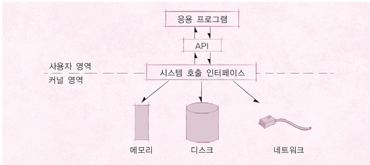

# Operating System Structure
### [Back to OS Home](https://github.com/boys-be-ambitious/TIL/tree/master/computer-science-school/Operating_system)
---

# 1. System Call

## 1.1. 응용프로그램, 운영체제, 컴퓨터 하드웨어(시스템 리소스) 관계
### 도서관에 비유
    - 운영체제 : 도서관
    - 응용 프로그램 : 시민
    - 컴퓨터 하드웨어 : 책
    - 운영체제의 역할
        - 시민은 도서관에 원하는 책(자원)을 요청
        - 도서관은 적절한 책을 찾아서, 시민에게 대여
        - 시민의 기한이 다 되면, 도서관이 해당 책(자원) 회수

> 출처 : 구글

- 운영체제는 응용 프로그램이 요청하는 메모리를 허가하고, 분배한다.
- 운영체제는 응용 프로그램이 요청하는 CPU 시간을 제공한다.
- 운영체제는 응용 프로그램이 요청하는 IO Devices 사용을 허가/제어한다.

## 1.2. 운영체제는 사용자 인터페이스 제공
    - 쉘 (Shell)
        - 사용자가 운영체제 기능과 서비스를 조작할 수 있도록 인터페이스를 제공하는 프로그램
        - 쉘은 터미널 환경(CLI)과 GUI 환경 두 종류로 분류

## 1.3. 운영체제는 응용 프로그램을 위해서도 인터페이스를 제공
    - API (Application Programming Interface)
        - 함수로 제공
        - open()
    - 보통은 라이브러리(library) 형태로 제공
        - C library
        - https://www.gnu.org/software/libc/

- 운영체제는 사용자 뿐만 아니라, 응용 프로그램을 위해서도 인터페이스를 제공해준다.
- 사용자 인터페이스를 제공해주기 위해 별도의 shell 프로그램을 제공한다.
- OS 바로 전 단계에 (함수의 집합, 요청서의 집합인) API가 있다.
- 운영체제가 제공해주는 API를 가지고 Shell(도 하나의 응용 프로그램이니까)이라는 프로그램을 만든다. 
- Application도 운영체제의 특별한 기능을 쓰고 싶을 때에는 API를 사용해야한다.

## 1.4. System Call
    - 시스템 콜 또는 시스템 호출 인터페이스
    - 운영체제가 운영체제 각 기능을 (응용 프로그램에서) 사용할 수 있도록 시스템 콜이라는 명령 또는 함수를 제공
    - API 내부에는 (해당 운영체제 기능을 사용할 수 있는)시스템콜을 호출하는 형태로 만들어지는 경우가 대부분

> 출처 : 구글

## 1.5. 운영체제를 만든다면?
    1. 운영체제 개발 (핵심 운영체제 software - Kernel)
    2. 시스템 콜 개발
    3. C API(library) 개발
    4. (사용자를 위한) shell 프로그램 개발
    5. 응용 프로그램 개발

## 1.5. 운영체제와 시스템 콜
- 표준 시스템 콜 정의
- [POSIX API](https://docs.oracle.com/cd/E19048-01/chorus4/806-3328/6jcg1bm05/index.html), Windows API

> - API(library) : 각 언어별 운영체제 기능 호출 인터페이스 함수 (각 언어별 인터페이스)
> - 시스템 콜 : 운영체제 기능을 호출하는 함수

## Summary
    - 운영체제는 컴퓨터 하드웨어와 응용 프로그램을 관리한다.
    - 사용자 인터페이스를 제공하기 위해 쉘 프로그램을 제공한다.
    - 응용 프로그램이 운영체제 기능을 요청하기 위해서, 운영체제는 시스템 콜을 제공한다.
        - 보통 시스템 콜을 직접 사용하기 보다는, 해당 시스템 콜을 사용해서 만든 각 언어별 라이브러리(API)를 사용한다.

# Operating System Structure 2
### [Back to OS Home](https://github.com/boys-be-ambitious/TIL/tree/master/computer-science-school/Operating_system)
---
# 2. 사용자 모드와 커널 모드

## 2.1. CPU Protection Rings
- CPU도 권한 모드라는 것을 가지고 있다.
	+ 사용자 모드 (User mode) : 응용 프로그램이 사용
	+ 커널 모드 (Kernel mode) : 특권 명령어 실행과 원하는 작업 수행을 위한 자원 접근을 가능케 하는 모드, OS가 사용ㅎ

> Intel CPU
> - Ring 3 : User Mode
> - Ring 1 : Kernel Mode

### Kernel이란?
1. (견과류, 씨앗의) 알맹이
2. (사상, 주체의) 핵심 

### Shell이란?
1. (달걀, 견과류 등의 딱딱한) 껍데기
2. 고둥 껍데기 모양의 것

## 2.2. 응용 프로그램과 운영체제
- 우리가 만든 프로그램은 맨 위에서 놀고 있다.

### 시스템 콜은 커널 모드로 실행
- 커널 모드에서만 실행 가능한 기능들이 있음
- 커널 모드로 실행하려면, 반드시 시스템 콜을 사용해야 함(거쳐야 함)
- 시스템 콜은 운영체제 제공

 
- 응용 프로그램이 커널 모드에서만 실행 가능한 기능을 사용하려면 반드시 시스템 콜을 사용해서, 커널 모드로 변환된 상태에서 CPU에서 실행이 된다.

### 사용자 모드와 커널 모드
- 함부로 응용 프로그램이 전체 컴퓨터 시스템을 해치지 못함
- 주민등록등본은 꼭 동사무소 또는 민원24시(정부 사이트)에서 특별한 신청서(->시스템 콜)를 써야만, 발급
	+ 동사무소 직원은 특별한 권한을 가지고, 주민등록등본 출력 명령을 실행(-> 커널 모드)

## 2.3. 정리
- 운영체제는 **시스템 콜** 제공
- 프로그래밍 언어별로 운영체제 기능을 활용하기 위해, 시스템 콜을 기반으로 **API** 제공
- 응용 프로그램은 운영체제 기능 필요시, 해당 API를 사용해서 프로그램을 작성
- 응용 프로그램이 실행되서, 운영체제 기능이 필요한 **API**를 호출하면, 시스템 콜이 호출되서, **커널 모드로 변경되어** OS 내부에서 해당 명령이 실행되고, 다시 응용 프로그램으로 돌아간다.