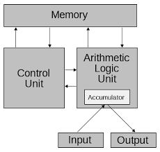

# Operating System
### [Back to OS Home](https://github.com/boys-be-ambitious/TIL/tree/master/computer-science-school/Operating_system)
---

# 1. 운영체제 역할을 큰그림으로 이해하기

## 1.1. 운영체제 역할 1 : 시스템 자원(System Resource) 관리자
- Operating System 또는 OS라고 부른다.
- 시스템 자원(System Resource) = 컴퓨터 하드웨어
	+ CPU (중앙처리장치), Memory(DRAM, RAM)
	+ I/O Devices (입출력장치)
		- Monitor, Mouse, Keyboard, Network
		- 저장매체 : SSD, HDD		
- OS는 Computer H/W를 관리하는 S/W다.

### 운영체제 역할
> 컴퓨터 하드웨어는 스스로 할 수 있는 것이 없다.
1. CPU : 각 프로그램이 얼마나 CPU를 사용할지를 결정할 수는 없다.
2. Memory : 각 프로그램이 어느 주소에 저장되어야 하는지, 어느 정도의 메모리 공간을 확보해줘야 하는지를 결정할 수는 없다.
3. 저장매체(HDD, SSD) :어디에, 어떻게 저장할지는 결정할 수는 없다.
4. 키보드/마우스 : 스스로 표시할 수는 없다.

> 그래서 운영체제(라는 S/W)가 필요하다.

### 대표적인 운영체제
- Windows OS, Mac OS, 그리고 UNIX

- UNIX OS
	+ UNIX 계열 OS
		- UNIX와 사용법이나, OS구조가 유사
    + Linux OS
    	- 프로그래머, 전공자
        
### 쉬어가기 : OS는 만들기 어렵다.
> - TmaxOS 시연
> - 참고 : https://youtu.be/OylmhpqptkY
> - Windows 시연
> - 참고 : https://youtu.be/nA2SQcaB0ok

## 1.2. 운영체제 역할2 : 사용자와 컴퓨터간의 커뮤니케이션 지원
## 1.3. 운영체제 역할3 : 컴퓨터 하드웨어와 프로그램을 제어

## Summary
- 운영체제 역할 1 : 시스템 자원(System Resource) 관리자
- 운영체제 역할 2 : 사용자와 컴퓨터간의 커뮤니케이션 지원
- 운영체제 역할 3 : 컴퓨터 하드웨어와 프로그램을 제어

---
# 2. 운영체제와 응용프로그램

## 2.1. 응용 프로그램이란?
- 프로그램 = 소프트웨어
- 소프트웨어 = 운영체제, 응용 프로그램(엑셀, 파워포인트, 사용자가 만든 프로그램)
- 응용 프로그램 = Application(일반 PC에서의 프로그램) = App(스마트폰에서의 응용프로그램)

## 2.2. 운영체제와 응용 프로그램간의 관계

### 2.2.1. 운영체제는 응용 프로그램을 관리
+ 응용 프로그램을 실행시킨다.
+ 응용 프로그램 간의 **권한**을 관리해준다.
    - 관리자 권한으로 실행
+ 응용 프로그램을 사용하는 **사용자**도 관리
    - 로그인
    
### 2.2.2. 응용 프로그램은 누구나 만들 수 있다.
+ 응용 프로그램에 무한 반복문을 넣었다.
+ 응용 프로그램을 잘못 작성해서, 프로그램이 다운
+ 모든 파일 삭제 막기(권한/사용자 관리)
+ 응용 프로그램이 욕심이 많아서, CPU를 자기만 쓰겠다. <- 운영체제가 막는다.
    
> 그래서 운영체제는 응용 프로그램을 관리  

### 2.2.3. 정리
1. 응용 프로그램을 관리한다.
2. 시스템 자원(System Resource)를 관리한다.
3. 사용자와 컴퓨터 간의 커뮤니케이션을 지원한다.  
 

> - 운영체제의 목표 : 사용자가 사용하는 응용 프로그램이 효율적으로, 적절하게 동작하도록 지원.
> - 운영체제는 응용 프로그램이 요청하는 시스템 리소스를 효율적으로 분배하고, 지원하는 소프트웨어.
> - 운영체제는 저장매체(SSD/HDD)에 저장(설치)이 된다.

## 2.3. 컴퓨터 구조 복습
> 컴퓨터를 키면? --> 운영체제는 Memory에 올라가게 된다.

### 참고 : 폰 노이만 구조

> 현대 컴퓨터의 구조
> 모든 프로그램은 메모리에 올라가고, 하나씩 CPU에 던져지면서 컴퓨터가 실행이 된다.

## 2.4. 정리
1. 운영체제 역할 : 시스템 자원, 응용 프로그램 관리, 효율적 분배
2. 응용 프로그램이란? : 소프트웨어 (운영체제, 응용 프로그램)

---
