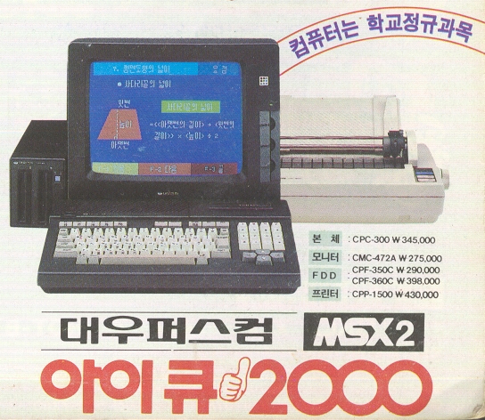
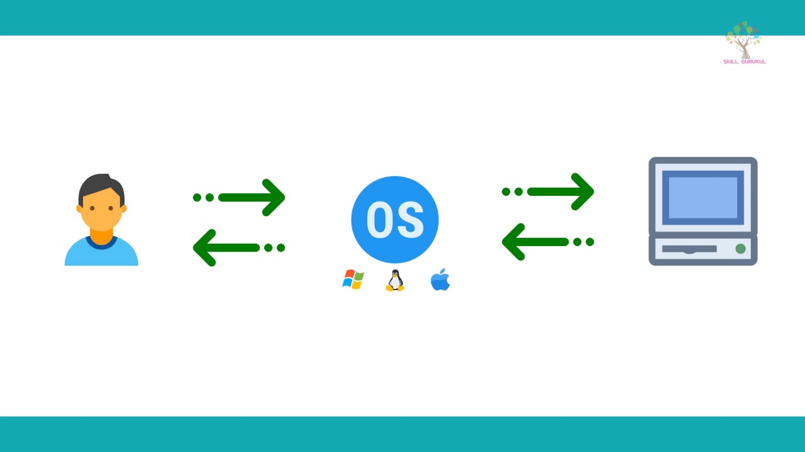
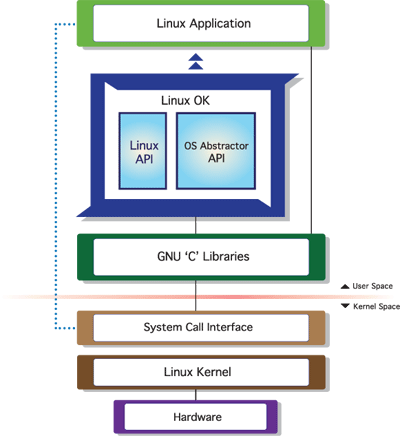

# Operating System
---
# 운영체제 역할 큰그림으로 이해하기
> 핵심 이론과 용어에 집중해서 감을 잡는데 중점을 둔다(80%).

---
## 운영체제 역할 1 : 시스템 자원(System Resource) 관리자
- Operating System 또는 OS라고 부른다.
- 시스템 자원(System Resource) = 컴퓨터 하드웨어
	+ CPU (중앙처리장치), Memory(DRAM, RAM)
	+ I/O Devices (입출력장치)
		- Monitor, Mouse, Keyboard, Network
		- 저장매체 : SSD, HDD
		
- Computer H/W를 관리하는 S/W다.

---
## 운영체제 역할
> 컴퓨터 하드웨어는 스스로 할 수 있는 것이 없다.
1. CPU : 각 프로그램이 얼마나 CPU를 사용할지를 결정할 수는 없다.
2. Memory : 각 프로그램이 어느 주소에 저장되어야 하는지, 어느 정도의 메모리 공간을 확보해줘야 하는지를 결정할 수는 없다.
3. 저장매체(HDD, SSD) :어디에, 어떻게 저장할지는 결정할 수는 없다.
4. 키보드/마우스 : 스스로 표시할 수는 없다.

> 그래서 운영체제(라는 S/W)가 필요하다.

---
## How did we ever run Computer without OS?
> OS 미설치된 랩탑
> 출처 : https://youtu.be/e9FrlIvlN38

---
## 대표적인 운영체제
- Windows OS, Mac OS, 그리고 UNIX

- UNIX OS
	+ UNIX 계열 OS
		- UNIX와 사용법이나, OS구조가 유사
    + Linux OS
    	- 프로그래머, 전공자

---
## 쉬어가기 : OS는 만들기 어렵다.
> TmaxOS 시연
> 출처 : https://youtu.be/OylmhpqptkY
> Windows 시연
> 출처 : https://youtu.be/nA2SQcaB0ok

---
## 운영체제 역할2 : 사용자와 컴퓨터간의 커뮤니케이션 지원

---
## 운영체제 역할3 : 컴퓨터 하드웨어와 프로그램을 제어

---
## 정리
- 운영체제 역할 1 : 시스템 자원(System Resource) 관리자
- 운영체제 역할2 : 사용자와 컴퓨터간의 커뮤니케이션 지원
- 운영체제 역할3 : 컴퓨터 하드웨어와 프로그램을 제어

---
---
# 운영체제 역할 큰그림으로 이해하기
## 운영체제와 응용프로그램

---
## 응용 프로그램이란?
- 프로그램 = 소프트웨어
- 소프트웨어 = 운영체제, 응용 프로그램(엑셀, 파워포인트, 사용자가 만든 프로그램)
- 응용 프로그램 = Application(일반 PC에서의 프로그램) = App(스마트폰에서의 응용프로그램)

---
## 운영체제와 응용 프로그램간의 관계
- 운영체제는 응용프로그램을 관리
	+ 응용 프로그램을 실행시킨다.
	+ 응용 프로그램 간의 **권한**을 관리해준다.
		- 관리자 권한으로 실행
	+ 응용 프로그램을 사용하는 **사용자**도 관리
		- 로그인
---
## 운영체제와 응용 프로그램간의 관계
- 응용프로그램은 누구나 만들 수 있다,
	+ 응용 프로그램에 무한 반복문을 넣었다.
	+ 응용 프로그램을 잘못 작성해서, 프로그램이 다운
	+ 모든 파일 삭제 막기(권한/사용자 관리)
	+ 응용 프로그램이 욕심이 많아서, CPU를 자기만 쓰겠다. <- 운영체제가 막는다.
> 그래서 운영체제는 응용 프로그램을 관리

---
## 운영체제와 응용 프로그램 간의 관계
1. 응용 프로그램을 관리한다.
2. 시스템 자원(System Resource)를 관리한다.
3. 사용자와 컴퓨터 간의 커뮤니케이션을 지원한다.

> 운영체제의 목표 : 사용자가 사용하는 응용 프로그램이 효율적으로, 적절하게 동작하도록 지원.
> 운영체제는 응용 프로그램이 요청하는 시스템 리소스를 효율적으로 분배하고, 지원하는 소프트웨어.

---
## 쉬워가기 : 운영체제는 어디에 있을까?
> 운영체제는 저장매체(SSD/HDD)에 저장(설치)이 된다.

---
## 컴퓨터 구조 복습
> 컴퓨터를 키면? --> 운영체제는 Memory에 올라가게 된다.

### 참고 : 폰 노이만 구조

---
## 정리
1. 운영체제 역할 : 시스템 자원, 응용 프로그램 관리, 효율적 분배
2. 응용 프로그램이란? : 소프트웨어 (운영체제, 응용 프로그램)

---
---
# History로 보는 운영체제 1
## - 1950 ~ 1960년대 초반
---
## 1950년대
###  ENIAC : 첫 번째 컴퓨터
### 운영체제가 없었다.
- 1개의 응용 프로그램을 실행시키키도 바빴다.
- 응용 프로그램이 시스템 자원을 직접 제어
> 참고 : https://www.youtube.com/watch?v=kH8gehlirrE

---
### 1960년대 초기
> 프로그램 종류도 많아지고, 사용자도 슬슬 많아지기 시작
- 철수 : 프로그램 1 (예상 실행 시간 12시간)
- 영희 : 프로그램 2 (예상 실행시간 1분)
- 이전 방식
	+ 프로그램 1 --> 프로그램 2
	+ 프로그램 2 --> 프로그램 1
	+ 하나의 프로그램이 끝나야지 다음 프로그램을 실행시킬 수 있음. 선행된 프로그램이 끝날 때까지 하염없이 기다려야함.
	
- 배치 처리 시스템 (Batch Processing System) 출현
	+ 여러 응용 프로그램을 등록시켜놓으면, 순차적으로 실행하는 시스템
	+ 배치 처리 시스템을 기반으로 운영체제가 출현
	> 참고 : https://youtu.be/fAselhq0Q8g

---
## 배치 처리 시스템 (batch processing system)
> 과거에는 컴퓨터 학과에 컴퓨터 1대 (배치처리 시스템을 지원)
> 컴퓨터 학과에서 프로그램 과제를 내주면,
> 후배들은 프로그램 실행(테스트)이 어려웠던 적이 있었다.
> 왜냐하면, 하나의 프로그램이 끝나야 자동으로 다음 프로그램이 실행되니까 예상 응답 시간이 얼마나 걸릴지도 모르고, 길었다.
---
## 정리
- 1950년대
	+ 운영체제가 없었음
	+ 응용 프로그램이 직접 시스템 자원을 제어하며 실행
 
- 1960년대 초반
	+ 배치 처리 시스템 출현, 이를 기반으로 운영체제가 출현

---
---
# History로 보는 운영체제 2
## - 1960년대 후반

---
## 1960년대 후반
- 새로운 개념이 제안됨
	+ 시분할 시스템 (Time Sharing System)
	+ 멀티 태스킹 (Multi Tasking)
 
> 운영 체제로 구현되지는 않았다.

---
## 시분할 시스템과 멀티 태스킹
- 응용 프로그램이 CPU를 사용하는 시간을 잘개 쪼개서, 여러 개의 응용 프로그램을 동시에 실행하는 기법

---
## 시분할 시스템과 멀티 태스킹
- 시분할 시스템 : 다중 사용자를 지원하고, 컴퓨터 응답 시간을 최소화하는 시스템

---
## Q&A
- Q : "시분할 시스템을 사용하게 되면 컴퓨터 입장에서 생각했을 때, 응용프로그램을 계속 바꾸면서 실행을 하기 때문에 배치 시스템으로 사용 했을 때 보다 속도 측면에서 봤을 때 느려지게 되는 것이 아닌가요?"
 
- A : "굉장히 좋은 질문입니다. 네 맞습니다. 속도 측면에서는 배치 시스템이 더 나을 수도 있습니다.응용 프로그램을 수시로 바꾸기 때문에, 오버헤드(부가적인 작업)이 많이 걸립니다. 오버헤드도 있지만, CPU 활용도 측면에서 배치 처리 시스템보다 멀티 태스킹/프로그래밍이 분명히 장점이 있음을 이해하실 수 있으실 것입니다."

---
## 시분할 시스템과 멀티 태스킹
- 멀티 태스킹 : 단일 CPU에서 여러 응용 프로그램의 병렬 실행을 가능케 하는 시스템

- 보통 시분할 시스템 = 멀티 태스킹 ('시간을 잘개 쪼개서 여러 프로그램을 돌려가면서 실행시키는 것'으로 유사한 기술로 보는 경우가 많다).
 
> 플립북 예제
> 참고 : https://youtu.be/7BW4-IVO5Jc
> 멀티 프로그래밍 : 가능한 CPU를 많이 활용하도록 하는 기능 (시간대비 CPU 사용률을 높이자)

---
## 배치 처리 시스템의 단점
1. 컴퓨터 응답 시간 (response time)이 오래 걸릴 수 있다.
 	+ (앞단에 실행시간이 많이 필요로 하는 응용 프로그램이 실행될 경우)
 
2. 실행 시간도 오래 걸릴 수 있다.
	+ (CPU가 필요 없음에도 응용 프로그램이 CPU를 점유할 수 있기 때문)

---
## 시분할 시스템과 배치 처리 시스템
- 배치 처리 시스템의 단점을 극복하기 위해 시분할 시스템이 나왔음.
 

- 시분할 시스템 / 멀티 태스킹
	+ 핵심 기술 : 시간을 잘게 쪼개서, 여러 응용 프로그램을 실행
		+ 컴퓨터 응답 시간을 줄일 수 있음 (시분할 시스템, 다중 사용자를 지원)
		+ 전체 응용프로그램의 실행 시간도 줄일 수 있음 (멀티 프로그래밍)
		+ 결과적으로, 사용자가 느낄 때에는 여러 응용 프로그램이 동시에 실행되는 것처럼 보인다. (멀티 태스킹)

---
## 정리
> 1960년대 후반부 정리

- 시분할 시스템/멀티태스킹
	- 멀티프로그래밍

> 당시에는 아이디어로 제안이 되었지만, 기술로는 구현되지 않았음.

- 기술 : CPU 시간을 잘게 쪼개기
- 결과 : 다중 사용자 지원, 응용 프로그램 동시 실행

---
---
# History로 보는 운영체제
## - 1970년대

---
## 1970년대
> 제대로 된 운영체제가 나온 시기

### Unix(유닉스) OS
- 미국 AT&T사의 벨 연구소
	+ 켐톤슨, 데니스 리치
	+ 데니스 리치 : C언어를 개발한 사람, 그 언어로 Unix OS를 만들었다.
	+ 시분할 시스템, 멀티 태스킹, 멀티 프로그래밍이 들어가 있음. 운영체제의 중요성이 높아지기 시작했음.
> Dennis Ritchie - Write in C
> 참고 : https://youtu.be/H4YRPdRXKFs

---
## 쉬어가기 : 운영체제 개발에 C언어가 필요했던 이유
- 1970년대 이전 : Assembly 언어로 소프트웨어 개발
	+ CPU(명령어), Memory(주소)
	+ 컴퓨터마다 각각 다시 개발(지정)해줘야 하는 단점
	+ 프로그래밍 복잡도가 높음
	
- 1970년대 C언거가 개발된 후.
	+ C언어로 코드를 작성하면, CPU 명령을 직접 쓸 필요도 없고, 메모리 주소 지정을 해줄 수도 있지만, 물리적 주소에 매칭이 되는 작업을 컴파일러(소프트웨어)를 통해 자동으로 기계어(Assembly)로 바꿔준다. 즉, 컴퓨터마다 각각 다시 작성할 필요가 없다는 뜻이다.
 
	+ 컴파일러 : 다시 작성할 필요가 없음
	+ (Assembly에 비해) 프로그래밍 복잡도는 낮음
> C언어를 기반으로 운영체제를 개발했다.

---
## Unix 특징
- 현대 운영체제의 기본 기술을 모두 포함한 최초의 운영체제
	+ 멀티 태스킹, 시분할 시스템, 멀티 프로그래밍
		+ 다중 사용자 지원

> UNIX는 어떻게 생겼나?
> AT&T Unix PC boosting
> 참고 : https://youtu.be/Aj1n2_qEq5k

---
## 정리
### 1970년대
- 본격적으로 운영체제 중요성 부각
- 현대 운영체제 기술 확립, Unix OS에 최초 구현
- Unix : 멀티 태스킹, 시분할 시스템, 멀티 프로그래밍 구현

---
---
# History로 보는 운영체제
## - 1980년대

---
## 1980년대 - 개인용 컴퓨터
- 개인용 컴퓨터 시대
	+ 1980년대 이전 ㅣ 대형 컴퓨터를 여러 명이 접속해서 사용 (Unix) -> 시분할 시스템이 컴퓨터 응답시간을 줄여서 다중 사용자를 지원하게 됨.
	+ 1980년대 ~ : Personal Computer (PC)

---
## 1980년대
- 용어 이해 : CLI와 GUI
	+ CLI (Command Line Interface) : 터미널 환경
	+ GUI (Graphical User Interface) : GUI 환경

---
## 1980년대 : CLI --> GUI
- 1980년대 초반 : 아직 터미널 환경
- 1980년대 중후반 : GUI 환경 (마우스)
 
> Apple vs. Microsoft OS
> 참고 : https://youtu.be/f_Q0XPher3o

> Macintosh : 마우스를 사용한 OS
> 참고 : https://youtu.be/cvjLc24VbI8

> Apple Macintosh Commercials
> 참고 : https://www.youtube.com/watch?v=I1YTahnDy1Y

---
## 정리
### 1980년대
1. 개인용 컴퓨터
2. GUI 환경

---
---
# History로 보는 운영체제
## - 1990년대 
1. 응용 프로그램 시대 by GUI 환경, 개인용 컴퓨터 (사용자 증대)
	+ 엑셀, 워드프로세서 등
	+ Windows OS 대중화
	 
    
> Windows 95 Commercials
> 참고 : https://youtu.be/lAkuJXGldrM

---
## 쉬어가기 : Killer Application
> 1. '위닝 일레븐'이라는 축구 게임 프로그램을 위해 플레이스테이션 기기를 구매했다.
> 2. '엑셀'프로그램을 사용하기 위해서, Windows 컴퓨터를 구매했다.

---
## 1990년대
2. 네트워크 기술 발전 - 월드와이드웹(WWW) 인터넷 대중화

---
## 1990년대
3. 오픈 소스 운동 활성화 시작
	+ Unix 계열 OS + 응용 프로그램 자체 개발, 소스 오픈
	+ Linux(리눅스) 운영체제, 소스 오픈, 무료

---
## 정리
### 1990년대
1. 다양한 응용프로그램 활성화 (Killer Application)
2. 네트워크 발전 (인터넷)
3. 오픈 소스 운동 활성화 (리눅스)

---
---
# History로 보는 운영체제
## 2000년대 이후 및 전체 운영체제 발전사 정리
1. 오픈 소스 활성화
	+ Linux 운영체제
	+ Apache (웹서버)
	+ MySQL (데이터베이스)
	+ 요즘 기술들(안드로이드, 데이터사이언스, IoT)
	 
2. 가상 머신, 대용량 병렬 처리 등 활성화

---
## 정리1
1. 1950년대 : 운영체제 없음 (프로그램이 시스템 자원 직접 제어)
2. 1960년대 : 배치 처리 시스템
3. 1970년대 : 시분할 시스템 / 멀티 태스킹 시스템 - Unix OS (C언어)
4. 1980년대 : GUI, 개인용 컴퓨터(PC)
5. 1990년대 : 다양한 응용프로그램(Killer Application), 인터넷(Network) 발달, 오픈 소스 운동 활성화, 가상 머신, 대용량 병렬 처리 등

---
## 정리2
1. 운영체제는 응용 프로그램과 시스템 자원을 제어하고, 관리한다.
2. 응용 프로그램(Application)용어 이해
3. 배치 처리 시스템, 시분할 시스템, 멀티 태스킹 개념
4. CLI(터미널) vs. GUI 환경 용어 이해
5. History 전반은 가볍게만 알아두기

---
---
---
# 운영체제 구조

---
## 응용프로그램, 운영체제, 컴퓨터 하드웨어(시스템 리소스) 관계

### 도서관으로 비유
- 운영체제 : 도서관
- 응용 프로그램 : 시민
- 컴퓨터 하드웨어 : 책
- 운영체제의 역할
	+ 시민은 도서관에 원하는 책(자원)을 요청
	+ 도서관은 적절한 책을 찾아서, 시민에게 대여
	+ 시민의 기한이 다 되면, 도서관이 해당 책(자원) 회수

---
## 응용프로그램, 운영체제, 컴퓨터 하드웨어 관계
- 운영체제는 응용 프로그램이 요청하는 메모리를 허가하고, 분배한다.
- 운영체제는 응용 프로그램이 요청하는 CPU 시간을 제공한다.
- 운영체제는 응용 프로그램이 요청하는 IO Devices 사용을 허가/제어한다.

---

## 사용자, 응용 프로그램, 운영체제, 컴퓨터 하드웨어와 관계

> 출처 : 구글

---
## 운영체제는 사용자 인터페이스 제공
- 쉘 (Shell)
	+ 사용자가 운영체제 기능과 서비스를 조작할 수 있도록 인터페이스를 제공하는 프로그램
	+ 쉘은 터미널 환경(CLI)과 GUI 환경 두 종류로 분류

---
## 운영체제는 응용 프로그램을 위해서도 인터페이스를 제공
- API (Application Programming Interface)
	+ 함수로 제공
	+ open()
- 보통은 라이브러리(library) 형태로 제공
	+ C library
	+ https://www.gnu.org/software/libc/

---
- 운영체제는 사용자 뿐만 아니라, 응용 프로그램을 위해서도 인터페이스를 제공해준다.
- 사용자 인터페이스를 제공해주기 위해 별도의 shell 프로그램을 제공한다.
- OS 바로 전 단계에 (함수의 집합, 요청서의 집합인) API가 있다.
- 운영체제가 제공해주는 API를 가지고 Shell(도 하나의 응용 프로그램이니까)이라는 프로그램을 만든다. 
- Application도 운영체제의 특별한 기능을 쓰고 싶을 때에는 API를 사용해야한다.

---
## 운영체제는 응용 프로그램을 위해서도 인터페이스를 제공
### 시스템 콜
- 시스템 콜 또는 시스템 호출 인터페이스
- 운영체제가 운영체제 각 기능을 (응용 프로그램에서) 사용할 수 있도록 시스템 콜이라는 명령 또는 함수를 제공
- API 내부에는 (해당 운영체제 기능을 사용할 수 있는)시스템콜을 호출하는 형태로 만들어지는 경우가 대부분

---
## Operating System Diagram

> 출처 : 구글

---
## 운영체제를 만든다며?
1. 운영체제 개발 (핵심 운영체제 software - Kernel)
2. 시스템 콜 개발
3. C API(library) 개발
4. (사용자를 위한) shell 프로그램 개발
5. 응용 프로그램 개발

---
## 운영체제와 시스템 콜
- 표준 시스템 콜 정의
- [POSIX API](https://docs.oracle.com/cd/E19048-01/chorus4/806-3328/6jcg1bm05/index.html), Windows API

> - API(library) : 각 언어별 운영체제 기능 호출 인터페이스 함수 (각 언어별 인터페이스)
> - 시스템 콜 : 운영체제 기능을 호출하는 함수

---
## 정리
- 운영체제는 컴퓨터 하드웨어와 응용 프로그램을 관리한다.
- 사용자 인터페이스를 제공하기 위해 쉘 프로그램을 제공한다.
- 응용 프로그램이 운영체제 기능을 요청하기 위해서, 운영체제는 시스템 콜을 제공한다.
	+ 보통 시스템 콜을 직접 사용하기 보다는, 해당 시스템 콜을 사용해서 만든 각 언어별 라이브러리(API)를 사용한다.

---
---
---
# 운영체제 구조
## 사용자 모드와 커널 모드

---
## CPU Protection Rings
- CPU도 권한 모드라는 것을 가지고 있다.
	+ 사용자 모드 (User mode) : 응용 프로그램이 사용
	+ 커널 모드 (Kernel mode) : 특권 명령어 실행과 원하는 작업 수행을 위한 자원 접근을 가능케 하는 모드, OS가 사용ㅎ

> Intel CPU
> - Ring 3 : User Mode / Ring 1 : Kernel Mode

---

### Kernel이란?
1. (견과류, 씨앗의) 알맹이
2. (사상, 주체의) 핵심 

### Shell이란?
1. (달걀, 견과류 등의 딱딱한) 껍데기
2. 고둥 껍데기 모양의 것

---
## 응용 프로그램과 운영체제
- 우리가 만든 프로그램은 맨 위에서 놀고 있다.

---
## 시스템 콜은 커널 모드로 실행
- 커널 모드에서만 실행 가능한 기능들이 있음
- 커널 모드로 실행하려면, 반드시 시스템 콜을 사용해야 함(거쳐야 함)
- 시스템 콜은 운영체제 제공

 
- 응용 프로그램이 커널 모드에서만 실행 가능한 기능을 사용하려면 반드시 시스템 콜을 사용해서, 커널 모드로 변환된 상태에서 CPU에서 실행이 된다.

---
## 사용자 모드와 커널 모드
- 함부로 응용 프로그램이 전체 컴퓨터 시스템을 해치지 못함
- 주민등록등본은 꼭 동사무소 또는 민원24시(정부 사이트)에서 특별한 신청서(->시스템 콜)를 써야만, 발급
	+ 동사무소 직원은 특별한 권한을 가지고, 주민등록등본 출력 명령을 실행(-> 커널 모드)

---
## 정리
- 운영체제는 **시스템 콜** 제공
- 프로그래밍 언어별로 운영체제 기능을 활용하기 위해, 시스템 콜을 기반으로 **API** 제공
- 응용 프로그램은 운영체제 기능 필요시, 해당 API를 사용해서 프로그램을 작성
- 응용 프로그램이 실행되서, 운영체제 기능이 필요한 **API**를 호출하면, 시스템 콜이 호출되서, **커널 모드로 변경되어** OS 내부에서 해당 명령이 실행되고, 다시 응용 프로그램으로 돌아간다.