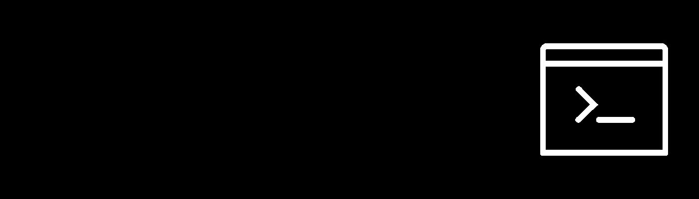
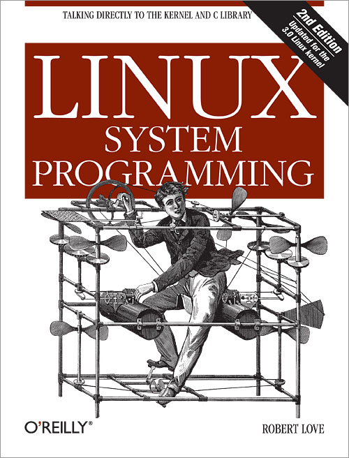

# System Programming

## Table of Contents
### 1. 리눅스 특징과 장점
### 2.리눅스 역사와 운영체제 기술
### 3. 클라우드 컴퓨팅과 리눅스 설치 (AWS 회원가입)
### 4. 클라우드 컴퓨팅과 리눅스 설치 (리눅스 서버 생성)
### 5. 클라우드 컴퓨팅과 리눅스 설치 (리눅스 서버 접속)
### 6. 가상 소프트웨어와 리눅스 설치 (참고 강의)
### 7. 시스템 프로그래밍 시작 - 기본 구성 알아두기
### 8. 쉘 기본 사용법 - 다중 사용자 지원
### 9. 쉘 기본 사용법 - 파일 및 권한 관리1
### 10. 쉘 기본 사용법 - 파일 및 권한관리2
### 11. 쉘 기본 사용법 - 리다이렉션과 파이프
### 12. 강 foreground와 background 프로세스
### 13. 프로세스 관리 및 제어
### 14. 리눅스 파일 시스템
### 15. 리눅스 파일 시스템 탐색
### 16. 파일 관련 쉘 명령어 - 하드 링크
### 17. 파일 관련 쉘 명령어 - 소프트 링크 및 특수 파일
### 18. 시스템 프로그래밍 핵심 기술 - 시스템콜과 API
### 19. 시스템 프로그래밍 핵심 기술 - ABI와 표준
### 20. 프로세스 관리 - 프로세스 ID
### 21. 프로세스 관리 - 프로세스 ID 시스템콜
### 22. 프로세스 관리 - 프로세스 생성(fork)
### 23. 프로세스 관리 - 프로세스 생성(exec)
### 24. 프로세스 관리 - 프로세스 생성(wait)과 나만의 쉘만들기
### 25. 프로세스 관리 - 프로세스 생성 (copy on write)
### 26. 프로세스 관리 - 프로세스 종료 (exit)
### 27. 프로세스 관리 - 프로세스 생성과 종료 총정리 및 wait 시스템콜 상세
### 28. 프로세스 스케쥴링 관련(참고)
### 29. IPC 기법 실습1
### 30. IPC 기법 실습2
### 31. 시그널 동작 메커니즘과 사용법 이해
### 32. 쉘스크립트의 이해와 변수
### 33. 쉘스크립트 조건문
### 34. 쉘스크립트 반복문과 실제 예제
### 35. 쉘스크립트 현업 예제 및 정리
### 36. 스레드(Pthread) 기본
### 37. 스레드(Pthread) 기본과 동기화
### 38. 메모리와 mmap
### 39. mmap 예제 및 활용
### 40. 파일 시스템 관련 시스템콜 이해

