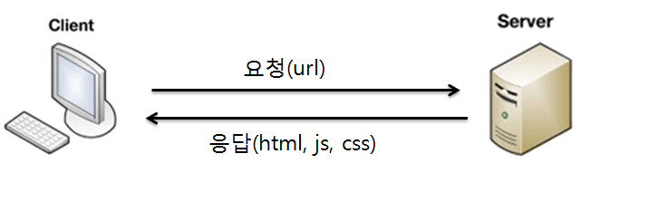
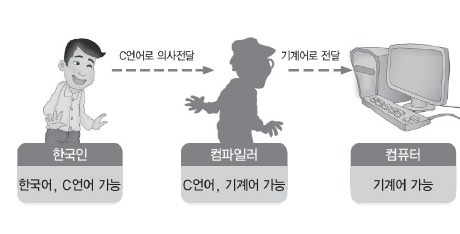

# System Programming
## Goal
- 실전 리눅스 / 운영체제 고급 활용
- 리눅스 OS
	1. 인터넷 서비스 서버 환경 익히기
	2. 고급 운영체제 기능 직접 제어
	3. Unix 계열 OS 사용법 익히기

---
## 시스템 프로그래밍 선수 과목
- C언어
- 자료 구조
- 컴퓨터 구조
- 운영체제

---
## 학습 방법
- 실제 실습을 해봐야 함
- 직접 작성해서 결과를 보면 이해도가 더 높아짐
- 여유가 된다면, 조금씩 바꿔보면서 다른 결과를 보면 이해도가 더 높아짐
- 운영체제 과목 내용을 찾아보면 더 이해도가 높아짐
- 끝까지 진행 후, 재반복하면 처음에는 이해하지 못한 부분도 이해가 가기 시작함
- 80% 이해 - 대박 성공!

---
## 정리
- 시스템 프로그래밍
	+ 고급 운여체제 이해/활용
	+ 리눅스 OS 익히기
	+ 다른 과목 종합 정리도 가능
	+ 실습 + 운영체제 과목 내용을 복습, 재반복!

---
---
# 한 번은 알아둬야 할 리눅스 배경, 역사, 철학 1
# 1.1. 리눅스 특징과 장점 (2강)
## - 리눅스 특징

---
## Linux
- 서버에 많이 사용되는 운영체제

---
## Linux
- 프로그래밍을 할 때에도 많이 사용된다.

---
## Linux
- 클라우드 컴퓨팅 (AWS)

---
## Linux
- 운영체제, 소프트웨어의 대부 Unix 계열 운영체제
	+ 완전 프로그래머 스타일

---
## Linux
- Plain하게 프로그래밍이 가능
	+ ANSI C : C 언어 표준
	+ 변종적인 문법을 익힐 필요가 없음

---
## 정리
- 리눅스
	+ 서버 + 클라우드 컴퓨팅
	+ 프로그래밍에도 유용
	+ Unix 계열 운영체제 이므로, 사용법을 익힐 수 있다.

---
---
# 한 번은 알아둬야 할 리눅스 배경, 역사, 철학 2
## 1.2. 리눅스 역사와 운영체제 기술 (3강)
### - 리눅스 역사
---
## 한 번은 들어봐야 할 리눅스 배경
- 소프트웨어 역사
- 배경과 철학을 이해할 필요가 있음
	+ 최신 IT 업계 방향 이해 가능

---
## 리눅스 시작
- 리누스 토발즈 (Linus Torvalds)가 개발
	+ 대학에 있는 Unix 컴퓨터를 집에서 쓰고 싶다는 희망을 갖고 있었다.
	+ 다중 사용자, 다중 작업(시분할 시스템, 멀티 태스킹)을 지원하는 유닉스(Unix)와 유사한 운영체제

---
## GNU 프로젝트
- GNU = Gnu is Not Unix.
- 1970년대, 유닉스 운영체제를 여러 회사에서 각자 개발, 소스를 공유하는 문화에 반발
- 리차드 스톨만 : 초기 컴퓨터 개발 공동체의 상호협력적인 문화로 돌아갈 것을 주장하며, 1985년도에 GNU 선언문을 발표
- GNU 프로젝트를 지원하기 위해 자유 소프트웨어 재단(FSF) 설립과, GNU 공개 라이선스(GPL)라는 규약을 제공

---
## GPL 라이선스
- GPL 프로그램은 어떤 목적으로, 어떤 형태로든 사용할 수 있지만, 사용하거나 변경된 프로그램을 다시 배포하는 경우, 동일한 GPL 라이선스로 공개를 해야 함

- 소스 오픈을 장려하기 위함

---
## GNU 프로젝트와 GNU Hurd
- 운영체제 커널 개발 시도 : GNU Hurd
- 운영체제에 필요한 라이브러리, 컴파일러, 에디터, 쉘 개발 (최소 6개)
> GNU Hurd : https://www.gnu.org/software/hurd/

 

- 시스템 자원을 이용하려면 운영체제(커널)를 통해 제어를 해야하는데, 응용 프로그램은 시스템 콜을 통해야만 하는데, 각 프로그래밍 언어별로 시스템 콜에 접근하기 위해 API(혹은 Library)를 통해 쉽게 접근한다.

- 운영체제 만들고, 커널을 사용하려면, 각각의 요청을 받기 위해서 시스템 콜을 만들어야 한다. 각 언어를 지원하는 컴파일러를 만들어야 하고, 해당 시스템 콜을 사용하는 API나 Library를 만들어야 한다. 사용자에게 요청을 받기 위해서 shell이라는 응용 프로그램을 만들어야 한다. shell 또한 API로 만들어야 한다. 에디터(VI)도 필요하다.

---
## GNU 프로젝트와 Linux
- GNU Hurd (OS - Kernel) 개발 지연
- 리누스 토발즈가 리눅스 커널 소스 오픈
- GNU 프로젝트 산출물과 리눅스 커널이 통합 개발

---
## GNU 프로젝트와 Linux
### GNU / Linux라고 불리기를 희망
- 리차트 스톨만 (GNU 프로젝트 창시자)

---
## 정리
- 오픈 소스 운동
- 운영체제 개발 : OS Kernel, System Call, Compiler, API(Library), Shell, Editor
- 소스 라이선스 : GPL
- GNU/Linux