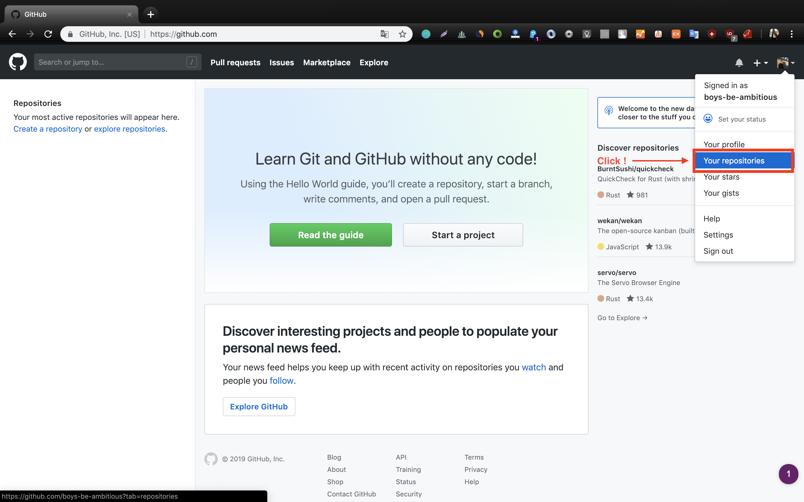
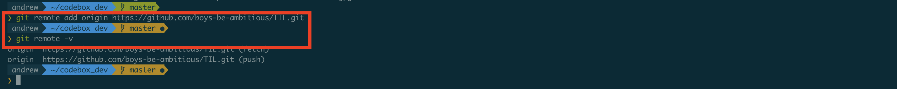
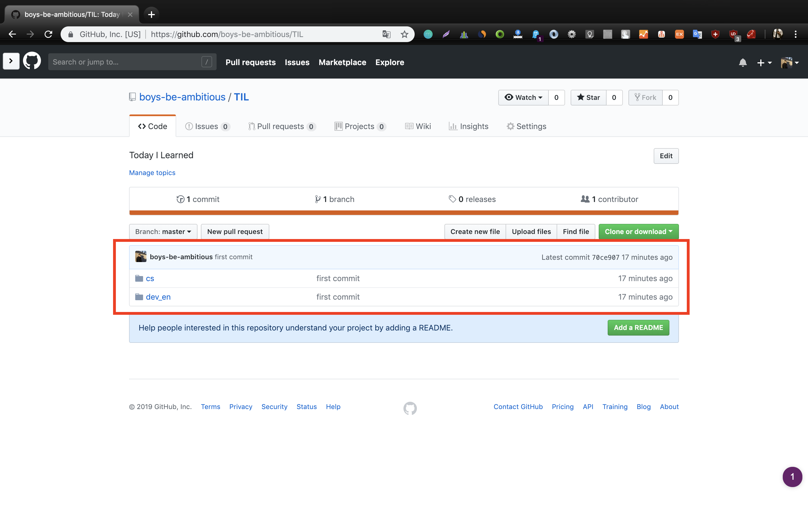

# 1. Git


- 리눅스 토발즈가 개발한 분산형 버전 관리 시스템(VCS)

## 1.1. VCS(Vesion Control System)란?
- 동일한 정보에 대한 여러 버전을 관리하는 것
- 프로그래밍의 세계에서는 소스코드를 일컫는다.

## 1.2. Git의 기원
- 버전 관리 시스템으로 BitKeeper를 쓰며 리눅스를 개발하고 있던 리눅스 토발즈는 BitKeeper의 여러 이념들의 충돌과 성능에 화가 나서 2주 만에 버전 관리 시스템 Git을 만들었다.

## 1.3. Git의 특징
- 빠른 속도, 단순한 구조
- 분산형 저장소 지원
- 비선형적 개발(브랜치를 나누어 개발)가능

## 1.4. Git의 장점
- 코드 백업
- 저장소를 통한 협업

- 소스코드를 주고 받지 않아도 동시 작업 가능 -> **생산성 증가**
- 수정 내용을 **Commit** 단위로 관리, 원하는 시점으로 돌아가기 가능 -> **백업**
- **Branch** 단위로 개발하여 A를 개발하던 도중 B라는 기능 추가 -> **편안한 테스트 가능**
- 인터넷이 없어도 개발이 가능 -> **장소 제약이 없어짐**

## 1.5. Git 설치
[공식 홈페이지](https://git-scm.com/)에 들어가서 다운로드 하고, Next를 눌러서 진행하면 설치 완료된다.

[한글 참고 문서](https://git-scm.com/book/ko/v2/%EC%8B%9C%EC%9E%91%ED%95%98%EA%B8%B0-Git-%EC%84%A4%EC%B9%98)

## 1.6. Git 사용 방법
Git을 사용하는 방법은 크게 두 가지로 나뉜다.
- 1) CLI(커맨드)를 통한 git 사용
- 2) GUI(프로그램)를 통한 git 사용

- 프로그래머라면, GUI보다 CLI 환경에 익숙해지는 게 더 좋으므로 CLI 환경으로 진행하겠다.
- GUI를 사용하고 싶은 사람은 [SourceTree](https://www.sourcetreeapp.com/) for Windows, Mac 이나 [SmartGit](https://www.syntevo.com/smartgit/) for Ubuntu를 추천한다.

- - -
- - -

# 2. GitHub

- Git 원격 저장소, 개발자들의 놀이터, 개발자들의 포트폴리오, 오픈소스들이 모여 있는 곳, 업계 1등, 2018년 Microsoft가 약 75억 달러에 인수
- Git != Github
- Github은 Github이라는 사이트에서 소스코드를 관리, 저장해주는 호스팅 서비스이다.

## 2.1. GitHub 가입하기
- [GitHub](https://github.com/)링크로 이동해서 가입한다.


- 가입시 email과 username은 노출되는 부분이므로 되도록 멋지게 짓는 것이 좋다.


- 공개 저장소 사용은 무료이고, 비공개 저장소는 한달에 7달러 수준.
- 비공개 저장소를 무료로 사용하고 싶다면, Bitbucket, Gitlab을 추천.

## 2.2. GitHub 저장소 만들기

- 우측 상단의 썸네일을 눌러 "Your repositories"를 클릭한다.
- 내가 만든 GitHub 원격 저장소를 볼 수 있다.


- 아직 만들어놓은 것들이 없기 때문에 "boys-be-ambitious doesn’t have any public repositories yet."라는 메시지가 뜬다.
- 새로운 저장소를 만들기 위해 "New" 버튼을 클릭한다.


- 생성할 저장소의 이름(필수), 설명(옵션), 공개 여부(필수)를 선택하고 생성하기 버튼을 누른다.


- 1단계 완료

## 2.3. Local Machine 설정

- **Git을 설치한 다음**에 진행해야 한다.


- Terminal(Windows는 PowerShell)을 실행한다.
- 저장소로 사용할 디렉토리를 생성하고, 해당 디렉토리로 이동한다.
    - ```mkdir dev```
    - ```cd dev```
- 해당 디렉토리에서 아래와 같은 명령어를 친다.
    - ```git config --global user.name "{github에 등록한 user name}"```
    - ```git config --global user.email "{github에 등록한 email}"```
    - ```git config --list```


- **Warning !** :  **해당 디렉토리**에 **민감한 개인정보**가 있다면 폴더에서 지우거나, 다른 폴더로 이동한 다음에 진행한다.
- 디렉토리의 위치로 이동했는지 확인하고, 아래와 같은 명령어를 내린다.


- ```git init```
    - git으로 이제 이 폴더를 관리하겠다는 명령어 (최초 선언)
- ```git add -A```
    - 현재 git이 관리하고 있지 않는 파일, 폴더, 코드를 전부 추가하겠다.
- ```git commit -m "first commit"```
    - 추가한 파일, 폴더, 코드에 관한 주석(어떤게 뭐가 바뀌었고, 무엇을 추가했는지 상세하게 적어줄수록 좋다.)





- 이제 마지막!
    - ```git remote add origin "{github repository 에 나온 주소를 복사하여 붙여넣기}"```
    - ```git remote -v```
    - ```git push -u origin master```


- github 홈페이지를 새로고침하면 위와 같이 새로운 저장소가 생성되었다!

- - -

## 3. Git Workflow (add, commit, push, reset, revert, log, status)

### Goal : 코드백업이 어떻게 이루어지는지 commit과 reset, revert 명령을 통해 알아보기


- workspace에서 add명령을 통하면, index 영역으로 간다.
- git은 two page 방식으로(add, commit이라는 두 단계로 나누어) commit을 진행한다.
- 어떤 파일을 commit할 건지, 파일을 골라서 add를 통해 local repository에 넣은 다음에, remote repository(원격 저장소)에 올린다.

### add, commit, push, reset, revert, log, status

아래 명령어를 하나씩 사용해보자.

- ```first.txt```라는 파일 만들기
    - ```touch first.txt```
    
-  git의 현재 상태 확인하기
    - ```git status```
    
- ```add``` 명령을 통해 index 영역으로 보내기
    - ```git add first.txt```
    
-  git의 현재 상태 확인하기
    - ```git status```
    
- commit을 통해 local repository에 보내기
    - ```git commit -m "create first.txt"```
    
- git log를 통해 commit 되돌리기
    - ```git log```
    - ```git revert {git log에 나와 있는 해당 commit id 4자리 숫자 입력}```
    - VIM 창이 뜨면 ```wq```를 눌러서 나가준다.
    - 파일이 사라지지만, git log에는 내역이 다 나와 있음.
    - commit을 되돌리기 위해선 ```revert```를 사용.
    - 원격저장소와 로컬 저장소의 commit log가 꼬이면 push가 복잡해지므로 ```reset```은 사용하지 말자.