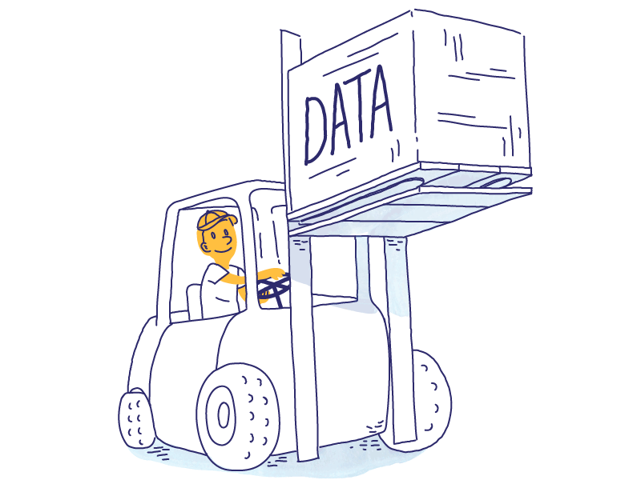

# Data Engineering

## Table of Contents
### 1. Building Cloud Infra (AWS)
    - AWS EC2
    - VPC 생성
    - IAM 권한관리
    - S3 버킷 생성, 관리, 설정
    - CloudWatch를 이용한 모니터링

### 2. Data Engineering Overview
#### Data Engineering Intro
    - Case Study
    
#### Big Data Intro
    - Hadoop
    - MapReduce
    - Hive
    - 분산 DB

### 3. Spark
#### Python for Spark
#### Spark Intro
    - Core Concept
    - RDD, DataFrame, Machine Learning 
    
#### Spark Practice 1, 2 - DataFrame
    - Spark DataFrame
    - Spark SQL
    - Spark DataFrame UDF
    - Spark DataFrame Analytic Function
    
#### Spark Cluster
    - Spark Cluster 구축 리뷰 (EMR)
    - Master, Slave Script
    - Cluster 구조 (이론)
    - Cluster UI
    
#### Spark Practice 3 - Spark Streaming
    - Spark Streaming 이론 수업
    - 실습환경 구축
    - 트위터 실시간 분석 실습

### 4. Practice using Cloud Platform
#### RDBMS 실습 및 효율화
    - Managed RDBMS(RDS)
    - Scale Up
    - Load Balancing 
#### 1. Preprocessing & Storage
    - AWS GLUE
    - EMR
    - Athena
    - Redshift
#### 2. Collection
    - Kinesis stream
    - Kinesis Firehose
    - Lambda
#### 3. Dashboard
    - AWS ES (Elasticsearch Service)
    - DMS (Database Migration Service)
#### 4. Cloud_GCP
    - GCP Bigquery
#### 5. Sage Maker for ML
    - Sage Marker

### 5. Visualization
    - BI Tools (Dashboard)
    - Tableau, DataStudio

### 6. Machine Learning, Deep Learning

### 7. Project

### Profile
> - Name           : Seokhyeon Jang
> - Email          : verbena.jang@gmail.com
> - Portfolio Page : http://rpubs.com/verbena/
> - Mobile         : 010-7711-3553
> - Hobby          : Reading, Writing, Programming
