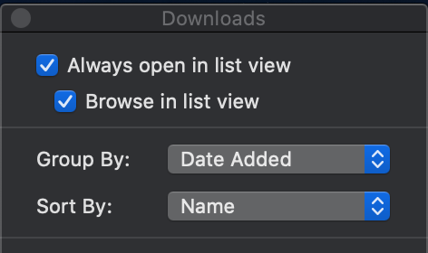

# 알면 쓸모 있는 맥북 개발 환경 세팅
#### 별것 아닌 거 같지만 도움이 되는 맥북 환경 세팅
- - -

## 1. 시스템 기본 설정
본격적인 개발환경 설정에 앞서 몇 가지 유용한 시스템 설정을 확인해보겠다. macOS Catalina를 기준으로 작성하였으나, 다른 버전도 비슷하다고 생각된다. 반드시 동일하게 설정할 필요는 없으며, 보시면서 필요하다고 느껴지는 항목을 적용하시면 되겠다.


> 상단 메뉴의 `````` 로고를 누르고 ```System Preferences(시스템 환경설정)...```를 선택합니다.

### 언어 설정 : 영어로 변경
간혹 locale 설정 때문에 오류가 발생하는 걸 방지해주고 영어 오류 메시지가 구글 검색이 잘됨
> ```Language & Region (언어 및 지역)``` &rightarrow; ```Preferred languages(선호하는 언어)```: English > 한국어 (드래그로 순서 조정)

### 패스워드 즉시 설정
잠자기 모드나 화면 보호기가 켜지면 즉시 패스워드 입력을 활성화하여 보안을 최대한 안전하게 유지
> ```Security & Privacy (보안 및 개인 정보 보호)``` &rightarrow; ```General (일반)``` &rightarrow; ```Require password(암호 요구)``` : immediately

### 분실 대비 잠금화면 메시지 설정
잠금화면에서 자신의 이름과 연락처를 표시될 수 있도록 (분실시 찾을 수 있게).
> ```Security & Privacy (보안 및 개인 정보 보호)``` &rightarrow; ```General(일반)``` &rightarrow; ```Show a message when the screen is locked``` (화면이 잠겨있는 동안 메시지 표시) 체크박스 클릭 &rightarrow; ```Set Lock Message... (잠금 메시지 설정...)``` : 이름 / 전화번호 / 메일주소

### 마우스 세 손가락 드래그
창 또는 아이콘을 이동할 때, 트랙패드를 누른 상태로 이동할 필요 없이, 세 손가락으로 편하게 드래그 할 수 있게끔.
> ```Accessibility (손쉬운 사용)``` &rightarrow; ```Pointer Control (포인터 제어 or 마우스와 트랙패드)``` &rightarrow; ```Trackpad Options...(트랙패드 옵션...)``` &rightarrow; ```Enable Dragging (드래그 활성화)``` 클릭 &rightarrow; three finger drag (세 손가락으로 드래그하기)


### 한영 키보드 전환 및 커맨드 키 위치 변경
윈도우처럼 편하게 한영 키보드 전환을 할 수 있고, 커맨드 키를 한영 키에 둠으로써 편리하게 이용할 수 있게끔.
> 1단계 :  ```Keyboard (키보드)``` &rightarrow; ```Modifier Keys...(보조키...)``` &rightarrow; ```Caps Lock``` 키 : ```Command```으로 , ```Command``` 키 : ```Caps Lock```으로 전환

> 2단계 : ```Keyboard (키보드)``` &rightarrow; ```Input Sources (입력소스)``` 카테고리 클릭 &rightarrow; ```Use the 한/A key to switch to and from ABC (한/영키로 key ABC 전환))``` 체크박스 클릭

| 기호 | 설명 (변경 전) | 설명 (변경 후) |
|:--------|:--------|:--------|
| ⌘	 | Command | 한/A (CapsLock) |
| 한/A(CapsLock)	 | 한/A(CapsLock) |  Command |
| ⌥	 | Option | Option |
| ⌃	 | Control | Control |
| ⇧	 | Shift | Shift |

### 모든 텍스트 자동 변경 옵션 끄기
입력한 단어를 컴퓨터 마음대로 바꾸는 걸 방지
> ```Keyboard``` &rightarrow; ```Text```: 모든 자동 변경 옵션(Correct spelling automatically, Capitalize words automatically, Use smart quotes and dashes) 해제


## 2. Finder Preference


> ```Finder```실행한 후에 ```⌘``` + ```,``` (```Finder``` &rightarrow; ```Preferences...```)를 선택

### 파인더 기본 폴더 설정
파인더 최초 실행 시 버벅임이 없도록 기본 폴더를 홈 폴더로 설정

> ```General``` &rightarrow; ```New Finder windows show: seokhyeonjang (본인 맥의 home folder를 선택)```

### 파일 확장자 보여주기
모든 파일의 확장자를 보여줌

> ```Advanced``` &rightarrow; ```Show all filename extensions```: 체크함

## 3. Download Folder Option


> ```Downloads```폴더로 이동한 후에 ```⌘``` + ```J``` (```View&rightarrow; ```Show View Options```)를 선택

### 날짜그룹 + 이름 정렬
파일 목록을 보여줄 때 날짜별로 그룹화 하고 그룹 내에서 이름으로 다시 정렬
다운로드 폴더 특성상 최근에 받은 파일들을 찾는 경우가 많으므로 유용함
> ```Group By```: Date added

> ```Sort By```: Name

## 4. 필수 프로그램
시스템 설정을 완료했으니, 개발 환경 구축을 위한 필수 프로그램을 설치

### Xcode
macOS에는 기본적으로 ```gcc```, ```make```와 같은 컴파일 도구가 설치되어 있지 않기 때문에 명령어 도구<sub>Command Line Tools</sub>를 설치해야 한다. 예전에는 Xcode를 전체 설치하고, 추가로 명령어 도구를 설치해야 했으나 Xcode용량이 꽤 크고 모든 사람이 IDE가 필요한 게 아니기 때문에 명령어 도구만 따로 설치할 수 있게 변경.

#### 설치
    xcode-select --install
    
#### 확인
    $ gcc
    clang: error: no input files 

[Xcode 홈페이지](https://developer.apple.com/xcode/)


### homebrew
각종 커맨드라인 프로그램을 손쉽게 설치해주는 맥용 패키지 매니저. 리눅스의 ```apt```나 ```yum```과 비슷하다. 다양한 프로그램을 복잡한 빌드과정 없이 손쉽게 설치할 수 있고 업데이트, 관리도 간단하므로 쓰지 않을 이유가 없는 필수 프로그램.

#### 설치
    /usr/bin/ruby -e "$(curl -fsSL https://raw.githubusercontent.com/Homebrew/install/master/install)"

#### 확인
    $ brew doctor
    Your system is ready to brew.

[Homebrew 홈페이지](https://brew.sh/) / [brew 명령어](https://docs.brew.sh/Manpage.html) / [brew 패키지 검색](https://formulae.brew.sh/)

### git
버전 관리 도구. (macOS에 기본으로 설치되어 있지만 최신 버전이 아니므로) brew를 이용해서 업데이트. git-lfs 는 Git Large File Storage로 용량이 큰 바이너리 파일을 git으로 관리할 때 유용하다. git 설치할 때 같이 설치. 보다 자세한 내용이 궁금하다면 [링크](https://github.com/boys-be-ambitious/TIL/tree/master/git)를 클릭하면 된다.

#### 설치
    brew install git git-lfs

git 설치가 완료되었으면 개인정보를 설정.

#### 설정
    git config --global user.name "Your Name"
    git config --global user.email "you@your-domain.com"
    git config --global core.precomposeunicode true
    git config --global core.quotepath false


## 5. 터미널 설정
시스템 설정도 하고 필수 프로그램도 설치했으니, 본격적으로 터미널을 설정해본다.

### iTerm2
macOS에 기본으로 설치되어 있는 Terminal 앱 대신 iTerm2를 터미널 앱으로 사용. iTerm2는 기본 앱에 없는 다양한 기능이 있고 손쉽게 테마를 설정할 수 있음.

#### 설치
    brew cask install iterm2

#### 테마선택


설치를 완료했으면 [3024 Night.itermcolors](https://raw.githubusercontent.com/mbadolato/iTerm2-Color-Schemes/master/schemes/3024%20Night.itermcolors) 파일을 오른쪽 버튼 누르고 다운 받거나 [여러 개의 테마](https://iterm2colorschemes.com/)를 둘러보고 맘에 드는 것을 고른다. 다운받은 파일을 더블 클릭하면 자동으로 ```iTerm Color Preset```에 추가.


#### 테마적용


> ```iTerm```을 실행하고 설정(```⌘``` + ```,```)창에서 ```Profiles``` 항목을 선택하고 ```Colors```탭을 선택.
> 오른쪽 하단에 ```Color presets...```를 클릭하면 조금 전에 추가한 Relaxed preset을 선택할 수 있음.

#### 추가설정
- 타이틀바 배경색 어둡게 변경
  > ```Appearance&rightarrow; ```Theme```: Dark

- 스크롤바 감추기
  > ```Appearance``` &rightarrow; ```Hide scrollbars```: 체크

- 타이틀바 밑에 1px 라인 제거
  > ```Appearance``` &rightarrow; ```Show line under title bar when the tab bar is not visible```: 체크 안함

- 마진 수정
  > ```Advanced``` &rightarrow; ```Height of top and bottom margins in terminal panes```: 10 <br>
  > ```Advanced``` &rightarrow; ```Width of left and right margins in terminal panes```: 12


### zsh
iTerm2도 설치하고 테마도 설치했으니, 이젠 쉘을 바꿀 차례다.

macOS는 기본으로 Bash shell을 사용하고 있다. bash외에 csh, ksh, sh, tcsh, zsh 등을 내장하고 있다. 그 중 제일 잘 나가는 zsh을 설치하겠다. zsh에 설정 관리 프레임워크인 oh-my-zsh을 사용하여 이쁜 테마를 적용하고 여러 가지 플러그인을 설치해봅니다.

    brew install zsh zsh-completions

그리고 zsh의 설정을 관리해주는 oh-my-zsh을 설치한다.

    sh -c "$(curl -fsSL https://raw.github.com/robbyrussell/oh-my-zsh/master/tools/install.sh)"
                  
설치스크립트를 실행하면 관련 파일을 설치하고 패스워드를 물어본다.<br>
계정의 패스워드를 입력하면 기본쉘을 자동으로 bash에서 zsh로 변경해준다. <br>
이미 터미널이 상당히 이쁘게 변해있을 것이다. 하지만 더 강력하게 만들기 위해선 몇가지 과정이 더 필요하다.

#### 플러그인

oh-my-zsh의 가장 강력한 점은 플러그인이다. 기본 플러그인 외에 명령어 하이라이팅 플러그인 zsh-syntax-highlighting과 자동완성 플러그인 zsh-autosuggestions을 설치한다.


    # zsh-syntax-highlighting
    git clone https://github.com/zsh-users/zsh-syntax-highlighting.git ${ZSH_CUSTOM:-~/.oh-my-zsh/custom}/plugins/zsh-syntax-highlighting

    # zsh-autosuggestions
    git clone git://github.com/zsh-users/zsh-autosuggestions $ZSH_CUSTOM/plugins/zsh-autosuggestions


플러그인을 설치하면 반드시 ~/.zshrc파일에 설정을 해야한다. 파일을 열고 plugins항목에 플러그인을 추가한다.

#### 테마
agnoster 테마는 현재 디렉토리에서 Git의 상태를 알려준다. <br>
이 기능은 보이는 것보다 아주 강력해서 현재 마스터 브랜치인지 개발 브랜치인지 혹은 커밋은 까먹고 하지 않았는지 등을 자연스레 알려준다.

> ```zshrc``` 설정 파일에 진입 &rightarrow; ```ZSH_THEME```=”agnoster”로 수정. <br>
그 다음 저장을해준 후 터미널을 나온 다음 zshrc파일을 적용(source ~/.zshrc)시킨다


그럼 폰트가 깨지는 모습을 볼 수 있다. D2 코딩 폰트를 사용하길 권장한다. <br>
참고로 코딩용 폰트이 중요성은 이 [링크](https://ppss.kr/archives/66633)를 통해 읽어볼 수 있다.

https://github.com/naver/d2codingfont 에 들어가 폰트를 다운받은 후 최신버전을 설치해준다.


아까와 마찬가지로 cmd + ,를눌러 환경설정에 들어간 후 상단 Profile -> Text로 진입한다음 change Font를 누른 후 D2Coding폰트를 선택한다.

3024Night과 D2를 적용한다면 터미널이 몰라보게 이뻐진다. 불필요한 몇 가지가 더 있는데 이름 부분에 계속 나오는 macbook-pro부분도 지워보겠다. 조금 전 ~/.zshrc파일로 다시 들어가 하단에 아래와 같이 추가해준다.

    prompt_context() {
      if [[ "$USER" != "$DEFAULT_USER" || -n "$SSH_CLIENT" ]]; then
        prompt_segment black default "%(!.%.)$USER"
      fi
    }

이렇게하면 사용자 이름만 변경되고 아무 것도 나오게 하고 싶지 않다면 중괄호안의 내용을 지우고 {}로만 놔둔다.

#### New Line 적용하기 (옵션)
현재 터미널은 이미 많은 텍스트 내용이 있기에 명령어를 칠 경우 화면에서 벗어나는 경우가 많다. 때문에 New Line을 적용해보겠다.


agnoster테마를 적용한것을 기준으로하면

    vi ~/.oh-my-zsh/themes/agnoster.zsh-theme


theme파일을 연다.

    build_prompt() {
      RETVAL=$?
      prompt_status
      prompt_virtualenv
      prompt_context
      prompt_dir
      prompt_git
      prompt_bzr
      prompt_hg
      prompt_newline //이부분을 추가 꼭 순서 지켜서
      prompt_end
    }
        
하단 buld_prompt를 찾아 꼭 prompt_end 위에 prompt_newline을 추가한다. 그다음 아래 코드를 추가한다.

    prompt_newline() {
      if [[ -n $CURRENT_BG ]]; then
        echo -n "%{%k%F{$CURRENT_BG}%}$SEGMENT_SEPARATOR
    %{%k%F{blue}%}$SEGMENT_SEPARATOR"
      else
        echo -n "%"
      fi

      echo -n "%"
      CURRENT_BG=''
    }


#### oh-my-zsh 팁

zsh과 oh-my-zsh의 조합으로 강력한 쉘을 사용할 수 있게 되었다. <br>
여기서 모든 기능을 설명할 순 없지만 자주 사용하는 몇 가지 팁을 소개한다.

- 명령어가 기억나지 않으면 tab을 누르자.
- cd ../.. 대신 ..., ...., ....., …
- 단축명령어 - git status => gst, git pull => gl 등등 다양한 단축명령어


## 6. 추천 애플리케이션
기본적인 프로그램 외에 사용하면 꽤 쓸만한 프로그램을 소개한다.

### docker


따로 소개할 필요가 없을 정도로 유명한 가상화 프로그램이다. MySQL, Redis, Oracle과 같은 데이터베이스나 rails, php 개발 환경까지 두루두루 사용하고 있다. 하나의 개발 PC에 여러 버전의 MySQL이나 Redis를 설치하는 건 쉽지 않은데 docker를 사용하면 쉽고 간단하게 개발환경을 구축할 수 있다.

docker에 대한 자세한 내용은 [여기](https://subicura.com/2017/01/19/docker-guide-for-beginners-1.html)서 확인하자.

[Docker 홈페이지](https://www.docker.com/) / [Docker for mac download](https://www.docker.com/products/docker-desktop)

### jq

JSON 결과를 이쁘게 보여주고 원하는 대로 편집할 수 있는 도구이다.<br>
간단하게 필터를 적용하여 원하는 항목만 볼 수 있고 특정 결과를 다른 형태로 변경할 수 있다.

[jq github](https://stedolan.github.io/jq/)

### ngrok
로컬 서버를 외부로 터널링을 통해 오픈해주는 도구이다. <br>
보통 로컬에 개발 서버를 띄우면 외부에서 접근하기가 어려운데 ngrok을 이용하여 간단하게 오픈할 수 있다. 사용법도 간단하다.

[ngrok 홈페이지](https://ngrok.com/)

### asciinema
터미널을 텍스트로 녹화하는 프로그램이다. 영상으로 녹화하는 것보다 용량이 적고 품질도 훌륭한 편이다.

    # 설치
    brew install asciinema
    
    # 녹화 시작
    asciinema rec
    
[asciinema 홈페이지](https://asciinema.org/)

### neofetch
간단하게 시스템 상태를 보여준다.


    # 설치
    brew install neofetch
    
    
[neofetch github](https://github.com/dylanaraps/neofetch)


## 7.References
- - -
많은 선배님들의 좋은 포스트가 있었기에 그래도 수월하게 셋업을 마칠 수 있었다. <br>
아래 포스트들을 많이 참고하였으며, 조금 더 발전시킬 수 있을 것 같은 부분은 발전시켜 포스팅하였다.<br>

- [Back to the Mac](https://macnews.tistory.com/)
- [본격 macOS에 개발 환격 구축하기 by subicura](https://subicura.com/2017/11/22/mac-os-development-environment-setup.html)
- [상대적이면서도 절대적인 개인취향이 반영된 어떤 개발자의 맥 환경](https://github.com/doortts/env-of-mac)
- [Oh My ZSH+ iTerm2로 터미널을 더 강력하게](https://medium.com/harrythegreat/oh-my-zsh-iterm2%EB%A1%9C-%ED%84%B0%EB%AF%B8%EB%84%90%EC%9D%84-%EB%8D%94-%EA%B0%95%EB%A0%A5%ED%95%98%EA%B2%8C-a105f2c01bec)
- [Mac 클린 설치 이후 개발 환경 구축/세팅 하기](https://lazyren.github.io/devlog/mac-clean-installation.html)


이외에도 많은 자료들을 참고하였으며 가능한 한 해당 글/자료들의 링크를 포스트에 첨부시켜 놓았다.