# 1. Git

[](http://hits.dwyl.io/boys-be-ambitious//Git)

- 리눅스 토발즈가 개발한 분산형 버전 관리 시스템(DVCS)

## 1.1. DVCS (Distributed Vesion Control System)란?
- 동일한 정보에 대한 여러 버전(소스코드)을 관리하는 시스템으로, 우리가 알고 있는 Git이 대표적 제품이다.
- 클라이언트는 서버 저장소를 통째로 로컬에 복제해서 사용한다. 즉, 그림으로 보면 다음과 같다.

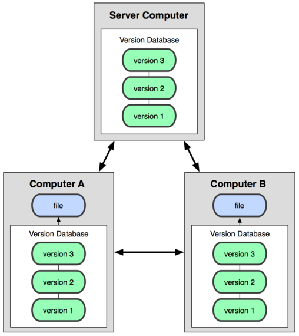


## 1.2. Git의 기원
- 버전 관리 시스템으로 BitKeeper를 쓰며 리눅스를 개발하고 있던 리눅스 토발즈는 BitKeeper의 여러 이념들의 충돌과 성능에 화가 나서 2주 만에 버전 관리 시스템 Git을 만들었다.

## 1.3. Git의 특징
- 단순한 구조에서 오는 빠른 속도
- 분산형 저장소 지원 (완벽한 분산 처리)
- 비선형적 개발(브랜치를 나누어 개발)가능
- 속도나 크기면에서 대형 Project에 적합

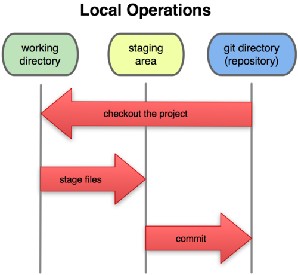
( 이미지 출처 : https://git-scm.com/ )

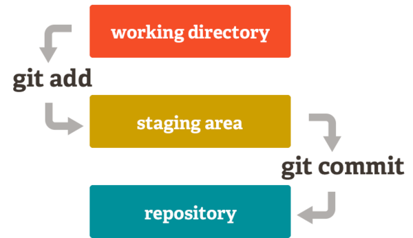
( 이미지 출처 : http://egloos.zum.com/incredible/v/7278471 )


## 1.4. Git의 장점
- 소스코드를 주고 받지 않아도 동시 작업(저장소를 통한 협업) 가능 -> **생산성 증가**
- 수정 내용을 **Commit** 단위로 관리, 원하는 시점으로 돌아가기 가능 -> **백업**
- **Branch** 단위로 개발하여 A를 개발하던 도중 B라는 기능 추가 -> **편안한 테스트 가능**
- 인터넷이 없어도 개발이 가능 -> **장소 제약이 없어짐**

## 1.5. Git 설치
- [공식 홈페이지](https://git-scm.com/)에서 다운로드하고, 설치한다.
- [한글 참고 문서](https://git-scm.com/book/ko/v2/%EC%8B%9C%EC%9E%91%ED%95%98%EA%B8%B0-Git-%EC%84%A4%EC%B9%98)

## 1.6. Git 사용 방법
Git을 사용하는 방법은 크게 두 가지로 나뉜다.
- 1) CLI(커맨드)를 통한 git 사용
- 2) GUI(프로그램)를 통한 git 사용

- 프로그래머라면, GUI보다 CLI 환경에 익숙해지는 게 더 좋으므로 CLI 환경으로 진행하겠다.
- GUI를 사용하고 싶은 사람은 [SourceTree](https://www.sourcetreeapp.com/) for Windows, Mac 이나 [SmartGit](https://www.syntevo.com/smartgit/) for Ubuntu를 추천한다.

- - -

# 2. GitHub

- Git 원격 저장소, 개발자들의 놀이터, 개발자들의 포트폴리오, 오픈소스들이 모여 있는 곳, 업계 1등, 2018년 Microsoft가 약 75억 달러에 인수
- Git != Github
- Github은 Github이라는 사이트에서 소스코드를 관리, 저장해주는 호스팅 서비스이다.

## 2.1. GitHub 가입하기
- [GitHub](https://github.com/)링크로 이동해서 가입한다.

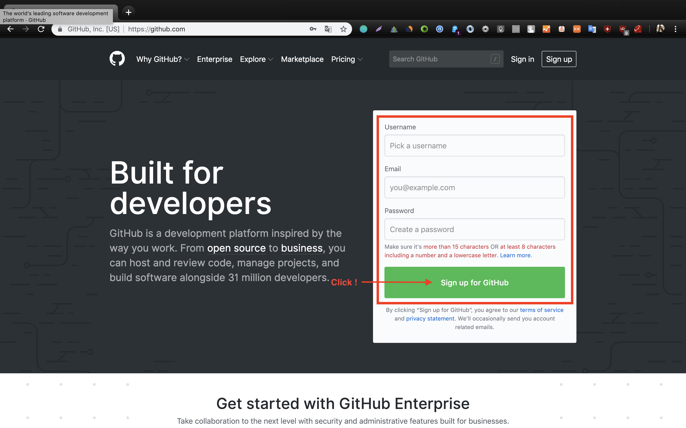
- 가입시 email과 username은 노출되는 부분이므로 되도록 멋지게 짓는 것이 좋다.

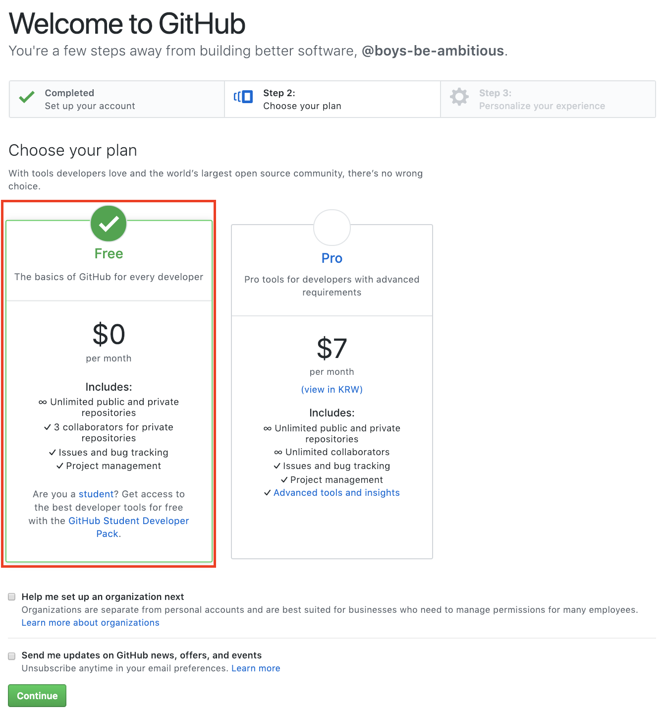
- 공개 저장소 사용은 무료이고, 비공개 저장소는 한달에 7달러 수준.
- 비공개 저장소를 무료로 사용하고 싶다면, Bitbucket, Gitlab을 추천.

## 2.2. GitHub 저장소 만들기
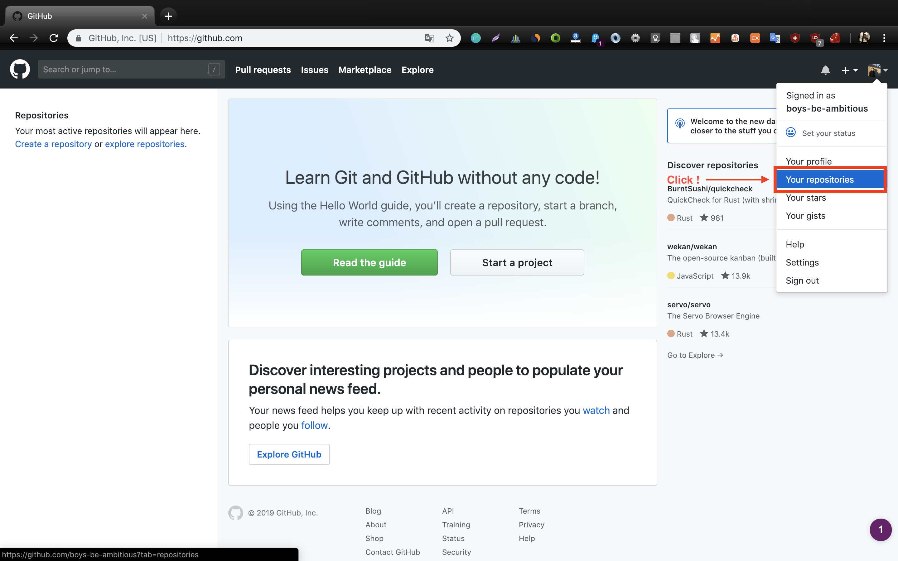
- 우측 상단의 썸네일을 눌러 "Your repositories"를 클릭한다.
- 내가 만든 GitHub 원격 저장소를 볼 수 있다.

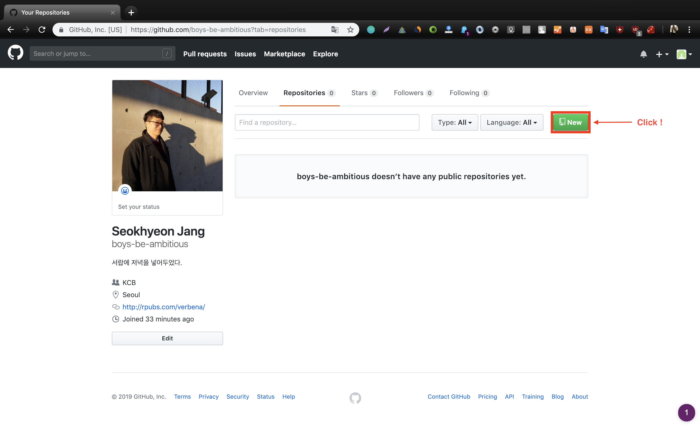
- 아직 만들어놓은 것들이 없기 때문에 "boys-be-ambitious doesn’t have any public repositories yet."라는 메시지가 뜬다.
- 새로운 저장소를 만들기 위해 "New" 버튼을 클릭한다.

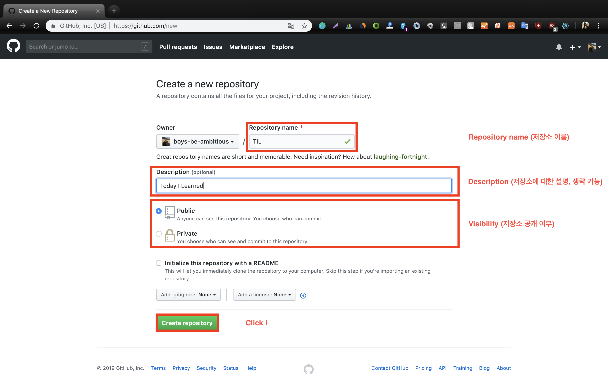

- 생성할 저장소의 이름(필수), 설명(옵션), 공개 여부(필수)를 선택하고 생성하기 버튼을 누른다.

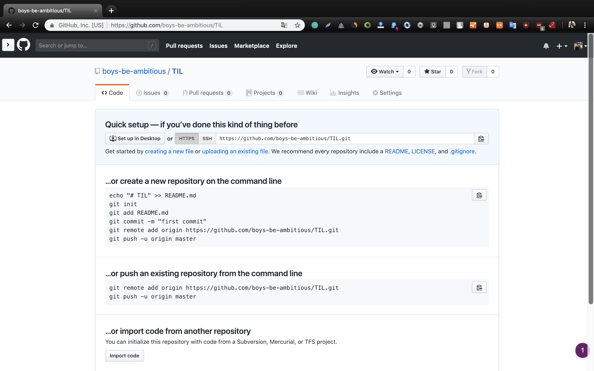

- 1단계 완료

## 2.3. Local Machine 설정

- **Git을 설치한 다음**에 진행해야 한다.

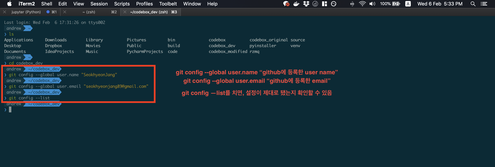

- Terminal(Windows는 PowerShell)을 실행한다.
- 저장소로 사용할 디렉토리를 생성하고, 해당 디렉토리로 이동한다.
    - ```mkdir dev```
    - ```cd dev```
- 해당 디렉토리에서 아래와 같은 명령어를 친다.
    - ```git config --global user.name "{github에 등록한 user name}"```
    - ```git config --global user.email "{github에 등록한 email}"```
    - ```git config --list```

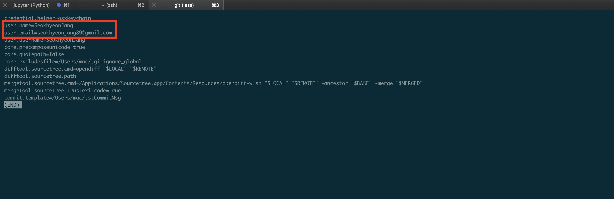

- **Warning !** :  **해당 디렉토리**에 **민감한 개인정보**가 있다면 폴더에서 지우거나, 다른 폴더로 이동한 다음에 진행한다.
- 디렉토리의 위치로 이동했는지 확인하고, 아래와 같은 명령어를 내린다.


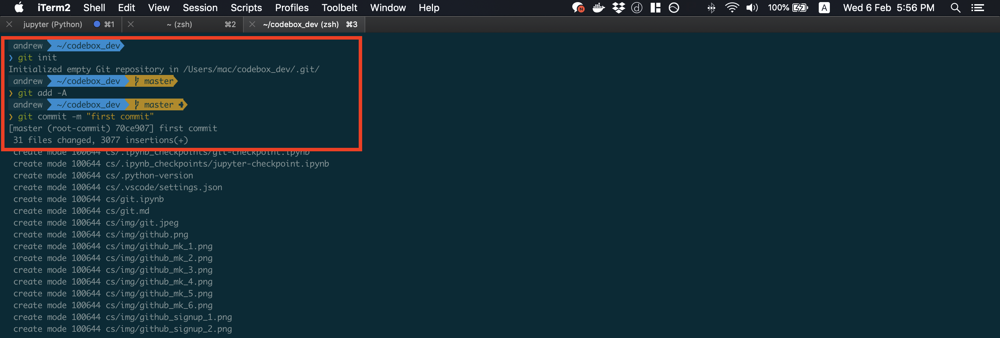

- ```git init```
    - git으로 이제 이 폴더를 관리하겠다는 명령어 (최초 선언)
- ```git add -A```
    - 현재 git이 관리하고 있지 않는 파일, 폴더, 코드를 전부 추가하겠다.
- ```git commit -m "first commit"```
    - 추가한 파일, 폴더, 코드에 관한 주석(어떤게 뭐가 바뀌었고, 무엇을 추가했는지 상세하게 적어줄수록 좋다.)

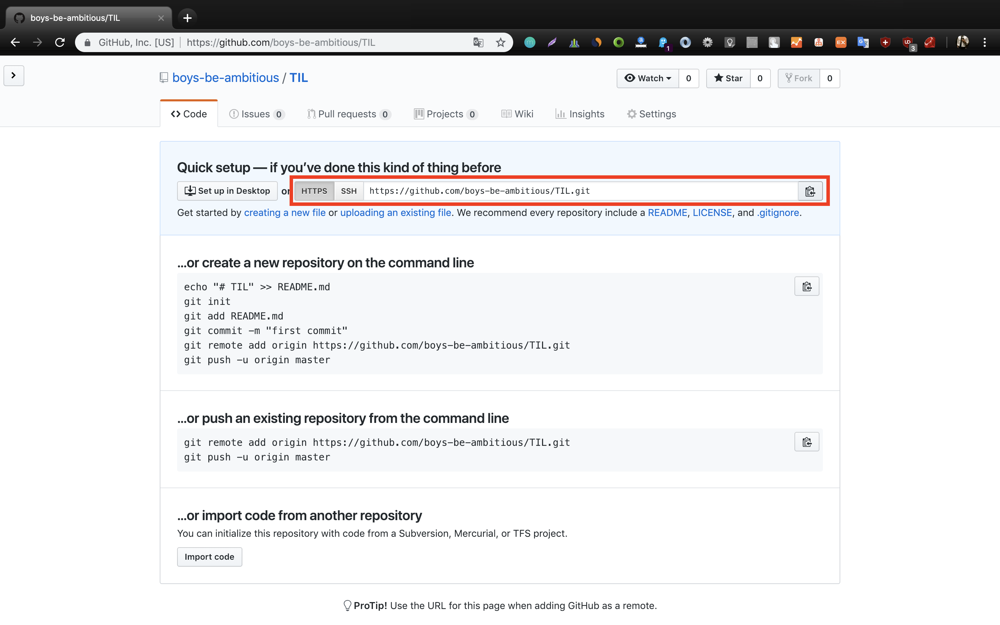

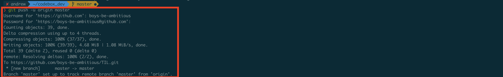

- 이제 마지막!
    - ```git remote add origin "{github repository 에 나온 주소를 복사하여 붙여넣기}"```
    - ```git remote -v```
    - ```git push -u origin master```

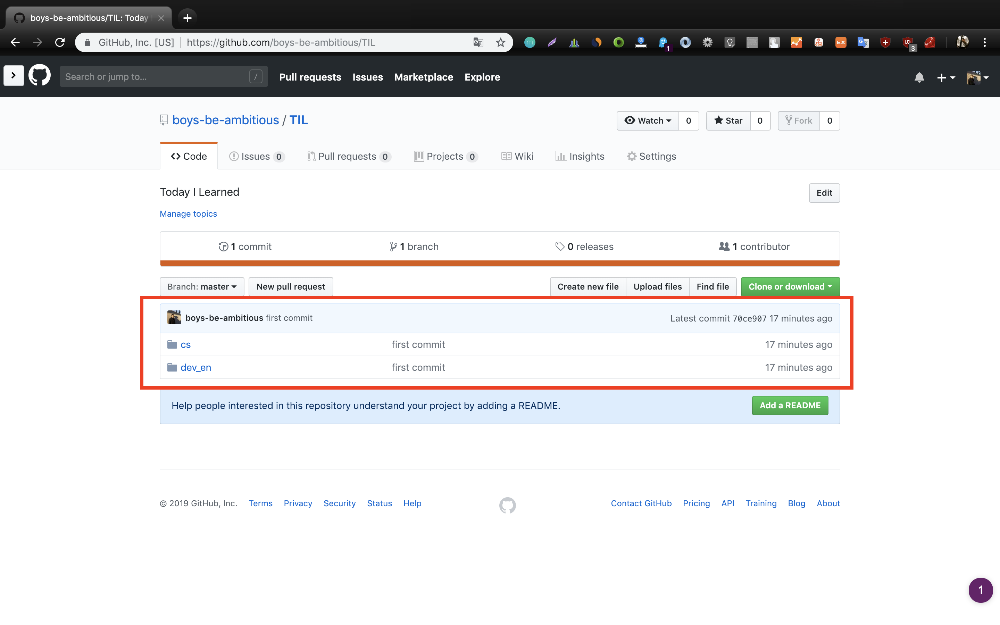
- github 홈페이지를 새로고침하면 위와 같이 새로운 저장소가 생성되었다!

- - -

## 3. Git Workflow (add, commit, push, reset, revert, log, status)

### Goal : 코드백업이 어떻게 이루어지는지 commit과 reset, revert 명령을 통해 알아보기
### keyword : add, commit, push, reset, revert, log, status

- workspace에서 add명령을 통하면, index 영역으로 간다.
- git은 two page 방식으로(add, commit이라는 두 단계로 나누어) commit을 진행한다.
- 어떤 파일을 commit할 건지, 파일을 골라서 add를 통해 local repository에 넣은 다음에, remote repository(원격 저장소)에 올린다.

### 3.1. commit과 revert로 되돌리기
아래 명령어를 하나씩 사용해보자.

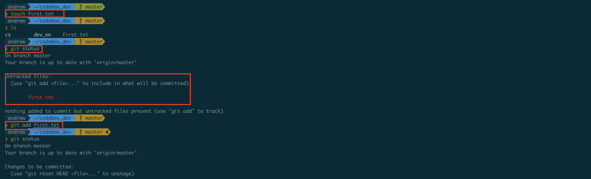
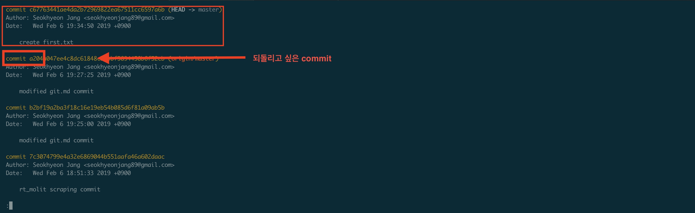
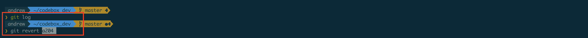
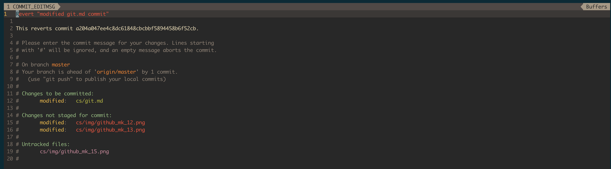
- ```first.txt```라는 파일 만들기
    - ```touch first.txt```
    
-  git의 현재 상태 확인하기
    - ```git status```
    
- ```add``` 명령을 통해 index 영역으로 보내기
    - ```git add first.txt```
    
-  git의 현재 상태 확인하기
    - ```git status```
    
- commit을 통해 local repository에 보내기
    - ```git commit -m "create first.txt"```
    
- git log를 통해 commit 되돌리기
    - ```git log```
    - ```git revert {git log에 나와 있는 해당 commit id 4자리 숫자 입력}```
    - VIM 창이 뜨면 ```wq```를 눌러서 나가준다.
    - 파일이 사라지지만, git log에는 내역이 다 나와 있음.
    - commit을 되돌리기 위해선 ```revert```를 사용.
    - 원격저장소와 로컬 저장소의 commit log가 꼬이면 push가 복잡해지므로 ```reset```은 사용하지 말자.
    
- - -

## 4. Branch

( 이미지 출처 : https://rogerdudler.github.io/git-guide/index.ko.html )


- 분기점을 생성하고, 동일한 소스코드에서 다른 개발을 하기 위한 기능

- branch를 통해 기준점이 되는 분기점을 잡고, 해당 분기점에서 동시에 여러 개발자들이 다른 기능을 각각 추구할 수 있게 된다. 동일한 버전의 소스코드를 나누어 갖고, 특정 기능을 branch별로 나누어서 개발에 들어갈 수 있다. 생산성을 높일 수 있는 좋은 기능이다.
- 우리는 이미 branch를 사용하고 있다.  git은 처음 세팅(git init)할 때, master라는 branch를 기본값으로 만들어 준다. 새로운 branch를 만들어서 이동하지 않았다면 모든 작업들을 master branch에서 이루어졌을 것이다. 

### Goal : git을 이용한 협업의 과정인 branch를 생성, 이동, 합치는 과정에 대해서 알아보겠다.
### keyword : branch, merge, checkout, conflict

### 4.1. branch 확인하기
- 터미널(windows의 경우 powershell) 실행
- 해당 디렉토리로 이동

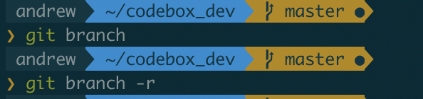

- ```git branch``` : 로컬 저장소의 branch 리스트를 나타낸다.


- ```git branch -r``` : 원격 저장소의 branch 리스트를 나타낸다.


- ```git branch -a``` : 원격/로컬 저장소의 branch 리스트를 나타낸다.


### 4.2. branch 생성 및 이동하기
#### branch 생성
- ```git branch <branch 이름>```
- ex) ```git branch login_logic```


#### branch 이동
- ```git checkout <branch 이름>```
- ex) ```git checkout login_logic```


#### branch 생성과 이동 한번에
- ```git checkout -b <branch 이름> ```
- ex) ```git checkout -b signup_logic```


### 4.3. merge
- login_logic branch로 이동한 다음에 commit을 몇개 작성하고, git log를 한다면?

- master, login_logic branch가 나뉘어진 걸 확인할 수 있다.
- branch를 생성하고 이동하는 건 알겠는데, 두 개의 branch를 합치고 싶으면(그래야 개발했던 내용들이 합쳐지는 거 아닌지)?
- 그러한 과정을 merge라고 부른다. 두 개의 브랜치의 코드를 합쳐주는 기능이다.

- ```git merge <합칠 브랜치>```
- **Warning!**
    - **merge를 실행하면 현재 branch에 합쳐진다.**
    - **master branch에 login_logic을 합치고 싶다면 master branch에서 merge를 진행해야한다.**
    
- ```git checkout master```
- ```git merge login_logic```

- merge가 위험한 이유 : 하나의 가정
    
    - 우리 서비스에 문제가 있어서 그걸 고치기 위한 branch(issue100, issue 101)를 만들었다. 
    - master branch에서는 온전히 동작하는 완벽한 코드가 올라와야 한다. 그래서 master branch에서 작업을 하면 안 된다.
    - 그리고 issue100 branch로 이동해서 git_test1.txt를 수정한다.
    
    - 그리고 add, commit까지 진행한다.,
    - 그리고 이번엔 issue101 branch로 이동해서 git_test1.txt를 수정한다.
    
    
    - 기능 수정이 완료되었다. 이제 두 개의 branch를 master에 합치겠다.
        - ```git checkout master```
        - ```git merge issue100```
        
        - master branch에 issue100을 merge 했다.
        
    - 이제 master branch에 issue101 branch를 merge 하겠다.
        - ```git merge issue101```
        
        
    - 같은 파일에 같은 부분을 수정한 branch를 merge하게 되면 지금처럼 conflict가 발생하는데 이러한 부분은 직접 수정해줘야한다.
    
        
        
    - 이렇게 수정하고 commit을 진행하겠다.
        - ```git add git_test1.txt```
        - ```git commit -m "issue101 branch 합칩"
        
    
    - 지금과 같은 과정을 통해 merge를 진행하고, conflict가 생긴 경우를 살펴보았다.
    - merge를 진행하고 나면 branch는 어떻게 될까?
        - ```git log```
        
        
    - issue branch들이 남아 있어서 log가 지저분해보인다면?
        - 할 일을 다한 branch들이니 지워도 된다.
            - ```git branch -d <지우고 싶은 branch>```
            - ```git branch -d issue100```
            - ```git branch -d issue101```
        
        
    
    - branch가 없어지고, 깔끔해졌다.

### 5. Conclusion
- git에 대한 기초 중의 기초를 정리했다.
- 이제 git을 통해서 작업을 backup하고, 나누어 개발하고, 협업하는 것을 알았다.
- 잘 쓰려면 멀었다...
    