# 별것 아니지만 도움이 되는 : GitHub Pages (블로그) 만들기

#### Jekyll를 설치하여, 쉽고 빠르게 나만의 Blog 만들기
포트폴리오를 정리할 겸, Github Pages를 만들어 보려고 한다. [Jekyll 공식 사이트](https://jekyllrb-ko.github.io/)에 나와 있는 빠른 시작 방법을 참고했다.

#### 우리가 최종적으로 만들어 볼 페이지는 아래와 같다.
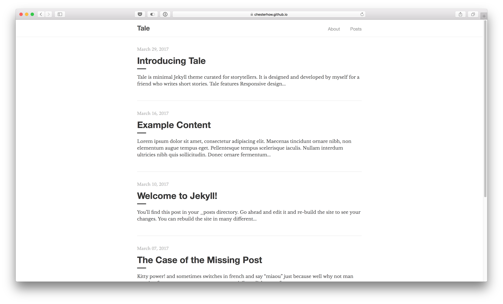

## Step 1. Jekyll 설치를 위한 환경 만들기
- macOS Catalina를 기준(19.10.20)으로 작성했다.

### 1. Command Line Tools 설치하기

터미널에서 아래와 같은 명령어를 작성하여 설치한다.  
~~이미 설치했다면 넘어간다.~~

    # 설치
    xcode-select --install

[Xcode 홈페이지](https://developer.apple.com/xcode/)

### 2. Home Brew 설치하기
각종 커맨드라인 프로그램을 손쉽게 설치해주는 맥용 패키지 매니저로 리눅스의 apt나 yum과 비슷하다.  
다양한 프로그램을 복잡한 빌드과정 없이 손쉽게 설치할 수 있고 업데이트, 관리도 간단하므로 쓰지 않을 이유가 없는 필수 프로그램이다.

~~이미 설치했다면 넘어간다.~~

    # 설치
    /usr/bin/ruby -e "$(curl -fsSL https://raw.githubusercontent.com/Homebrew/install/master/install)"

    # 확인
    $ brew doctor
    Your system is ready to brew.

[Homebrew 홈페이지](https://brew.sh/) / [brew 명령어](https://docs.brew.sh/Manpage.html) / [brew 패키지 검색](https://formulae.brew.sh/)

### 3. Home Brew로 Ruby Version Manager rbenv 설치하기
    # rbenv 설치
    brew install rbenv ruby-build

    # ruby 설치
    rbenv install

### 4. Jekyll 설치하기
    # jekyll 설치
    sudo gem install jekyll

### 5. 로컬에 Jekyll로 블로그 만들기
    # github page 만들기
    jekyll new my-first-site

위 코드는 Jekyll에게 my-first-site라는 이름의 새 Blog를 만들어달라는 명령이다. 그러므로 my-first-site는 만들고자 하는 Blog 이름으로 대체하면 된다. 새로운 블로그를 만들지 않고 괜찮은 테마를 찾아서 Fork를 떠서 수정하는 방법도 있다(일단 새로운 블로그를 만들어보자).

위의 코드를 실행하면 로컬의 최상위 폴더에 my-first-site라는 이름의 폴더가 생성된다. 이 폴더가 나의 블로그다. 이 폴더를 Github Repository에 Push하고 Github Pages로 Publishing 하면 URL로 접근할 수도 있다.

### 6. 서버 띄어서 새로운 블로그 보기
    # 디렉토리 이동
    cd my-first-site

    # 서버 띄우기
    jekyll serve

위의 코드를 실행하면 터미널에 서버 주소(Server address: http://127.0.0.1:4000/)가 보일 것이다. 해당 주소로 접근하면 새로운 블로그를 볼 수 있다. 서버를 끄려면 `Ctrl` + `c`를 누르면 된다(`Command`가 아니고 `Ctrl`이다).

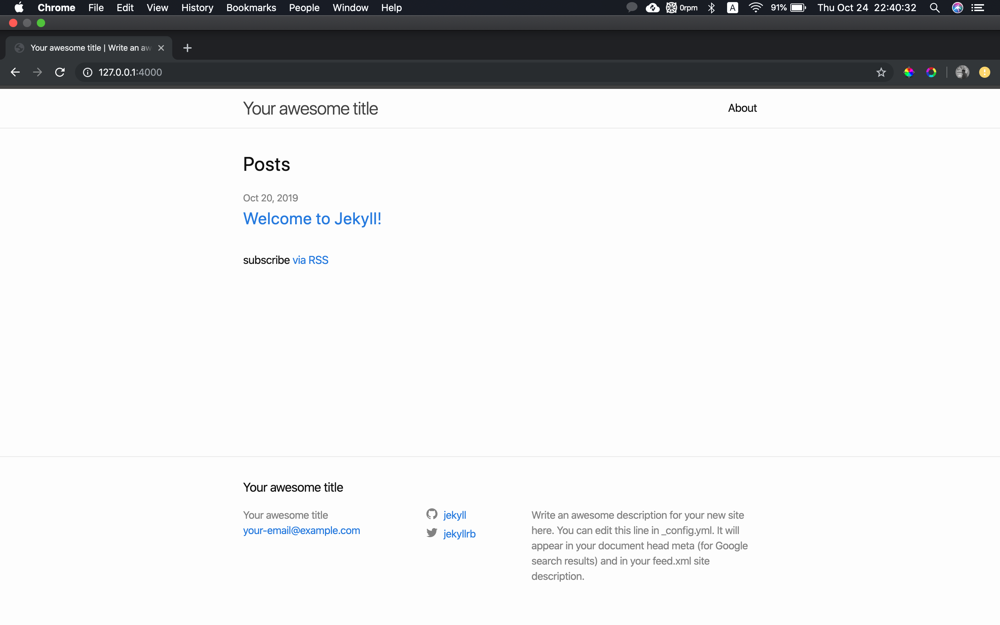

## Step 2. GitHub에 Jekyll 블로그 올리고, Publishing 하기 
로컬에서 만든 Jekyll 테마의 블로그 폴더를 올릴 것이다. 그리고 GitHub Pages로 Jekyll 블로그를 호스팅하여 http://username.github.io/ 로 접속하기까지 진행해볼 예정이다. 우선 [GitHub](https://github.com/)에 가입한다. GitHub Pages로 호스팅하면 Username이 URL에 사용된다. Username은 바꿀 수 있지만 그래도 URL에 사용될 것을 고려해서 정하자.  

로그인한 후에 `New Repository`을 누른다. Repository 이름은 `username.github.io`로 적어야한다. 그래야 GitHub Pages로 호스팅할 수 있다(~~나중에 수정할 수 있지만 이왕이면 처음부터 제대로 하자~~). README.md는 만든 저장소의 설명서라고 생각하면 쉽다(설명 : 사용법, Copyright 등을 적는 Markdown 형식의 파일이다).

<b>Git을 잘 모른다면... 공부할 수 있도록 내용을 정리해두었다. [해당 페이지로 이동하기](https://github.com/boys-be-ambitious/TIL/tree/master/git) </b>

로컬에서 폴더를 하나 생성한 다음에, 아래의 명령어를 순차적으로 실행해주면 된다(~~잘 모르겠다면 아래에 스크린샷을 참고하자~~).

<b>boys-be-ambitious는 본인의 username이다. 각자의 username으로 넣어야 한다(꼭).</b>

    echo "# boys-be-ambitious.github.io" >> README.md
    git init
    git add README.md
    git commit -m "first commit"
    git remote add origin https://github.com/boys-be-ambitious/boys-be-ambitious.github.io.git
    git push -u origin master

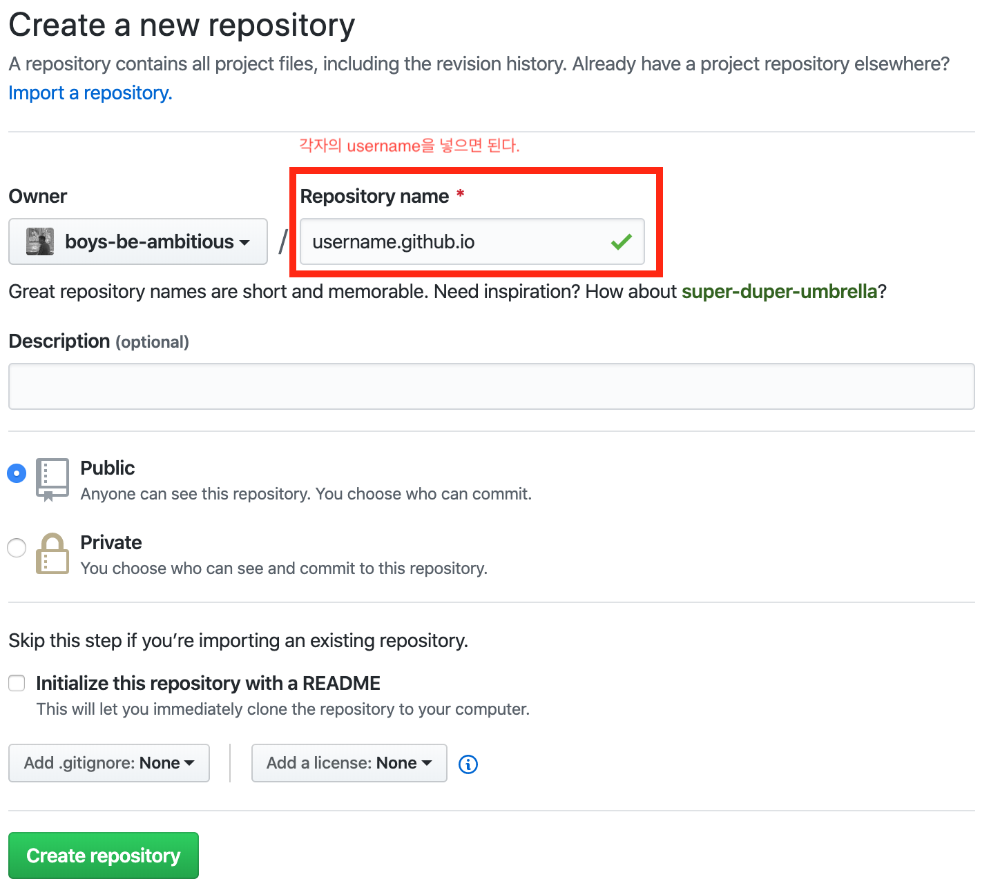
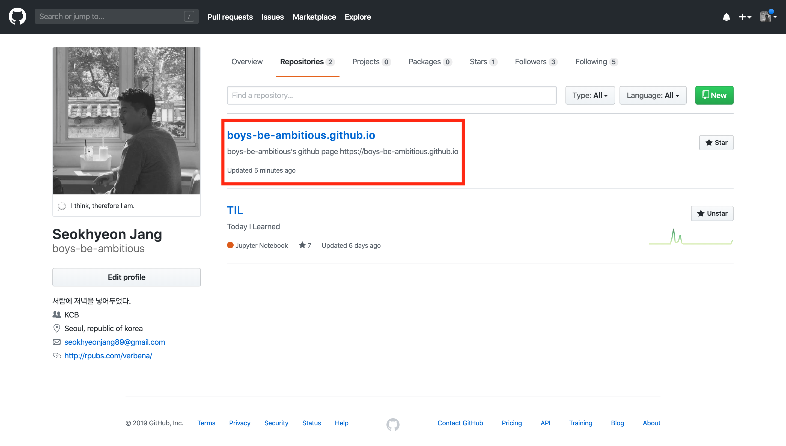
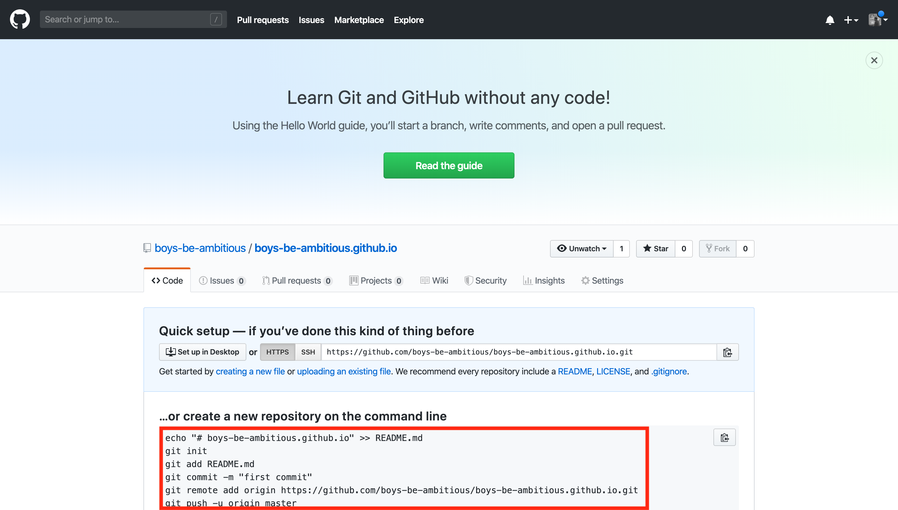
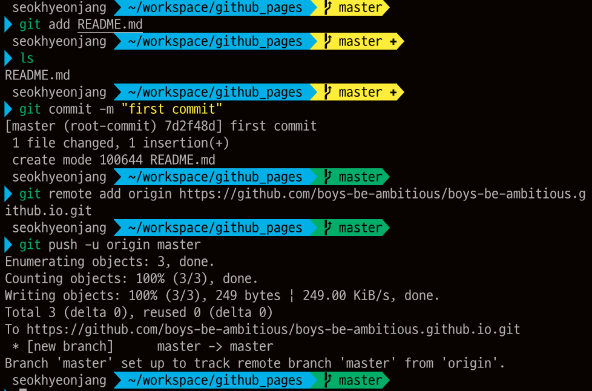
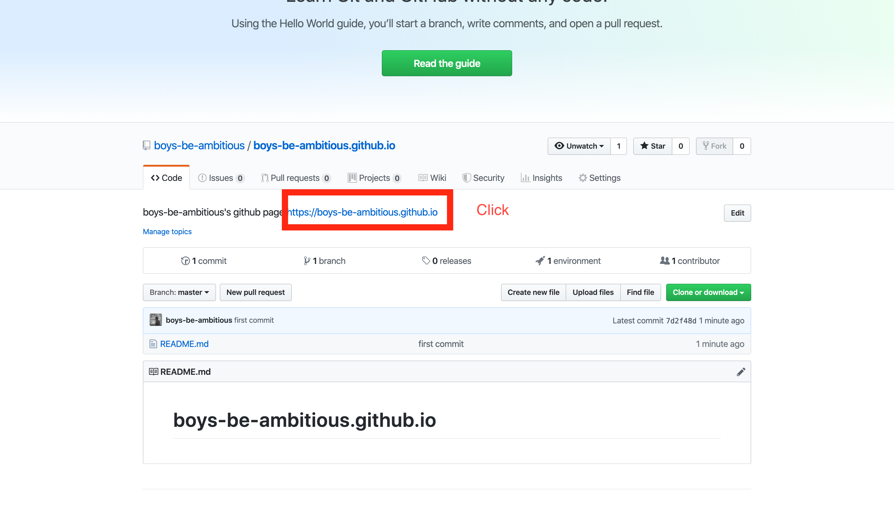
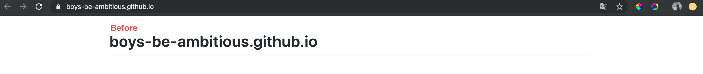
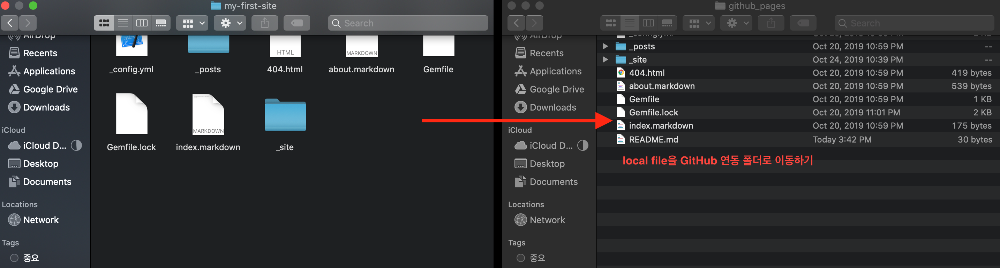
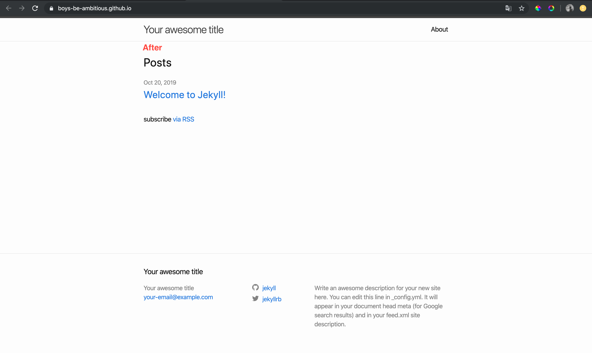
<b>2단계까지 완성되면 위의 이미지와 같은 모습을 볼 수 있다.</b>

## Step 3. 잘 만들어진 Jekyll 테마 활용해 GitHub Pages 블로그 만들기
<b>3단계부터가 진짜 시작이라고 보면 된다. 3단계가 완성되면 아래와 같은 이쁜 블로그의 모습을 볼 수 있다.   1~2단계는 3단계에 익숙해지기 위한 실습이었다고 보면 된다. 실제로 활용하고 싶다면 잘 따라오자.
</b>
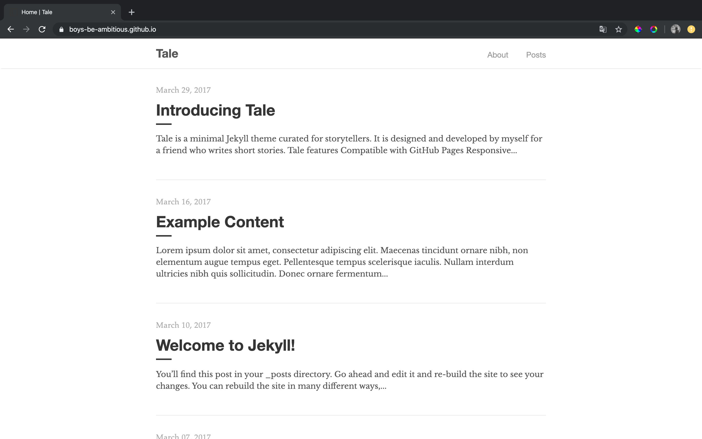

### 3.1. Blog 테마 설정
아래의 링크에 들어가면 Github Pages에 적용할 수 있는 Theme를 확인할 수 있다(마음에 드는 블로그의 테마를 고른다고 생각하면 된다).
- 인기 순으로 정렬 (무료) : https://github.com/topics/jekyll-themes
- 유료 : https://jekyllthemes.io
- 무료 : http://jekyllthemes.org

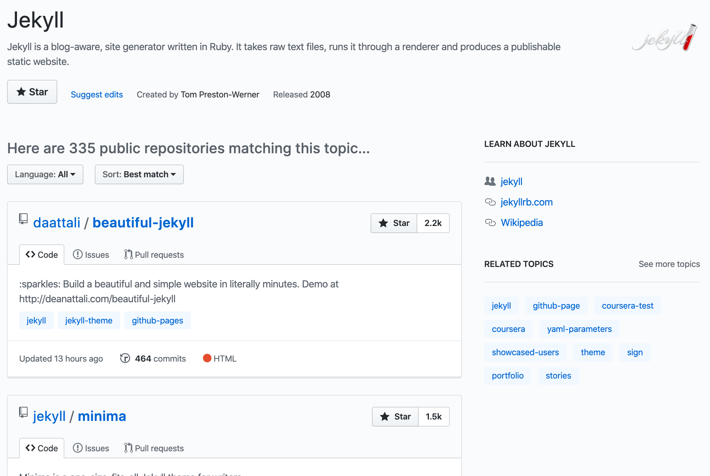

각 페이지에 들어가면 데모를 확인할 수 있다(잘 모르겠다면 `Ctrl`+`F`키를 눌러서 Demo라고 검색하면 URL들이 보일 것이다).

> <b> 경고! </b>  : 심플한 Theme을 사용하는 것을 추천한다. 멋지고 화려한 Theme를 선택하고 싶은 유혹이 크겠지만 그런 테마일수록 구조가 복잡해서, 까딱 잘못 건드렸다가 예상하지 못한 에러들이 발생하는데 `에러 났는데, 그게 뭔지는 안 알랴줌ㅋ 잘 찾아보삼 수고 ㅎ` 형태라 본인의 정신건강을 위해 추천하지 않는다.

> <b>tale</b> 이라는 theme를 선택했다.

### 3.2. 내가 원하는 GitHub Pages 만들기

### A. 기존 파일 지우기

- 일단 GitHub 저장소와 연동된 로컬 디렉토리의 파일들을 과감하게 지운다(~~아니 이게 무슨?! 그렇다고 폴더는 지우지 말자~~).  

### B. 내가 원하는 테마와 저장소 연동하기

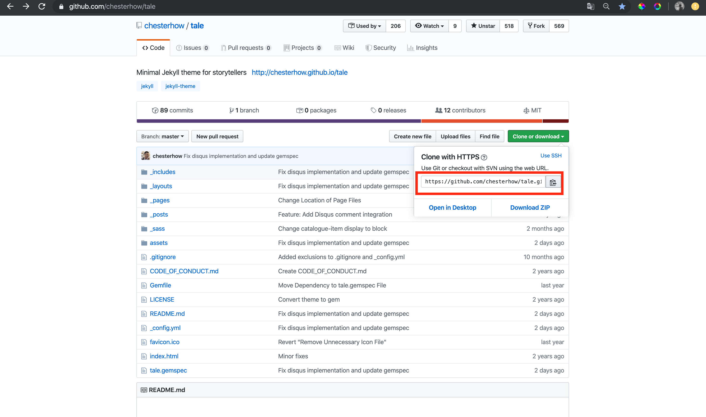

- 선택한 Theme의 GitHub 저장소에 들어간다.
- `Clone or download`라고 쓰여진 초록 버튼을 클릭한다.
- 주소(위의 이미지에서 빨간 박스로 표시한 부분)을 복사한다.

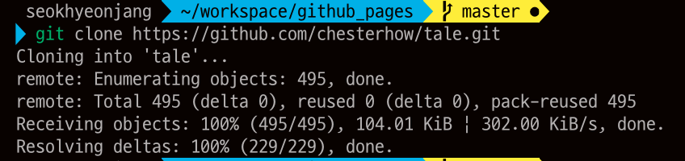

- 터미널을 통해 GitHub 저장소와 연동된 로컬 디렉토리로 이동한 뒤, 아래와 같이 따라서 입력하면 된다.

  

    git clone
    git add -A
    git commit -m "commit github-pages theme"
    git push -u origin master
    

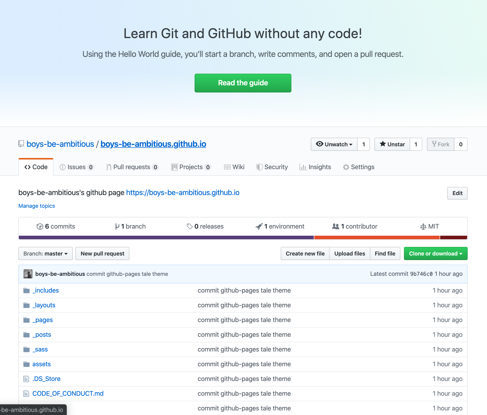

여기까지 했으면 절반은 완성했다. 이제 자신의 블로그를 어떻게 커스텀할 것인지 정해야 한다(GitHub Pages의 Theme는 거의 비슷한 구조를 가지고 있다).

### C. Jekyll 디렉터리 구조 파악하기
Jekyll의 기본 구조는 다음과 같다.

- **README.md**
    - 만들어진 GitHub Blog마다 사용 방법이 조금씩 다르다. 친절하게 설명해주는 곳도 있지만, 그렇지 않은 곳도 있다. 시작하기 전에 반드시 읽어보자. 그래야 헤매지 않고 내가 선택한 Theme에 대한 이해를 할 수 있다.

- **_config.yml**
    - 환경설정 정보를 보관하는 곳이다. 기본적인 설정은 대부분은 이곳에서 한다(baseurl, url과 같은 메타 태그).

- **_includes**
    - 재사용하기 위한 파일을 담는 곳이다(포스트나, 레이아웃을 손쉽게 편집할 수 있는 파일을 담아 놓는 곳이다). 예를 들어, header나 footer는 모든 곳에서 반복적으로 사용하기 때문에 include 폴더에 만들어놓고 가져다 쓰면 편하다. liquid 태그로 _include 안에 html을 소환할 수 있다.

- **_layouts**
    - GitHub Pages의 포스트 별로 적용되는 code들이 있는 곳이다. post의 모습을 편집하고 싶다면, 해당 디렉토리에 들어가서 살펴보면 된다.
    - default.html 은 최상위 Jekyll Blog 구성을 담고 있는 파일이라고 볼 수 있다. _include 폴더 안에 부분적인 html 들이 소환되어 있다. post.html 은 Post의 형태를 정의해놓은 html 파일이다.

- **_index.html**
    - 블로그에 접속했을 때 제일 먼저 자동으로 보여주는 파일이다(가장 기본적인 부분이다). 홈페이지의 설계도를 그려준다(?) 라고 생각하면 된다.
    
- **_posts**
    - 포스팅할 때, 이 디렉토리에 markdown 파일을 생성해서 작성을 한다. 주의사항은, markdown 으로 작성한 글이 blog에 올라가려면 어떤 형식을 따라줘야 한다. 예를 들어, 파일 이름은 `YEAR-MONTH-DAY-title.MARKDOWN` 형식을 사용하고 내부에서 글을 작성할 때 작성하는 것들이 있는데, 이러한 설명들은 대부분 `README.md` 에 설명이 되어있다.

- **_drafts**
    - 아직 게시하지 않은, 날짜 정보가 없는 Post를 보관할 수 있는 디렉터리이다.
    
- **_data**
    - 블로그에 사용할 수 있는 데이터를 모아놓을 수 있는 폴더이다. 확장자가 .yml, .yaml, .json, .csv 일 경우 자동으로 읽어 들여서 site.data 변수를 써서 불러올 수 있다.
    
- **_site**
    - Jekyll이 다른 디렉터리에 있는 모든 파일을 활용해서 Site로 자동 변환 작업을 마치면 그 파일들이 저장되는 폴더이다. _site 폴더 내 파일은 건드리면 안 된다.

> <b> 주의사항! </b>  : 본인이 선택한 Theme의 `README.md`를 읽고, `_config.yml`에 들어가서 기본설정을 하고 https://본인의githubusername.github.io 로 들어가서 제대로 적용이 되었는지 확인해보자. 저장소에 반영한 다음에 5~10분 정도 후에 들어갔을 때, 홈페이지가 제대로 보인다면 성공이다(그렇지 않다면 당신은 어딘가 놓친 부분이 있을 것이다). 천천히 따라해보자 (하다가 막혀서 정 못하겠으면 메일로 문의를...).